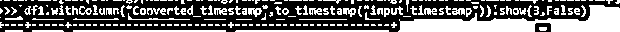
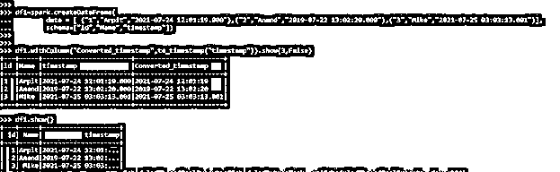
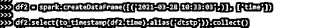

# PySpark 时间戳

> 原文：<https://www.educba.com/pyspark-timestamp/>

## PySpark 时间戳简介

PySpark TIMESTAMP 是一个 python 函数，用于将字符串函数转换为时间戳函数。该时间戳函数是一个格式函数，类型为 MM–DD–YYYY HH:MM:ss。sss，这表示由小时、月和秒表示的月、日和小时。

这些列在时间戳中进行转换，时间戳可进一步用于数据分析。这是一种转换，可用于获取 PySpark 中正确的月份后跟小时、月和秒的准确日期。它在数据分析过程中经常使用，因为它记录了数据加载的确切时间戳，并可用于进一步的分析。

<small>网页开发、编程语言、软件测试&其他</small>

在本文中，我们将尝试分析使用 PySpark 时间戳操作 PYSPARK 的各种方法。让我们试着更详细地了解一下 PYSPARK 时间戳。

**语法:**

PySpark 时间戳函数的语法是。to_timestamp 函数是将列函数转换成时间戳的函数。

`df1.withColumn("Converted_timestamp",to_timestamp("input_timestamp")).show(3,False)`

*   Df1:使用的数据帧。
*   Withcolumn:用于引入新列值的函数。它以新的列名作为参数，传递 to_timestamp 函数，将字符串转换为时间戳值。

它将输入数据帧作为输入函数，结果存储在一个新的列值中。

**截图:**

### PySpark 中时间戳的工作

让我们看看 PYSPARK 时间戳在 PySpark 中是如何工作的:

时间戳函数用于将字符串转换为时间和日期的组合。这是一个用于转换的精确函数，有助于分析。

时间戳函数有 19 个固定字符。这包括以下格式:

YYYY-MM-DD HH:MM:SS

每当输入列被传递以转换为时间戳时，它就接受列值并返回基于日期的数据时间值。转换在给定的格式内进行，然后转换后的时间戳作为输出列返回。我们还可以通过强制转换将时间戳函数转换为日期时间。它接受一个日期表达式，时间值相加，返回时间戳数据。该模式也可以作为定义列数据模式的参数显式传递。

让我们通过一些编码示例来检查 PySpark 时间戳的创建和工作。

### 例子

让我们看一些 PySpark 时间戳操作如何工作的例子。让我们从在 PySpark 中创建一个简单的数据框开始。

`df1=spark.createDataFrame(
data = [ ("1","Arpit","2021-07-24 12:01:19.000"),("2","Anand","2019-07-22 13:02:20.000"),("3","Mike","2021-07-25 03:03:13.001")],
schema=["id","Name","timestamp"])
df1.printSchema()
df1.show()`

这个数据帧中的列时间戳将被用来转换为时间戳函数中的列。

`df1.withColumn("Converted_timestamp",to_timestamp("timestamp")).show(3,False)
df1.show()`

这里引入了一个新列，新列的名称是 Converted_timestamp。将字符串转换为时间戳。

**截图:**

我们还可以显式传递将用于转换的格式时间戳函数。

`df1.withColumn("Converted_timestamp",to_timestamp(lit(‘2021-07-24 12:01:19.000’),'MM-dd-yyyy HH:mm:ss.SSSS')).show(3,False)`

让我们再看一个时间戳函数转换的例子:

`df2 = spark.createDataFrame([('2021-03-28 10:33:03',)], ['time'])
df2.select(to_timestamp(df2.time).alias('dtstp')).collect()`

这会将日期转换成时间戳。

**截图:**

同样的 to_timestamp 函数也可以用在 PySpark SQL 函数中，该函数也可以用于转换。spark.sql 接受 spark 函数中的 to_timestamp 函数，并转换时间戳中的给定列。

这是 PySpark 中 PySpark 时间戳的一些例子。

**注:**

1.它用于将字符串函数转换为时间戳。
2。其格式为 YYYY-MM-DD HH:MM: SS
3。PySpark TIMESTAMP 准确地考虑了数据发生变化的时间，该时间被精确地用于数据分析。
4。它将数据框列作为转换的参数。

### 结论

从上面的文章中，我们看到了 PySpark 中时间戳的工作原理。从各种例子和分类中，我们试图理解这个时间戳函数是如何在 PySpark 中使用的，以及在编程级别中使用的是什么。所使用的各种方法显示了它如何简化数据分析的模式以及同样的成本效益模型。

我们还看到了 PySpark 数据帧中时间戳的内部工作和优点，以及它在各种编程目的中的使用。此外，语法和例子帮助我们更准确地理解函数。

### 推荐文章

这是 PySpark 时间戳的指南。这里我们讨论 PySpark 示例中时间戳的介绍、语法、工作原理和代码实现。您也可以看看以下文章，了解更多信息–

1.  [pyspar 地图分区](https://www.educba.com/pyspark-mappartitions/)
2.  [PySpark 左连接](https://www.educba.com/pyspark-left-join/)
3.  [PySpark 计数不同](https://www.educba.com/pyspark-count-distinct/)
4.  [PySpark 逻辑回归](https://www.educba.com/pyspark-logistic-regression/)

