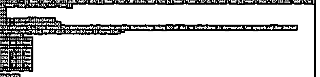
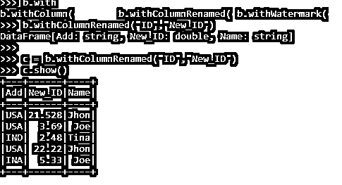

# 带列名的 PySpark

> 原文：<https://www.educba.com/pyspark-withcolumnrenamed/>

## 带列名的 PySpark 简介

PySpark With Column Renamed 是一个 PySpark 函数，用于重命名 PySpark 数据模型中的列。with column Renamed 函数用于重命名现有列，返回 PySpark 数据模型中的新数据框。此带列重命名功能可用于重命名 PySpark 数据框中的单个列和多个列。with column renamed 函数接受两个函数，一个是现有的列名，另一个是新的列名。

为生成新列生成查询计划，然后执行重命名功能。这不会修改现有的数据框，而是创建一个新的数据框。在本文中，我们将尝试分析使用 PYSPARK 的各种方法，并将列重命名为 operation PySpark。

<small>网页开发、编程语言、软件测试&其他</small>

让我们来看看 PYSPARK PYSPARK 的更多细节。

**列重命名为**的 PYSPARK 的语法

具有列重命名函数的 PYSPARK 的语法是:-

`data1  = [{'Name':'Jhon','ID':21.528,'Add':'USA'},{'Name':'Joe','ID':3.69,'Add':'USA'},{'Name':'Tina','ID':2.48,'Add':'IND'},{'Name':'Jhon','ID':22.22, 'Add':'USA'},{'Name':'Joe','ID':5.33,'Add':'INA'}] a = sc.parallelize(data1)
b = spark.createDataFrame(a)
c = b.withColumnRenamed("ID","New_ID")
c.show()`

要使用的数据框模型。

B:-创建的数据帧。

C:-与 with ColumnRenamed 函数一起使用的新数据框。这将占用旧的现有列以及新的列名。

**截图:-**

### 使用 PYSPARK 中重命名的列

让我们看看在 PYSPARK 中重命名了列的 PySpark 是如何工作的

with Column 函数用于重命名 PySpark 数据框中的一列或多列。这将数据框覆盖到一个新的数据框中，该数据框中嵌入了新的列名。with column 函数添加一个具有新名称的新列，或者替换具有相同名称的列元素。这需要两个参数，一个是现有的列名，另一个是需要重命名的新列名。

With column Renamed 函数通过对列函数执行重命名操作来返回新的数据帧，因为数据帧本质上是不可变的，所以返回类型是列被重命名的新数据帧。它引入了一个内部投影，使得 spark 应用程序的查询计划和列在 PySpark 作业中被重命名。

让我们用一些代码示例来检查 PYSPARK 的创建和工作，其中列被重命名。

### 带列名的 PySpark 示例

让我们看一些 PYSPARK 如何使用列重命名操作的例子

让我们从在 PySpark 中创建一个样本数据框开始。

`data1  = [{'Name':'Jhon','ID':21.528,'Add':'USA'},{'Name':'Joe','ID':3.69,'Add':'USA'},{'Name':'Tina','ID':2.48,'Add':'IND'},{'Name':'Jhon','ID':22.22, 'Add':'USA'},{'Name':'Joe','ID':5.33,'Add':'INA'}]`

这占用了我们可以用来创建数据框的数据列表。

`a = sc.parallelize(data1)
b = spark.createDataFrame(a)`

PySpark 中的并行化和创建数据帧功能用于在 Spark 中创建数据帧。

`b.show()`

**截图:-**

这将创建一个数据框，其示例列名称为添加、ID 和名称。现在，我们将尝试使用列重命名函数来重命名列名。

`b.withColumnRenamed("ID","New_ID")`

该函数采用两个参数，一个作为现有的列名，另一个作为新的列名。

新数据框将创建一个列名作为新列名。我们来分析一下这个的输出。

`c.show()`

**截图:-**

该函数也可应用于多列重命名，这种带列重命名的函数也可用于重命名多列而不是 PySpark 数据框函数。

多列重命名功能可应用于单个数据框，结果是具有重命名的更新列的单个新数据框。让我们用一个简单的例子来验证一下

`c = b.withColumnRenamed("ID","New_ID").withColumnRenamed("Add","New_Add").withColumnRenamed("Name","New_Name")
c.show()`

此示例代码将用于重命名 PySpark 数据框的所有列数据。

**输出:-**

**截图:-**

这些是 PySpark 的一些例子，其中的列在 PYSPARK 中被重命名。

**注:-**

1.  PYSPARK With Column RENAMED 用于重命名 PYSPARK 中的列。
2.  PYSPARK With Column RENAMED 从现有数据框创建一个新的数据框，重命名列值。
3.  列重命名的 PYSPARK 可用于重命名多个列，也可用于 SPARK 数据框。
4.  列被重命名的 PYSPARK 接受两个输入参数，一个是现有的参数，另一个是新的列名。

### 结论

从上面的文章中，我们看到了 PySpark 中 FLATMAP 的工作原理。从各种例子和分类中，我们试图理解这个 FLATMAP 函数是如何在 PySpark 中使用的，以及在编程级别中使用了什么。所使用的各种方法显示了它如何简化数据分析的模式以及同样的成本效益模型。

我们还看到了 PySpark 数据框架中的 FLATMAP 的内部工作和优点，以及它在各种编程目的中的使用。此外，语法和例子帮助我们更准确地理解函数。

### 推荐文章

这是一本关于 PySpark 的指南。在这里，我们讨论使用 PYSPARK 的各种方法，其中列被重命名为 operation PySpark。您也可以看看以下文章，了解更多信息–

1.  [PySpark 别名](https://www.educba.com/pyspark-alias/)
2.  [PySpark 计数不同](https://www.educba.com/pyspark-count-distinct/)
3.  [PySpark 结构类型](https://www.educba.com/pyspark-structtype/)
4.  [PySpark 回合](https://www.educba.com/pyspark-round/)

