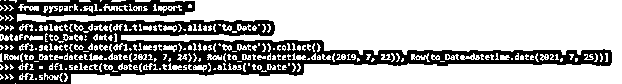
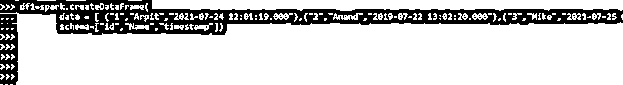
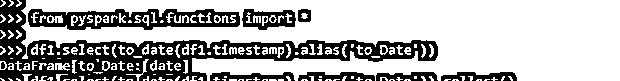
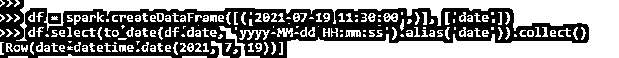
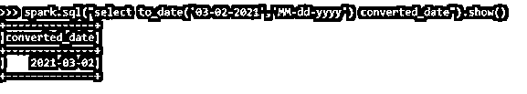
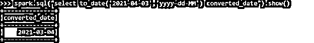

# PySpark 至今

> 原文：<https://www.educba.com/pyspark-to_date/>

## PySpark 简介至今

PySpark To_Date 是 PySpark 中的一个函数，用于将 PySpark 数据模型中的字符串转换为日期格式。这个 to_Date 函数用于将 PySpark 中的字符串类型列格式化为日期类型列。这是 PySpark 中一个重要且最常用的方法，因为日期的转换使得数据模型易于进行基于日期格式的数据分析。这个 to_Date 方法将列值作为输入函数，然后将日期模式作为第二个参数，将日期转换为第一个参数。转换后的列属于 pyspark.sql.types.DateType 类型。

在本文中，我们将尝试分析使用 PYSPARK To_Date 操作 PYSPARK 的各种方法。

<small>网页开发、编程语言、软件测试&其他</small>

**语法:**

PySpark To_date 函数的语法是:

`from pyspark.sql.functions import *
df2 = df1.select(to_date(df1.timestamp).alias('to_Date'))
df.show()`

PySpark 中的 import 函数用于导入转换所需的函数。

*   Df1:-用于转换的数据帧
*   to _ date:-to date 函数，将列值作为输入参数，将别名值作为新的列名。
*   Df2:-转换后选择的新数据帧。

**截图:**

### PySpark 中的最新工作

让我们用一些代码例子来检查 PySpark 的创建和工作。

#### 例子

让我们从在 PySpark 中创建一个简单的数据框开始。

`df1=spark.createDataFrame(
data = [ ("1","Arpit","2021-07-24 12:01:19.000"),("2","Anand","2019-07-22 13:02:20.000"),("3","Mike","2021-07-25 03:03:13.001")],
schema=["id","Name","timestamp"])
df1.printSchema()`

**输出:**

`df1.show()`

**截图:**

现在，我们将尝试使用数据框中的 to_date 函数来转换时间戳列。

我们将从导入所需的功能开始。

`from pyspark.sql.functions import *`

这将从其中导入必要的函数，用于转换。

`df1.select(to_date(df1.timestamp).alias('to_Date'))`

我们将从选择需要转换为日期列值的列值开始。这里将使用 df1.timestamp 函数进行转换。这将返回使用别名值的新数据框。

**截图:**

`df1.select(to_date(df1.timestamp).alias('to_Date')).collect()`

我们将尝试收集数据框并检查转换后的日期列。

`[Row(to_Date=datetime.date(2021, 7, 24)), Row(to_Date=datetime.date(2019, 7, 22)), Row(to_Date=datetime.date(2021, 7, 25))]`

我们将尝试将转换后的数据帧存储到新的数据帧中，并分析其结果。

`df2 = df1.select(to_date(df1.timestamp).alias('to_Date'))`

这将把列值转换为日期函数，结果存储在新的数据框中。其可进一步用于数据分析。

`df2.show()`

让我们试着用另一个例子来验证这一点，这个例子给出了转换前的日期格式。

`df = spark.createDataFrame([('2021-07-19 11:30:00',)], ['date'])`

这用于创建日期框架，它有一个列值作为我们将用于转换的日期，我们可以传递用于转换目的的格式。

`df.select(to_date(df.date, 'yyyy-MM-dd HH:mm:ss').alias('date')).collect()`

这将给定的格式转换为 To_Date 并作为结果收集。

**截图:**

通过使用 PySpark 中的 to_Date 函数，这个 to date 函数也可以与 PySpark SQL 函数一起使用。我们只需要传递这个函数，转换就完成了。

`spark.sql("select to_date('03-02-2021','MM-dd-yyyy') converted_date").show()`

这是可以使用的转换日期，这就放弃了如何使用 Spark.sql 函数来使用这个 to_date 函数的想法。

**截图:**

`spark.sql("select to_date('2021-04-03','yyyy-dd-MM') converted_date").show()`

这种格式可以按照我们想要的方式给出，我们可以用它来进行进一步的转换。

**截图:**

这些是 PySpark 迄今为止在 PySpark 中的一些例子。

**注:**

1.它用于将字符串函数转换为日期。

2.它将格式作为提供的参数。

3.它准确地考虑了用于数据分析的数据发生变化的日期。

4.它将日期框架列作为转换的参数。

### 结论

从上面的文章中，我们看到了 PySpark 中的 TO_DATE 的工作情况。从各种例子和分类中，我们试图理解这个 TO_DATE 函数是如何在 PySpark 中使用的，以及在编程级别中使用的是什么。所使用的各种方法显示了它如何简化数据分析的模式以及同样的成本效益模型。

我们还看到了 PySpark 数据框架中 TO_DATE 的内部工作和优点，以及它在各种编程目的中的使用。此外，语法和例子帮助我们更准确地理解函数。

### 推荐文章

这是 PySpark 的最新指南。这里我们讨论一下引言，PySpark To_Date 在 PySpark 中是如何工作的？和示例。您也可以看看以下文章，了解更多信息–

1.  [PySpark 重新分配](https://www.educba.com/pyspark-repartition/)
2.  [pyspar 地图分区](https://www.educba.com/pyspark-mappartitions/)
3.  [PySpark 左连接](https://www.educba.com/pyspark-left-join/)
4.  [PySpark 计数不同](https://www.educba.com/pyspark-count-distinct/)

