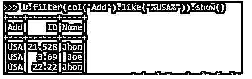
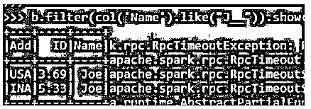

# PySpark LIKE

> 原文：<https://www.educba.com/pyspark-like/>


## PySpark LIKE 简介

PySpark LIKE 操作用于根据用于过滤目的的某些字符来匹配 PySpark 数据框中的元素。我们可以使用 like 运算符过滤数据框中的数据。过滤后的数据可用于数据分析和处理。它可以与单个或多个条件一起使用来过滤数据，也可以用于生成数据的新列。这也可以用在 PySpark SQL 函数中，就像 like 操作一样来过滤与里面的字符值相关联的列。

**py spark LIKE 的语法**

<small>网页开发、编程语言、软件测试&其他</small>

下面给出了提到的语法:

```
b.filter(col('Name').like("%Jhon%")).show()
```

*   **b:** 使用的数据帧。
*   **过滤:**用于过滤数据的过滤操作。
*   **Like:**Like 运算符与字符值一起使用。

like 函数使用的参数是我们要用来过滤数据的字符。

**输出:**


### PySpark 类工作

下面给出的是工作:

*   LIKE 操作是一个简单的表达式，用于查找或操作 PySpark SQL 或数据框架构中的任何字符。
*   这占用了两个特殊字符，可以进一步用来匹配那里的元素。
*   在 Like 中，这些被称为通配符运算符。
*   百分号(%)代表一个、零个或多个字符。
*   下划线(_)代表单个字符。
*   百分比前的值使其可用于以该字符开始的数据。然后对数据进行过滤，结果作为新列或旧列返回到 PySpark 数据框。
*   之后写入的值将检查所有以字符值结尾的值。

### PySpark 类的例子

下面是 PySpark 的例子:

首先在 PySpark 中创建简单的数据。

**代码:**

```
data1 = [{'Name':'Jhon','ID':21.528,'Add':'U SA'},{'Name':'Joe','ID':3.69,'Add':'USA'},{'Name':'Tina','ID':2.48,'Add':'IND'},{'Name':'Jhon','ID':22.22, 'Add':'USA'},{'Name':'Joe','ID':5.33,'Add':'INA'}]
```

创建一个示例数据，字段为 Name、ID 和 ADD。

```
a = sc.parallelize(data1)
```

RDD 是使用 sc.parallelize 创建的

```
b = spark.createDataFrame(a)
b.show()
```

使用 Spark.createDataFrame 创建了数据框。

**输出:**


让我们尝试在数据框中使用 like 函数。

**代码:**

```
b.filter(col('Name').like("%Jhon%")).show()
```

这将根据列名 Jhon 过滤数据，然后将数据用于数据分析。该列以列名的形式给出，字符名在 like 子句中提供。

**输出:**


这同样适用于多个列，也提供了进一步的结果。

让我们尝试使用 filter column 函数过滤基于 ADD 的列。

**代码:**

```
b.filter(col('Add').like("%USA%")).show()
```

**输出:**




**代码:**

```
b.filter(col('Name').like("%J%")).show()
```

**输出:**


让我们通过 _ 运算符来看看这个。

这将选择以 J 开头的名称，填充满足数据的空格，并相应地过滤数据。

通过在 PySpark 的 like 操作符中添加下划线，可以相应地填充相同的空格。

**代码:**

```
b.filter(col('Name').like("J__")).show()
```

**输出:**




这将查找以 J 开头的名称，最多 3 个位置。

**代码:**

```
b.filter(col('Name').like("J___")).show()
```

输出将打印以 J 开头的名称，并选择最多 3 位小数。

**输出:**


通过创建一个临时表，然后使用 SQL 语句，PySpark SQL 模型也可以使用同样的方法。

**Note:** It is used for data filtering of the PySpark data frame. It checks for the character that is like and filters the data accordingly that is used for data analytics purposes. It uses two wildcard conjunction as the basic rule for operation. It returns a Boolean column for more column functions.

### 结论

从上面的文章中，我们看到了 LIKE 函数的工作原理。从各种例子和分类中，我们试图理解 LIKE 函数在列中是如何工作的，以及它在编程级别上的用途。所使用的各种方法显示了它如何简化数据分析的模式以及同样的成本效益模型。我们还看到了 LIKE 在 Data Frame 中的内部工作和优势，以及它在各种编程目的中的使用。此外，语法和例子帮助我们更精确地理解了函数。

### 推荐文章

这是一本 PySpark LIKE 指南。为了更好地理解，我们在这里讨论 LIKE PySpark 的介绍、工作原理和示例。您也可以看看以下文章，了解更多信息–

1.  [PySpark 回合](https://www.educba.com/pyspark-round/)
2.  [PySpark 列到列表](https://www.educba.com/pyspark-column-to-list/)
3.  [PySpark 选择列](https://www.educba.com/pyspark-select-columns/)
4.  [PySpark 加入](https://www.educba.com/pyspark-join/)


