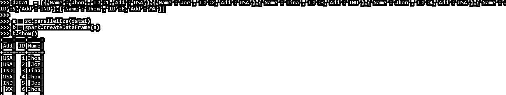
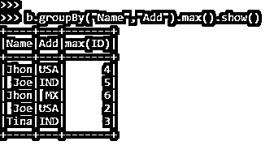
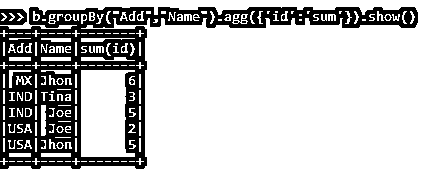
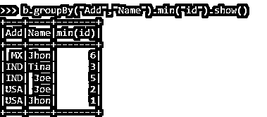
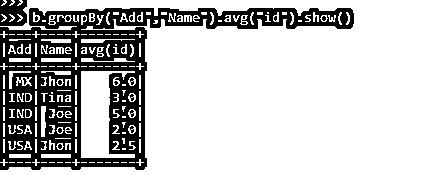
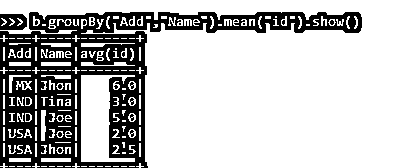

# 多列 PySpark 分组

> 原文：<https://www.educba.com/pyspark-groupby-multiple-columns/>


## PySpark groupby multiple columns 简介

PYSPARK GROUPBY MULITPLE COLUMN 是 PYSPARK 中的一个功能，它允许根据 SPARK 应用程序中的多个列值对多行进行分组。Group By 函数用于根据某些条件对数据进行分组，最终的聚合数据显示为结果。PySpark 中的 Group By 只是对 Spark 数据帧中的行进行分组，这些数据帧中的一些值可以进一步聚合到某个给定的结果集中。

相同的数据按组排列，并根据分区和条件对数据进行相应的洗牌。此条件可以基于多列值。PySpark Group By 也支持多列数据的高级聚合。在数据帧上执行后分组；返回类型是一个关系分组数据集对象，它包含聚合函数，我们可以从中聚合数据。

<small>网页开发、编程语言、软件测试&其他</small>

**py spark group by multiple columns 的语法**

PYSPARK GROUPBY 函数的语法是:-

```
b.groupBy("Name","Add").max().show()
```

*   b:py spark 数据帧
*   **ColumnName:** 需要进行 GroupBy 操作的 ColumnName 接受多个列作为输入。
*   **max()** 一个样本聚合函数

**截图:-**


### 多柱 PySpark 组的工作原理

让我们看看 GROUPBY 函数在 PySpark 中是如何工作的，它有多列:-

GROUPBY multiple column 函数用于根据在 PySpark 应用程序中对 RDD /数据帧进行操作的同一个键值对数据进行分组。多列有助于在 PySpark 数据框上更精确地对数据进行分组。

基于多个列的具有相同关键字的数据被混洗在一起，并被带到可以基于给定的列值分组在一起的位置。洗牌发生在整个网络上，这使得操作成本有点高。

具有相同键的组合在一起，并根据条件返回值。

GroupBy 语句通常与 count、max、min、avg 等聚合函数一起使用，然后对结果集进行分组。

Group By 可用于将多个列和多个列名组合在一起。Group By 为组合在一起的每个组合返回一行，聚合函数用于计算分组数据的值。

### 多列 PySpark 分组示例

让我们看一些 PYSPARK GROUPBY 多列函数如何工作示例

让我们首先创建一个简单的数据框，我们希望对其使用过滤操作。

数据帧的创建:-

```
data1 = [{'Name':'Jhon','ID':1,'Add':'USA'},{'Name':'Joe','ID':2,'Add':'USA'},{'Name':'Tina','ID':3,'Add':'IND'},{'Name':'Jhon','ID':4,'Add':'USA'},{'Name':'Joe','ID':5,'Add':'IND'},{'Name':'Jhon','ID':6,'Add':'MX'}]
a = sc.parallelize(data1)
b = spark.createDataFrame(a)
b.show()
```

**输出:**




让我们从一个简单的 groupBy 代码开始，它使用多列过滤数据框中的名称

```
b.groupBy("Name", "Add")
```

返回类型是 GroupedData 对象

```
pyspark.sql.group.GroupedData object at 0x0000022C66668908>
```

这将使用数据框的名称和地址对元素进行分组。

具有相同关键字的元素被组合在一起，并显示结果。

后期汇总功能，可以显示数据。这里我们使用 Max 函数，它将给出数据的最大 ID post 组。

```
b.groupBy("Name","Add").max().show()
```

**输出:**




让我们通过创建一个包含多个列的数据框并使用聚合函数来更准确地理解这一点，在这里，我们将尝试对单个列中的数据进行分组，并对结果进行分析。

```
data1 = [{'Name':'Jhon','ID':2,'Add':'USA'},{'Name':'Joe','ID':3,'Add':'USA'},{'Name':'Tina','ID':2,'Add':'IND'}]
```

创建一个示例数据，字段为 Name、ID 和 ADD。

```
a = sc.parallelize(data1)
```

RDD 是使用 sc.parallelize 创建的

```
b = spark.createDataFrame(a)
```

使用 Spark.createDataFrame 创建了 DataFrame。

作为聚合函数的 SUM 将显示为输出。

```
b.groupBy("Add","Name").agg({'id':'sum'}).show()
```

**输出:**




让我们使用 groupBy 使用多个列来查看更多的聚合函数。

获取最少的数据。

```
b.groupBy("Add","Name").min("id").show()
```

**输出:**




使用多列获得平均值

```
b.groupBy("Add","Name").avg("id").show()
```

**输出:**




通过对多列进行分组来获取数据的平均值。

```
b.groupBy("Add","Name").mean("id").show()
```

**输出:**




这些是在 PySpark 中使用 multiple 的 GroupBy 函数的一些例子。

**注:**

1.PySpark Group By Multiple Columns 对多个列进行操作，将数据分组在一起。

2.PySpark Group By Multiple Columns 允许通过基于 PySpark 中的列对数据进行分组来进行数据混排。

3.PySpark Group By Multiple Column 使用聚合函数来聚合数据，并显示结果。

4.PySpark 按多列分组有助于数据更加精确，可用于进一步的数据分析。

### 结论

从上面的文章中，我们看到了 PySpark 中 groupBy 操作的使用。通过各种示例和分类，我们试图理解 GROUPBY 方法如何在 PySpark 中处理多个列，以及在编程级别使用了什么。

我们还看到了 Spark 数据框架中 GroupBy 的内部工作和优点，以及它在各种编程目的中的用途。此外，语法和例子帮助我们更准确地理解函数。

### 推荐文章

这是 PySpark groupby 多个专栏的指南。这里我们讨论 Spark 数据框架中 GroupBy 的内部工作和优点。您也可以看看以下文章，了解更多信息–

1.  [PySpark 并行化](https://www.educba.com/pyspark-parallelize/)
2.  [PySpark 直方图](https://www.educba.com/pyspark-histogram/)
3.  [PySpark substring](https://www.educba.com/pyspark-substring/)
4.  [PySpark 回合](https://www.educba.com/pyspark-round/)


