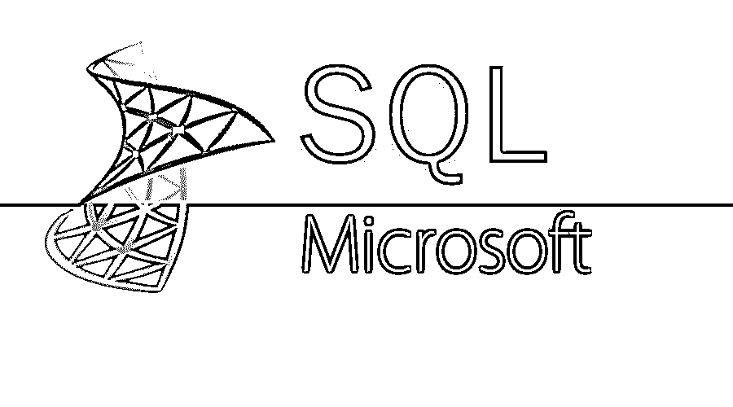

# SQL 是微软的吗？

> 原文：<https://www.educba.com/is-sql-microsoft/>

## SQL 是微软的吗？

不，SQL 不是微软。SQL 是一种结构化查询语言。SQL 有不同的产品。SQL 的产品之一是微软的产品。让我这样比较一下，SQL 是一台笔记本电脑，不同公司的产品都是笔记本电脑，如苹果、戴尔、惠普。同样，SQL 是一种数据库语言，像 Oracle 这样的公司有 MYSQL，IBM 有 DB2，微软有 SQL-Server 或 MS Server。

### SQL 是一个数据库

数据库是有组织的数据集合。数据库是一个电子系统，它允许数据被容易地访问、操作和更新。我们在数据库中以表格的形式存储数据。行和列形式的数据称为表格。我们将结构化数据存储在数据库中。让我们以脸书为例。它需要存储、操作和呈现与会员、他们的朋友、会员活动、消息、广告以及他们数据库中更多内容相关的数据。所有关系数据库管理系统，如 Oracle、SQL Server、MySQL、MS Access、DB2、Sybase、Informix 和 Postgres，都使用 SQL 作为它们的标准数据库语言。

<small>Hadoop、数据科学、统计学&其他</small>

### 为什么 SQL 很重要？

1.  SQL 之所以广泛流行和重要，是因为以下原因:
2.  SQL 允许你描述和访问 RDBMS 中的数据。
3.  SQL 允许您通过 SQL 模块、库和不同的连接器连接其他语言，如 Java、C、Python。
4.  SQL 允许您连接不同的表，并设置权限、过程和视图。

### 结构化查询语言的不同产品

*   **Oracle:**Oracle 的最新[版本 12c 专为云而设计，可以托管在一台或多台服务器上，它支持管理拥有数十亿条记录的数据库。](https://www.educba.com/oracle-versions/)
*   **微软:**微软 SQL Server 2016，微软将其应用于 [Linux 以及基于 Windows](https://www.educba.com/linux-vs-windows/) 的平台。这个数据库引擎同时在基于云的服务器和本地服务器上工作。
*   MySQL: 它是基于 web 的应用程序中最流行的数据库之一，并且是开源数据库。它是免费软件，但经常更新功能和安全改进。
*   **IBM- DB2:** IBM，DB2 是一个具有 NoSQL 功能的数据库引擎，它可以读取 JSON 和 XML 文件。

### SQL Server

SQL Server 是微软的关系数据库管理系统(RDBMS)。这是一个功能齐全的数据库，主要用于与竞争对手 Oracle Database (DB)和 MySQL 竞争。它支持企业 It 环境中各种各样的交易处理、商业智能和分析应用。它是三种市场领先的数据库技术之一，另外两种是 Oracle 数据库和 IBM 的 DB2。Microsoft SQL Server 提供不同的版本和功能来满足各种用户需求。以下是一些版本:

*   **企业版:**它是为大型企业和复杂的数据需求、基于 web 的数据库和数据仓库而设计的。你需要支付一大笔钱来获得许可证。
*   标准版:旨在支持电子商务和数据仓库，面向中小型组织。与企业版相比，许可成本更低。
*   工作组版:这个版本的数据库面向小型组织和初创企业。作为 web 服务器和本地使用的后端数据库，它不支持大小和用户限制。
*   **Express Edition:** 是微软提供的免费版本，主要用来替代 Access 数据库。在此版本中，用户的大小和数量受到限制。
*   **开发者:**这个版本是为了调侃和应用开发。这是一个单用户安装。
*   紧凑:这个版本是为独立应用程序设计的，它也是开源软件。

### Microsoft SQL Server 业务方面

Microsoft SQL Server 是世界上最具创新性的产品之一，能够满足中高层组织所有部门的业务需求。它正在彻底改变处理不同类型数据的业务。微软正在将[机器学习和人工智能](https://www.educba.com/machine-learning-vs-artificial-intelligence/)引入他们的数据库。Microsoft SQL Server 旨在帮助您的企业实现保护数据安全、易于访问和防止未经授权的访问的目标。这是因为我们正在处理大量的机密数据、业务数据、客户数据和财务数据。

### SQL Server 是一个数据库

SQL Server 是微软的关系数据库管理系统 RDBMS。该系统旨在管理和存储信息，以应对大型企业和复杂的数据需求。Microsoft SQL Server 系统通过交互式和用户友好的 GUI 支持各种商业智能操作、分析操作和事务处理。存储在服务器上的信息或数据存储在关系数据库中。它是行和列形式的结构化数据。由于 Microsoft SQL Server 不仅仅是一个数据库，它还包括一个用于处理数据管理的管理工具。SQL 代表结构化查询语言，一种管理服务器的计算机语言。Microsoft SQL Server 是致力于结构化查询语言的产品。Microsoft SQL server 不断改进他们的模型，并不断升级新功能。

### 比较 SQL 和 Microsoft SQL Server

SQL 和 Microsoft SQL Server 的存储机制是相同的。它们都是关系数据库管理系统。它们都以行和列的形式存储数据。它们都存储结构化数据。任何从事 SQL 工作的数据库开发人员都可以很容易地接受 Microsoft SQL Server。他们有相似的代码来查询、处理和分析数据。与 SQL 相比，Microsoft SQL Server 在技术上更先进。它得到了更好的数据交互管理。

### 结论

SQL 是一种语言，而微软是一家世界领先的公司，其 SQL 产品是微软 SQL Server。Microsoft SQL Server 既快又稳定。该引擎提供了调整和跟踪性能水平的能力，这可以减少资源的使用。Microsoft SQL Server 允许您在移动设备上访问可视化效果。它工作得非常好，并适合与其他微软产品。Microsoft SQL Server 有许多不同的版本，可以满足不同的工作负载和需求。

### 推荐文章

这是一个指南是 SQL 微软。在这里，我们讨论 SQL 的基本概念，如 SQL 的不同产品，SQL 的不同版本，SQL 的重要性等。您还可以浏览我们推荐的其他文章——

1.  [SQL Server 面试常见问题](https://www.educba.com/sql-server-interview-questions/)
2.  [备忘单 MySQL](https://www.educba.com/cheat-sheet-mysql/)
3.  [备忘单 SQL](https://www.educba.com/cheat-sheet-sql/)
4.  [PostgreSQL 面试问题](https://www.educba.com/postgresql-interview-questions/)

