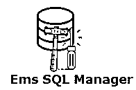
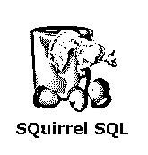
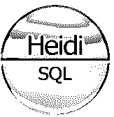

# SQL 管理工具

> 原文：<https://www.educba.com/sql-management-tools/>

## SQL 管理工具简介

SQL 或结构化查询语言是数据库中广泛使用的数据库管理编程语言，如 MySQL DB、Oracle DB、SQLite、MS SQL、MongoDB 等。目前市面上各种类型的 SQL 管理工具有 DBComparer、EMS SQL Manager、Firebird、Adminer、SQuirrel SQL、DBeaver、SQLite 数据库浏览器、DBVisualizer、HeidiSQL、FlySpeed SQL Query 等。这些工具中的每一个都有自己的个性&用于数据库/ SQL 管理过程的效率和高性能的有益特性。有许多和一些被广泛采用的 SQL 管理工具，简要解释如下

### 不同的 SQL 管理工具

不同的管理工具包括以下组件:

<small>Hadoop、数据科学、统计学&其他</small>

#### 1.管理员

Adminer 是一个 DB 管理工具，通过它，您可以使用 web 界面管理数据库、表、关系、权限、用户和其他组件。这是一个原子 PHP 文件，就像 Apache 服务器的 phpMyAdmin 一样，它支持上面提到的许多不同类型的数据库。您可以连接到服务器，使用服务器名称、登录凭证和数据库名称登录到数据库，然后管理数据库和表。

#### 2.数据比较器

DBComparer 是一个数据库比较工具，用于分析 Microsoft SQL Server 数据库结构或模式中的变化和差异。这样，您可以比较数据库组件，如表、列、索引、主键和外键、角色、用户等。

它允许您选择两个数据库，根据用户指定的属性和组件对它们进行比较，并显示两个不同数据库对象或组件之间的 SQL 差异。它还带有一个内置的 SQL 脚本编辑器，可以突出显示语法。

#### 3.EMS SQL 管理器

除了 SQL 管理工具的一般功能外，该工具还:

*   完全支持 PostgreSQL
*   拥有用于构建查询的可视化工具。
*   具有相对更安全的管理。
*   导入和导出数据库的功能

通过集成上述功能，这为 MS SQL Server Management Studio 提供了一个非常好的替代方案。

#### 4.火鸟

Firebird 是一个轻量级开源 RDBMS 管理工具，适用于 Windows 和 Linux。火鸟的几个突出特点如下

1.  存储过程和触发器的成熟实现。
2.  所有交易都符合 ACID 属性。
3.  具有增量备份功能。
4.  范围不同的访问方法，如基于 API，ODBC，Python 等。

Firebird 不愿成为交易破坏者，它的一个缺点是没有管理数据库的前端或用户界面。然而，你可以使用一些第三方软件，比如 FlameRobin 和 TurboBird。

#### 5.松鼠 SQL

SQuirrel SQL Client 是一个基于 Java 的 SQL 管理工具，专门管理 JDBC (Java 数据库连接)兼容的数据库。使用此功能可能需要用户配置必要的驱动程序定义(指定用于 JDBC 的驱动程序)和别名，以便连接到数据库。像其他，这也支持不同的数据库，如 Oracle，MSSQL，MySQL，PostgreSQL 等。

#### 6.SQLite 数据库浏览器

SQLite 数据库浏览器是一个 SQL 管理工具，帮助您创建和管理 SQLite 数据库。除了数据库管理工具的其他通用功能之外，它还具有从各种数据库导入和导出数据的功能。这个管理工具的附加价值在于它是一个开源的 SQL 管理工具。

#### 7.DBeaver

DBeaver 是另一个 SQL 管理工具，它拥有所有的通用特性，如创建、编辑、查询执行、er 图设计等。但是，这个工具或多或少是许多开发人员使用的通用数据库工具，它占用的内存非常少。任何数据库，如 MySQL、Oracle、IBM DB2、PostgreSQL 等。这是 JDBC 兼容的，可以使用 DBeaver 进行管理。这个数据库管理工具还提供了独立开发插件的空间，这些插件将为该工具增加更多的功能。

#### 8.DBVisualizer

DBVisualizer 是另一个通用数据库管理工具，可以处理任何符合 JDBC 标准的数据库，如 MySQL、Informix 等。顾名思义，它有一个特性:

*   包括一个数据库浏览器，您可以在其中浏览数据库的不同对象，使用一些可视化工具来创建和编辑数据库并执行查询。
*   这也有一个带有自动完成选项的 SQL 脚本编辑器。
*   这些帮助数据库管理员实现存储和安全策略。
*   这可以在不同的平台上运行，比如 Windows、Mac 和 Linux。

这形成了一个伟大的 SQL 管理工具，因为它有一个伟大的用户界面，所有的视觉辅助，使其使用非常容易和直观。

#### 9.HeidiSQL

HeidiSQL 是一个 SQL 管理工具，专门支持 MS SQL、MySQL 和 PostgreSQL 数据库。像其他管理工具一样——

*   用户可以创建、编辑和查看表格。
*   设置程序、触发器、预定事件等
*   其他功能包括:
    *   还存在从单一窗口管理多个数据库服务器的情况。
    *   跨数据库的导出和导入选项。
    *   批量编辑。
    *   数据库设计或模式优化功能。
    *   查询执行工具也很方便。

这个工具有一个很好的可视化设置，一旦用户连接到数据库，表，主键和外键，索引等。并且用户可以容易地操作它们。

#### 10.FlySpeed SQL 查询

FlySpeed SQL Query 是一个 SQL 管理工具，它可以帮助您连接到任何数据库，并具有相同的网格视图以及 SQL 管理工具的所有其他通用属性、特性和功能。这也允许您自定义表单视图。有一种叫做“查询构建器”的东西，你可以用它来构建和执行 SQL 查询。

### 结论

数据库管理本身就是一项伟大的技术，它使生活变得更加容易。由于数据库的广泛使用，使用这样的 SQL 管理工具是非常必要的；尤其是由数据库管理员来处理和管理应用软件生态系统中的多个数据库。

### 推荐文章

这是一个 SQL 管理工具指南。这里我们讨论了基本概念、定义和一些有用的 SQL 管理工具。你也可以浏览我们推荐的其他文章来了解更多信息

1.  [什么是 SQL 注入？](https://www.educba.com/what-is-sql-injection/)
2.  [Java 中的 AWT 是什么？](https://www.educba.com/what-is-awt-in-java/)
3.  [什么是僵尸网络及其用途？](https://www.educba.com/what-is-botnet/)
4.  [Redux 是什么？|学习基础知识](https://www.educba.com/what-is-redux/)

