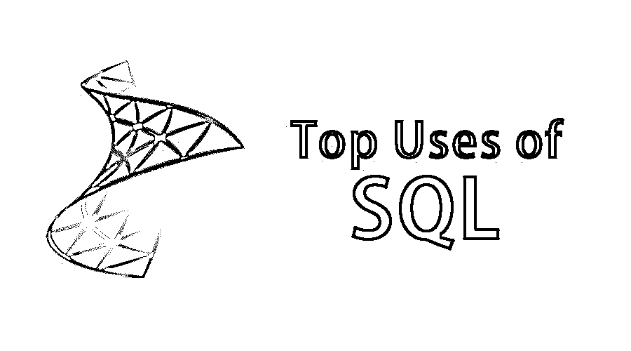

# SQL 的使用

> 原文：<https://www.educba.com/uses-of-sql/>

## SQL 使用简介

SQL 或结构化查询语言专门由商业专业人员或程序开发人员用来管理、更新、维护和操作用于商业决策的数据库或表格。它通常用于获取数据，更新表的内容，或者使用任何类型的数据库工具对数据库或表的结构进行操作，这些工具将有一个用户界面来应用对数据库的操作。SQL 可用于关系型和多维型数据库。SQL 是一种声明性语言，这意味着它是一种编程范式，一种构建计算机程序的结构和元素的风格，这些程序表达计算的逻辑，而不描述其控制流。

下面列出了一些著名的数据库:

<small>Hadoop、数据科学、统计学&其他</small>

| **来源** | **俗名** | **全名** |
| **ANSI/ISO 标准** | SQL/PSM | SQL/持久存储模块 |
| Interbase / Firebird | PSQL | 过程 SQL |
| **IBM DB2** | SQL PL | SQL 过程语言(实现 SQL/PSM) |
| **IBM Informix** | 声压级 | 存储过程语言 |
| **IBM 网易** | NZPLSQL[20] | (基于 Postgres PL/pgSQL) |
| **无效** | PSQL[21] | 无效的过程 SQL(实现 SQL/PSM 和 PL/SQL) |
| **微软/赛贝斯** | [T-SQL](https://www.educba.com/what-is-t-sql/) | Transact-SQL |
| **Mimer SQL** | SQL/PSM | SQL/持久存储模块(实现 SQL/PSM) |
| **MySQL** 的实现 | SQL/PSM | SQL/持久存储模块(实现 SQL/PSM) |
| **MonetDB** | SQL/PSM | SQL/持久存储模块(实现 SQL/PSM) |
| **NuoDB** | 法定病假工资 | Starkey 存储过程 |
| **甲骨文** | PL/SQL | 过程语言/SQL(基于 Ada) |
| **PostgreSQL** | PL/pgSQL | PostgreSQL(实现 SQL/PSM) |
| **SAP R/3** | ABAP | 高级商业应用程序编程 |
| **SAP HANA** | sql 脚本 | sql 脚本 |
| **赛贝斯** | Watcom-SQL | SQL Anywhere Watcom-SQL 方言 |
| **Teradata** | 声压级 | 存储过程语言 |

### SQL 的使用

下面给出的例子基于虚拟表，表名为“student_records ”,包含 id、name、address 和 mobile 列。

**约束:**“id”用作表的主键，还有一个名为“mobile”的列，该列只包含唯一数据；

#### 1.DQL

它代表数据查询语言。它用于从数据库中检索数据。

SQL 语句是 SELECT。

**举例:**

`SELECT * from student_records;`

#### 2.数据定义语言

它代表[数据定义语言](https://www.educba.com/data-definition-language/)。它用于定义数据库模式，从而处理数据库模式的描述，并用于在数据库中创建和修改数据库对象的结构。因此，SQL 语句是创建、删除、更改、截断、注释、重命名。

**举例:**

`CREATE TABLE student_records
(id integer NOT NULL DEFAULT,
name character varying,
address character varying,
mobile numeric,
CONSTRAINT student_records_pkey PRIMARY KEY (id)
)
DROP TABLE student_records;
ALTER TABLE student_records ALTER COLUMN mobile character varying;`

#### 3.DoctorofModernLanguages 现代语言博士

它代表[数据操作语言](https://www.educba.com/data-manipulation-language/)。它用于存储、修改、删除和更新数据库中的数据。因此 SQL 语句是 INSERT、UPDATE 和 DELETE。

**举例:**

`INSERT into student_records values (1,”name”,”address”, mobile);
UPDATE student_records set address = “new address” where name= “name”;
DELETE from student_records where mobile = [enter_mobile_number];
TRUNCATE table student_records;`

#### 4.民法博士

它代表[数据控制语言](https://www.educba.com/data-control-language/)。它用于授予对存储在数据库中的数据的访问权限。

SQL 语句被授予和撤销。

**语法:**

`REVOKE privilege_name
On object_name
From {user_name | PUBLIC | role_name};
GRANT privilege_name
On object_name
To {user_name | PUBLIC | role_name}
[WITH GRANT OPTION];`

**NOTE:** To use GRANT command-specific role_name should be created first.

#### 5.数据库事务管理

事务管理是指维护与数据库相关的事务，即遵循数据库 ACID 属性的基本规则。交易只有两种结果，要么成功，要么失败。因此，SQL 语句是事务、提交、回滚、保存点。

#### 6.过程、用户定义的函数、触发器、索引等

我们可以根据需求编写过程、自定义函数、触发器、索引、[游标，这些需求无非是 SQL 语句，使我们的工作容易满足业务需求。](https://www.educba.com/cursors-in-sql/)

#### 7.报告目的

从每个项目都有的报表角度来看，SQL 查询非常重要。我们可以为独立的报告编写查询，也可以为报告提取数据。

#### 8.人工分析

当需要人工干预时，SQL 查询对于分析非常重要。通过使用 SQL 查询，我们可以从结构化数据中过滤出必要的数据，并将其用于分析。

#### 9.NTC 托管的 SQL

甚至 MySQL 托管服务也提供了构建强大网站、基于网络的应用程序和程序的能力。MySQL 开源数据库解决方案并坚持速度、稳定性和可扩展性，那么就需要 MySQL 托管解决方案。

#### 10.SQL 连接

SQL join 是一种将两组数据(即两个或多个表)中的数据组合起来的指令。

*   (内部)联接:将两个表中匹配的值作为输出返回。
*   左(外)连接:它返回左表的所有记录和右表的匹配记录作为输出。
*   右(外)连接:它返回右表的所有记录，并将左表的匹配记录作为输出。
*   完全(外部)连接:如果表中有匹配项，即左表或右表，则返回所有记录。

#### 11.SQL 联合

两个或多个 SELECT 语句的结果集可以通过 UNION 连接。

#### 12.SQL 通配符

[通配符是 SQL](https://www.educba.com/wildcard-in-sql/) 中的特殊字符，用于替换字符串中的任何其他字符。

SQL 通配符运算符:“%”和“_”称为通配符运算符。

注意:

*   %–表示字符值中的零个、一个或多个字符(过滤时使用)。
*   _–表示单个字符。

### 结论

因此，最后可以得出结论，即使在技术快速发展和市场上没有 SQL 数据库的今天，SQL 的使用仍然对结构化数据起着重要的作用。SQL 提供了使用 SQL 查询来查询表格数据的灵活性，这在许多方面都有很大的帮助。

### 推荐文章

这是使用 SQL 的指南。这里我们已经用例子解释了 SQL 的基本概念和不同用法。您也可以看看以下文章——

1.  [SQL Server vs PostgreSQL](https://www.educba.com/sql-server-vs-postgresql/)
2.  [SQL 是微软吗？](https://www.educba.com/is-sql-microsoft/)
3.  [备忘单 MySQL](https://www.educba.com/cheat-sheet-mysql/)
4.  [SQL Server 职业生涯](https://www.educba.com/careers-in-sql-server/)

