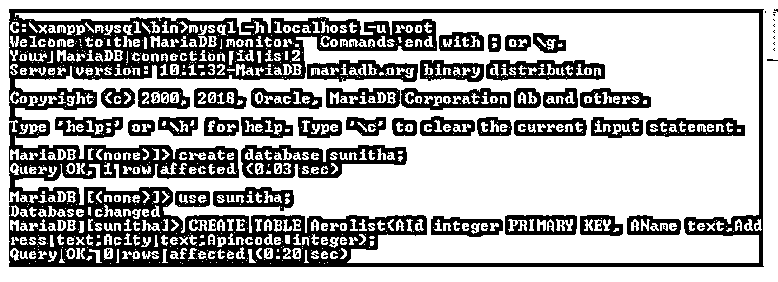
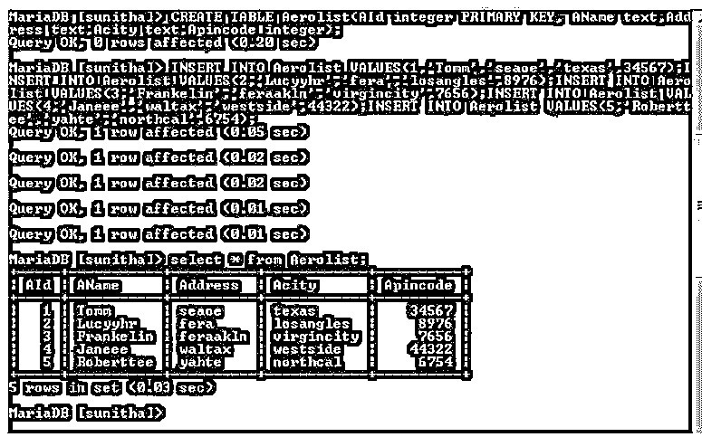
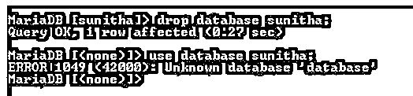
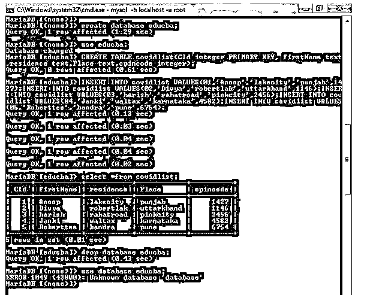

# SQL 删除数据库

> 原文：<https://www.educba.com/sql-drop-db/>


## SQL DROP DB 简介

下面的文章提供了 SQL DROP DB 的概要。可以使用 DROP DATABASE 语句删除现有的 SQL 数据库。删除数据库需要将一个数据库链接到主数据库(Tomcat、Apache)。此时只能删除一个数据库，并且 DROP DATABASE 命令必须是 SQL 批处理中的唯一语句。

### 关键要点

*   当数据库被删除时，明确分配给数据库的特权不会立即被删除。它们必须被手动丢弃。
*   数据库名称在 RDBMS 中应该总是不同的。

### 什么是 SQL Drop Database？

DROP DATABASE 语句永远忽略数据库和所有相关的表。因此，人们必须极其谨慎地使用这种说法。通过在删除数据库后检查数据库列表，可以再次检查数据库是否已经被正确删除。

<small>Hadoop、数据科学、统计学&其他</small>

**代码:**

```
Create database db name; // Creates a database
Use database; // Using a database to store a records
Show databases; // Displays available databases;
DROP database ; // Deletes a particular database.
```

### 如何使用 SQL Drop Database 语句？

Drop 语句用于数据库系统，在 MySQL 中创建一个单独的房间来放置记录。如果我们不需要数据库供进一步使用或垃圾收集器，我们可以在 SQL 语句中使用 DROP 关键字来完全丢弃系统中的记录。

表结构和相关的统计数据、权限、触发器和限制被完全删除。SQL 视图和存储过程可能会引用 SQL 表。这些存储过程和视图由 SQL Server 保留。我们必须明确地放弃它们。在删除 SQL 表之前，我们需要查看对象依赖关系。

DROP DATABASE 语句的语法如下所示:

删除数据库 db _ name

在该语句中的 DROP DATABASE 关键字之后，用户输入他们希望销毁的数据库名称。

如果我们试图删除一个不存在的数据库，就会产生一个 MySQL 错误。如果我们删除一个不存在的数据库，可以使用 IF EXISTS 选项来防止错误发生。MySQL 会在这种情况下停止语句，而不会抛出错误。

DROP DATABASE 语句返回被破坏的表的数量。

通过使用单个 DROP 语法，我们还可以快速销毁许多数据库:

删除数据库数据库名称 1、[数据库名称 2、…。，Db _ NameN]；

该语句消除了使用几个命令删除各种数据库的需要。如上面的语法所示，我们可以通过插入逗号在一个简短的语句中指定所有的数据库。

DROP DATABASE 语句从指定的数据库位置删除 MySQL 在常规操作中可能生成的文档和文件夹。所有具有以下扩展名的文档都包含在此:BAK、CFGS、DAT、DB 和 IBD。如果在 MySQL 删除了前面提到的项目后，数据库目录中还存在其他文件或目录，则不能删除该目录。在这种情况下，必须小心地删除任何延迟的文件或目录，并发出另一个 DROP DATABASE 语句。删除数据库时，不会删除在数据库中创建的任何临时表。创建临时表的会话在自动删除临时表后结束。

### SQL Drop DB Delete

*   DB Delete 在过滤查询语句时使用 where 子句。SQL drop 不使用 Where 子句来删除数据库。
*   在内存管理上看到 drop 命令时释放内存分配。在 DB 中，即使记录被删除，删除内存空间也不是空闲的，因为它不会删除整个数据库。
*   由于 Drop 命令直接影响数据，因此无法回滚。但是数据库删除可以。
*   使用 SQL 删除查询删除数据库表的全部内容。在目标表上，删除权限是运行删除查询所必需的。如果在 DELETE 中使用 WHERE 子句，Select 权限也是必要的。

### SQL DROP DB 示例

我们将通过两个不同的例子来看看如何删除数据库。

#### 示例#1

**代码:**

```
* Create a table called Aerolist */
CREATE TABLE Aerolist(AId integer PRIMARY KEY, AName text, Address text, Acity text, Apincode integer);
/* Create a few records in this table */
INSERT INTO Aerolist VALUES(1,'Tomm','seaoe','texas',34567);
INSERT INTO Aerolist VALUES(2,'Lucyyhr','fera','losangles',8976);
INSERT INTO Aerolist VALUES(3,'Frankelin','feraakln','virgincity',7656);
INSERT INTO Aerolist VALUES(4,'Janeee','waltax','westside',44322);
INSERT INTO Aerolist VALUES(5,'Roberttee','yahte','northcal',6754);
/* Display all the records from the table */
SELECT * FROM Aerolist;
```

下面的截图显示了如何创建一个数据库。

**输出:**







我们可以在下面的截图中看到，一旦使用 DROP 删除了数据库 Sunitha，我们就不能再使用该数据库了。这就是错误语句显示未知数据库的原因。




我们可以看到，如果我们尝试使用现有的表，它会像未知数据库一样向我们显示报告。因为我们已经完全删除了数据库。


#### 实施例 2

**代码:**

```
BEGIN TRANSACTION;
/* Create a table called covidlist */
CREATE TABLE covidlist(CId integer PRIMARY KEY, firstName text,residence text,Place text,cpincode integer);
/* Create a few records in this table */
INSERT INTO covidlist VALUES(01,'Anoop','lakecity','punjab',1427);
INSERT INTO covidlist VALUES(02,'Divya','robertlak','uttarkhand',1146);
INSERT INTO covidlist VALUES(03,'harish','rahatroad','pinkcity',2456);
INSERT INTO covidlist VALUES(04,'Janki','waltax','karnataka',4582);
INSERT INTO covidlist VALUES(05,'Roberttee','bandra','pune',6754);
COMMIT;
/* Display all the records from the table */
SELECT * FROM covidlist;
```

**输出:**




### 常见问题解答

下面是提到的常见问题:

#### Q1。删除数据库的目的是什么？

**答案:**

使用 DROP DATABASE 语句可以完全删除数据库及其所有表。

#### Q2。您有一个包含一些要输入的字段的表，并且已经删除了数据库。创建一个将“米”转换为“厘米”的函数。你能进一步创建一个函数吗？

**答案:**

否，当用户删除数据库时，我无法创建函数或更改表字段。因此，我们不能访问表来完成任务。

### 结论

我们已经通过示例详细了解了 DROP 命令的用法及其权限。

### 推荐文章

这是一个 SQL DROP DB 的指南。这里我们讨论一下入门，如何使用 SQL drop database 语句？示例和常见问题。您也可以看看以下文章，了解更多信息–

1.  [desc 的 SQL 订单](https://www.educba.com/sql-order-by-desc/)
2.  [SQL 执行](https://www.educba.com/sql-execute/)
3.  [PL/SQL 不等于](https://www.educba.com/pl-sql-not-equal/)
4.  [SQL 不在](https://www.educba.com/sql-not-in/)中


