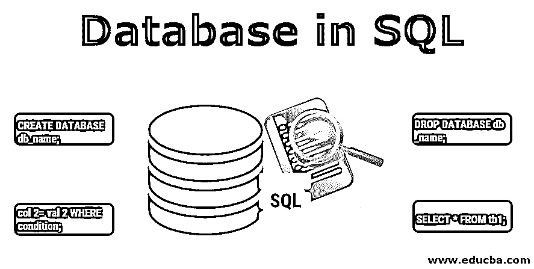

# SQL 中的数据库

> 原文：<https://www.educba.com/database-in-sql/>

## SQL 数据库简介

一种以有组织的形式将数据存储在存储器中的数据结构，便于诸如数据操作和数据的有效管理的功能，具有包含各种表的特定结构。每个表都是唯一的，并且以记录的形式存储独立概念的数据，记录由行表示，表中的列表示字段，表通过称为键的字段链接到其他表，这在 SQL 中称为数据库。

数据库还提供索引以方便访问数据。数据库可以是关系型的和非关系型的，这取决于用户想要存储的信息类型。关系数据库中的数据以行和列的形式存储在表中，而非关系数据库不使用表格格式存储数据；相反，数据以图形、文档、列或键值形式存储。SQL 是一个关系数据库，因此以行和列的格式存储值。SQL 中的每一列都被称为字段，用于存储记录的特定信息。单个实体的信息/数据存储在具有所有列的有效值的记录/行中。在 SQL 中，列具有垂直结构，行具有水平结构。

<small>Hadoop、数据科学、统计学&其他</small>

### 如何用 SQL 创建数据库？

在数据库中存储和访问任何信息之前，第一步是创建数据库。CREATE DATABASE 语句用 SQL 创建数据库。

**语法**

`CREATE DATABASE​ db_name;`

在上面的语法中，db_name 是用户希望赋予新数据库的数据库名称。用户必须拥有管理权限才能创建新的数据库。

**举例:**

`CREATE DATABASE employeeDB;`

它将在 SQL 中创建一个名为 employees 的新数据库。我们还可以使用下面给出的命令检查上面创建的数据库:

`SHOW DATABASES;`

它将显示到那时为止 SQL server 中存在的所有数据库的列表。

### 如何在 SQL 中删除数据库？

删除数据库意味着从 SQL Server 中删除现有数据库。删除不使用的数据库是一个很好的做法，因为这样可以节省内存。DROP 是一个 DDL 命令。SQL DROP DATABASE 语句用于删除特定数据库中的所有表，并删除该数据库。

**语法**

`DROP DATABASE​ db_name;`

在上面的语法中，db_name 是我们要删除的数据库的名称。使用 DROP 命令时必须非常小心，因为 DROP 命令的操作无法回滚。用户必须具有管理员权限才能删除数据库。

**举例:**

`DROP DATABASE employeeDB;`

如果我们试图删除一个不存在的数据库，SQL 将显示一个我们试图删除的缺失数据库的错误。删除任何数据库后，我们可以使用 SHOW DATABASES 进行检查；命令，被删除的数据库将不会出现在可用数据库列表中。

### 如何从数据库中提取数据？

在将数据存储/插入数据库表之后，一个重要的任务是获取数据并以特定的格式向用户显示结果。在 SQL 中，SELECT 语句用于从数据库中检索数据。根据用户对获取数据的要求，可以使用不同形式的 SELECT 语句。

*   要获取数据库的所有数据，需要使用*。
*   为了从数据库中提取特定的列，列名写在 SELECT 关键字之后。
*   为了根据某些条件检索数据，WHERE 子句与 SELECT 语句一起使用。

#### 语法 1:从表中获取所有数据

`SELECT * FROM tb1;`

在上面的语法中，tb1 是我们要从中获取数据的表的名称。(*)用于检索数据库中所有字段/列的数据。

**例#1**

考虑一个名为“Emp_details”的表，它包含下面提到的各种列和数据:

| **Emp_code** | **雇员名称** | **Emp_city** | **Emp_phno** |
| One hundred and one | 拉胡尔 | 诺伊达 | Seven billion eight hundred and ninety-four million five hundred and sixty-one thousand two hundred and thirty-six |
| One hundred and two | 鸭子！鸭子 | 德里 | Nine billion two hundred and thirty-six million five hundred and forty-seven thousand eight hundred and ninety-six |
| One hundred and three | Sonam | 阿格拉 | Nine billion two hundred and fifty-six million three hundred and forty-seven thousand eight hundred and ninety-five |

**例 2**

`SELECT * FROM Emp_details;`

**输出:**

记录数量:3

| **Emp_code** | **雇员名称** | **Emp_city** | **Emp_phno** |
| One hundred and one | 拉胡尔 | 诺伊达 | Seven billion eight hundred and ninety-four million five hundred and sixty-one thousand two hundred and thirty-six |
| One hundred and two | 鸭子！鸭子 | 德里 | Nine billion two hundred and thirty-six million five hundred and forty-seven thousand eight hundred and ninety-six |
| One hundred and three | Sonam | 阿格拉 | Nine billion two hundred and fifty-six million three hundred and forty-seven thousand eight hundred and ninety-five |

#### 语法 2:从表中提取特定的列

`SELECT column 1, column 2, column... from tb1;`

**例子**

`SELECT Emp_code, Emp_name, Emp_address from Emp_details;`

**输出:**

记录数量:3

| **Emp_code** | **雇员名称** | **Emp_city** |
| One hundred and one | 拉胡尔 | 诺伊达 |
| One hundred and two | 鸭子！鸭子 | 德里 |
| One hundred and three | Sonam | 阿格拉 |

#### 语法 3:根据给定的条件获取数据

| **SELECT * from tb1 其中 Emp _ code = 103** |  |
|  **输出:**记录数量:3 |  |  |
| **Emp_code** | **雇员名称** | **Emp_city** | **Emp_phno** |
| One hundred and three | Sonam | 阿格拉 | Nine billion two hundred and fifty-six million three hundred and forty-seven thousand eight hundred and ninety-five |

### 如何用 SQL 更新数据库？

存储在表中的值不必在将来保持不变。例如，在一个雇员表中，电话的雇员地址可以被改变，并且一旦被报告就需要在数据库中被改变。为了更新数据库中表的值，在 SQL 中使用了 update 语句。UPDATE 根据用户给定的特定条件，一次修改数据库中一个或多个记录的值。

**语法:**

`UPDATE tb1 SET col 1= val 1, col 2= val 2 WHERE condition;`

在上面的语法中，“tb1”是我们要对其数据进行更新的表的名称，“col 1”、“col 2”是我们要修改其值的表的列的名称，“condition”指定了选择行的条件，更新需要基于该条件进行。

**举例:**

`UPDATE Emp_details SET Emp_phno = ‘8746456789’ WHERE Emp_code = 101;`

**输出:**

受影响的行数:1

我们可以通过获取表数据来检查 Emp_code 为 101 的雇员的 Emp_phno 的更新:

| SELECT Emp_code，Emp_phno from Emp_details 其中 Emp _ code = 101 |
| **Output:**记录数量:1 |  |
| **Emp_code** | **Emp_phno** |
| One hundred and one | Eight billion seven hundred and forty-six million four hundred and fifty-six thousand seven hundred and eighty-nine |

### 结论

可以在 SQL 数据库中完成各种操作，可以根据需要以多种形式编写查询来访问数据。因此，在进行任何操作时编写优化的查询并在特定时间仅检索那些所需的记录是非常重要的，并且被认为是一种良好的实践。这提高了执行速度并节省了内存。

### 推荐文章

这是一个 SQL 数据库指南。在这里，我们讨论介绍，如何创建，删除，获取和更新 SQL 数据库。您也可以阅读以下文章，了解更多信息——

1.  [SQL 服务器约束](https://www.educba.com/sql-server-constraints/)
2.  [什么是 SQL 注入？](https://www.educba.com/what-is-sql-injection/)
3.  [如何将数据库连接到 MySQL？](https://www.educba.com/connect-database-to-mysql/)
4.  [PostgreSQL 字符串函数](https://www.educba.com/postgresql-string-functions/)

