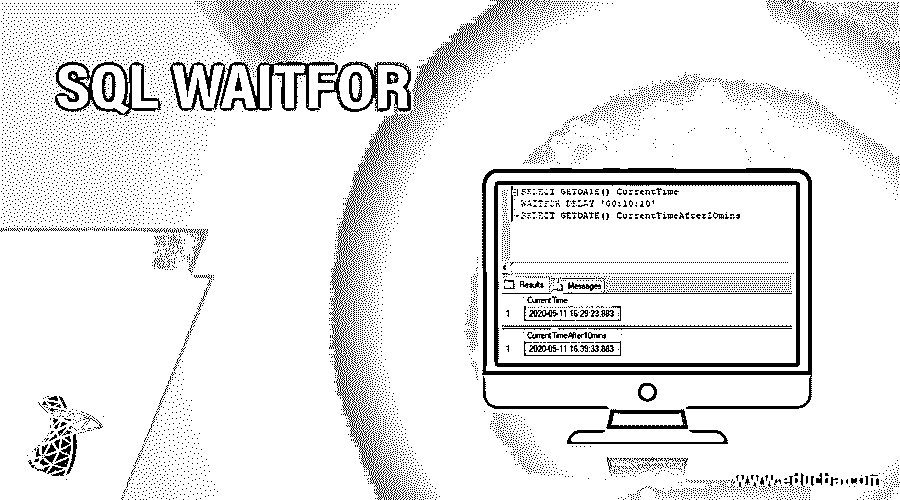
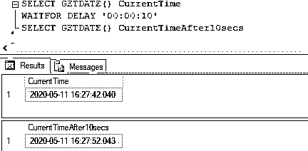
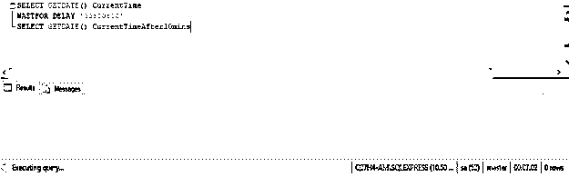
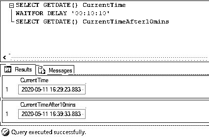
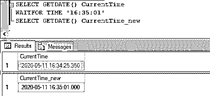
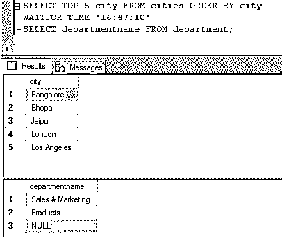

# SQL 等待时间

> 原文：<https://www.educba.com/sql-waitfor/>

## SQL WAITFOR 简介

标准查询语言(SQL)中的 WAITFOR 是一个命令，用于阻止或延迟批处理、事务或存储过程的执行一段特定的时间，或者直到返回前面提到的语句的修改或结果。这就像让处理器在开始执行下一个查询之前小睡一会儿。WAITFOR 与 DELAY 和 TIME 关键字一起使用，将事务的执行延迟一段时间。

但是，我们应该注意，WAIT FOR 只在 SQL SERVER 和 Azure SQL 数据库中有效。对于其他数据库，我们可以使用其他命令，比如 POSTGRESQL 中的 pg_sleep，ORACLE SQL 数据库中的 DBMS_LOCK.sleep。

<small>Hadoop、数据科学、统计学&其他</small>

### 语法和参数

在 SQL server 中使用 WAIT FOR 命令的基本语法如下:

`WAITFOR  {DELAY 'time_to_pass' | TIME 'time_to_execute'} [TIMEOUT]`

上述语法中使用的参数如下:

*   **DELAY:** DELAY 关键字用于指定在执行下一组语句或事务之前必须经过的时间段。最长可达 24 小时。
*   **time_to_pass:** 提到要经过的时间量。它可以用 datetime 数据格式指定，但只使用日期的时间部分。
*   **TIME:** 指定下一批或下一组语句开始执行的时间。
*   **time_to_execute:** 是 WAITFOR 语句应该停止等待的时间。同样，与 time_to_pass 类似，可以用 datetime 格式指定时间，但日期中只包含时间部分。
*   **超时:**服务器应该出来之前等待的最长时间。

### WAITFOR 函数在 SQL 中是如何工作的？

SQL server 中的 WAITFOR 命令通常与两个关键字 DELAY 和 TIME 一起使用。前者用于将查询或事务的执行延迟一段时间，而后者用于在指定的时间执行。

SQL 中的每个 WAITFOR 语句都有一个与之关联的线程。它或多或少有点像操作系统中的进程和资源。因此，如果您在一台服务器上提到多个 WAITFOR 语句，由于饥饿和死锁情况，WAITFOR 语句可能不会按您的计划执行。

我们应该注意，WAITFOR 命令不会对我们的查询的语义进行任何更改。因此，如果您的第一个查询没有返回任何内容，WAITFOR 将一直等待一段前所未有的时间，或者直到超时。因此，在这种情况下提到超时是一个好主意。这将防止其他 WAITFOR 语句的匮乏。

### 实现 SQL WAITFOR 的示例

这里有几个例子可以帮助我们更详细地理解等待 SQL 语句。

#### 示例#1

一个简单的 SQL 查询，说明如何使用 WAITFOR 命令将下一组语句的执行延迟 10 秒。

**代码:**

`SELECT GETDATE() CurrentTime
WAITFOR DELAY '00:00:10'
SELECT GETDATE() CurrentTimeAfter10secs`

**输出:**

**解释:**在上面的例子中，我们已经使用 WAITFOR 命令在延迟 10 秒后延迟执行下一条语句。我们可以注意到，第一个 GETDATE()函数在 16:27:42.040 返回当前日期和时间，下一个 GETDATE()函数在 16:27:52.043 返回当前日期和时间，正好在 10 秒延迟之后。

#### 实施例 2

一个简单的 SQL 查询，说明如何使用 WAITFOR 命令将下一组语句的执行延迟 10 分 10 秒。

**代码:**

`SELECT GETDATE() CurrentTime
WAITFOR DELAY '00:10:10'
SELECT GETDATE() CurrentTimeAfter10mins`

**输出:**上述 SQL 查询将持续执行 10 分 10 秒，等待时间结束后才会返回结果。

**输出:**10 分 10 秒后，查询被执行并返回结果，如下图所示。

#### 实施例 3

简单的 SQL 查询，说明如何使用 WAITFOR 命令在指定时间执行下一组语句。

**代码:**

`SELECT GETDATE() CurrentTime
WAITFOR TIME '16:35:01'
SELECT GETDATE() CurrentTime_new`

**输出:**

**解释:**有时候，我们希望 SQL 查询在指定的时间执行。为此，我们可以使用带有 TIME 关键字的 WAIT FOR 命令。

#### 实施例 4

SQL 查询计划 10 秒后进行选择查询。

**代码:**

`SELECT TOP 5 city FROM cities ORDER BY city
WAITFOR DELAY '00:00:10'
SELECT departmentname FROM department;`

**输出:**

**解释:**在这个例子中，我们有两个查询。第二个选择查询计划在第一个选择查询执行后等待 10 秒后执行，即在第一个查询的第一行返回后执行。

#### 实施例 5

SQL 查询在固定时间安排选择查询。

**代码:**

`SELECT TOP 5 city FROM cities ORDER BY city
WAITFOR TIME '16:47:10'
SELECT departmentname FROM department;`

**输出:**

**解释:**在这个例子中，我们已经使用 time 关键字和 WAIT FOR 命令安排了第二个查询在指定时间的执行。

### 结论

等待 SQL 命令用于阻塞或延迟一组语句、事务、block 等的执行。在特定的时间内。它还可以被编程为在指定的时间调度查询执行。

### 推荐文章

这是一个 SQL 等待指南。在这里，我们讨论一个介绍，语法，它是如何工作的，以及实现正确输出的例子。您也可以浏览我们的其他相关文章，了解更多信息——

1.  [带子句的 SQL](https://www.educba.com/sql-with-clause/)
2.  [带子句的 SQL](https://www.educba.com/sql-with-clause/?source=leftnav)
3.  [SQL HAVING 子句](https://www.educba.com/sql-having-clause/?source=leftnav)
4.  [SQL WHERE 子句](https://www.educba.com/sql-where-clause/?source=leftnav)

