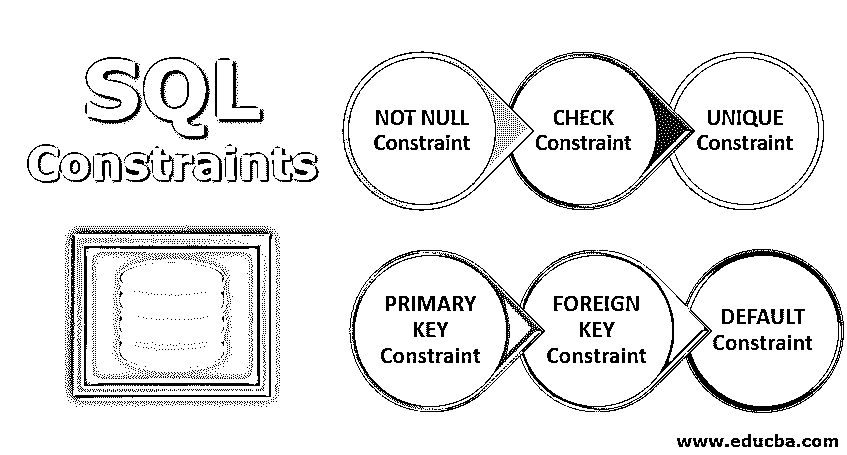

# SQL 约束

> 原文：<https://www.educba.com/sql-constraints/>

## SQL 约束条件简介

SQL 约束是用于创建要在表或数据库的内容上实现的限制的准则，以便记录应该遵守这些规则才能被放置在该表中。这些准则是由业务人员或数据库架构师设计的，目的是组织数据库中的数据，这可以为灵活的未来升级提供保证。这些约束是经过仔细和谨慎设计的，因为它会导致数据库的整体智能设计。

在 SQL 中，我们有许多不同种类的约束。让我们看看本文中的以下几个约束。

<small>网页开发、编程语言、软件测试&其他</small>

*   不为空
*   支票
*   独一无二的
*   主关键字
*   外键
*   系统默认值

### 不同种类的 SQL 约束

下面给出了不同的种类:

#### 1.非空约束

当您不希望该特定列中的任何值为空值时，可以使用此约束。这意味着在表中插入新行时，不能为该列插入 Null 值。因此，该列中的每个字段总是有一个非空值。空值意味着某个特定的字段为空，零或空格等值不属于空值。

让我们看一个例子，创建一个名为 Employee 的表，该表有 5 列，其中 empid、name 和 mobile 列不接受空值。

`CREATE TABLE Employee (
empid INT NOT NULL,
name VARCHAR(20) NOT NULL,
dob DATE,
mobile VARCHAR(10) NOT NULL,
address VARCHAR(20)
);`

#### 2.检查约束

此约束限制了可以在表的特定列中输入的值。为了更好地理解这一点，让我们以考试及格为例。这些标记的值的范围只能是从 35 到 100。为了确保只输入这个范围内的值，我们可以创建一个检查约束。

让我们看一个为雇员的工资创建支票约束的例子。

`CREATE TABLE Employee (
empid INT NOT NULL,
name VARCHAR(20) NOT NULL,
dob DATE,
mobile VARCHAR(10) NOT NULL,
salary INT CHECK (salary >= 15000 AND salary <= 30000),
address VARCHAR(20)
);`

#### 3.唯一约束

应用该约束是为了确保特定的列只接受唯一的值，并且在该列上有这样的约束时不允许重复的值。我们可以在一个表中的不同列上创建多个唯一约束。唯一约束允许输入空值。

让我们看一个实施唯一约束的例子。在本例中，我们在 Employee 表中创建了一个名为 mobile 的列，该列必须是惟一的，不能接受同一个手机号码两次。

`CREATE TABLE Employee (
empid INT NOT NULL,
name VARCHAR(20) NOT NULL,
dob DATE,
mobile VARCHAR(10) NOT NULL UNIQUE,
address VARCHAR(20)
);`

#### 4.主键约束

该约束用于标识特定的一列或一组列，这些列可以唯一地标识表中的一行。有了 PRIMARY KEY 约束，任何行都不能有重复值。我们不能将 NULL 作为这种列的值。尽管 Primary Key 约束和 unique 约束都要求值是唯一的，但当我们不想将列声明为 PRIMARY KEY 但仍希望该列中的值是唯一的时，我们使用 UNIQUE 约束。在一个表中，我们只能有一个主键列或一组列，但是我们可以声明许多单独的列是唯一的。

让我们看一个雇员表的例子，创建惟一的雇员 id；因此，我们可以将 empid 列声明为主键。

`CREATE TABLE Employee (
empid INT NOT NULL PRIMARY KEY,
name VARCHAR(20) NOT NULL,
dob DATE,
mobile VARCHAR(10) NOT NULL UNIQUE,
address VARCHAR(20)
);`

#### 5.外键约束

该约束有助于数据库中一个表中的数据与另一个表中的数据建立关系。外键可以是一列或一组列。例如，让我们考虑两个表，Employee 和 Departments。假设我们有一个名为“描述于雇员”的列，一个名为“离职于部门”的列。然后，如果列匹配，我们可以将离职员工引用到离职部门。在这种情况下，Employee 中的列成为 Department 表中列的外键引用，该列是主键。

`CREATE TABLE Employee (
empid INT NOT NULL PRIMARY KEY,
name VARCHAR(20) NOT NULL,
dob DATE,
mobile VARCHAR(10) NOT NULL UNIQUE,
address VARCHAR(20),
depicted INT FOREIGN KEY REFERENCES Department(depicted)
);`

#### 6.默认约束

该约束用于指定表中特定列的默认值。这样，如果没有为该列显式插入值，数据库引擎总是可以引用指定的默认值，并将其插入到该列中。如果我们插入了一个约束不为 NULL 且约束为 DEFAULT 的列，则不需要显式定义默认值。即使没有给出默认值，特定的行将被插入到表中。

让我们来看一个例子，在这个例子中，我们在地址中输入了默认的值“India”。

`CREATE TABLE Employee (
empid INT NOT NULL PRIMARY KEY,
name VARCHAR(20) NOT NULL,
dob DATE,
mobile VARCHAR(10) NOT NULL UNIQUE,
address VARCHAR(20) DEFAULT ‘India’,
depicted INT FOREIGN KEY REFERENCES Department(depicted),
);`

### 结论

SQL 约束通过为要插入到表中的数据指定限制和规则来帮助开发人员。约束可以在列级应用，只应用于特定的列，也可以在表级应用，将约束应用于整个表。这些约束限制了可以插入到表中的信息种类。这保证了表中数据的正确性和一致性。如果违反了约束所指定的规则，则终止该操作。

### 推荐文章

这是 SQL 约束的指南。这里我们讨论 SQL 约束的介绍和不同种类的 SQL 约束，包括 Not Null、Check、Unique、Primary、Foreign 和 Default 约束。您也可以浏览我们推荐的其他文章，了解更多信息——

1.  [SQL 中的数据库](https://www.educba.com/database-in-sql/)
2.  [SQL 的使用](https://www.educba.com/uses-of-sql/)
3.  [SQL 中的外键](https://www.educba.com/foreign-key-in-sql/)
4.  [MySQL 约束](https://www.educba.com/mysql-constraints/)

