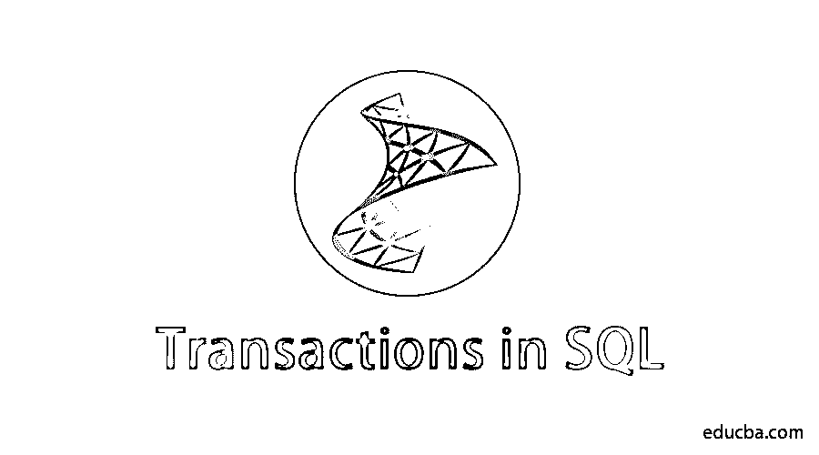
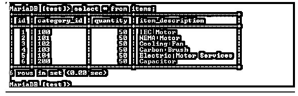
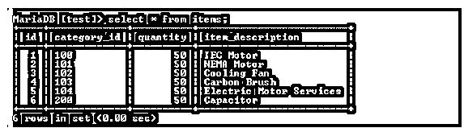
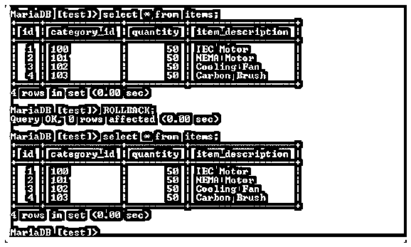

# SQL 交易

> 原文：<https://www.educba.com/transactions-in-sql/>

## SQL 中的事务简介

SQL 中的事务是在一个合理确定的流程中完成的一个或连续的过程集，可以手动执行或通过创建一个自动数据库编程来执行。SQL 中的每个事务都是从一个特定的作业开始的，应该在另一个作业中完成。如果任何或所有作业未完成，则事务状态为“失败”。当且仅当所有作业都成功完成时，事务才被称为“完成”或“成功”。

事务一旦提交，就不能回滚；仅当事务未提交时，它才可以是回滚。[如果所有查询都成功执行，MYSQL 会自动提交](https://www.educba.com/what-is-mysql/)对数据库的更改。要显式地将更改提交到数据库中，首先需要通过命令–

<small>Hadoop、数据科学、统计学&其他</small>

**语法:**设置 auto commit = 0；

### 交易的属性

以下是交易的重要属性:每个事务都必须遵循这些属性。

#### **1。**原子性

事务必须是原子的；意味着应该为某个逻辑单元完成数据操作。此属性确保数据更改完全发生；否则，回滚事务。

#### 2.一致性

一旦交易完成，所有可用的记录将在整个交易中保持一致。此属性确保数据库属性在成功提交后切换状态。

#### 3.隔离

隔离指的是某个逻辑单元上的数据更改不应该影响到另一个单元。它允许事务独立执行。

#### 4.持久性

交易期间所做的更改应该在系统中永久保留。如果出现系统错误，该属性还可以确保数据是否发生更改。

事务的上述属性也称为 ACID 属性。

### 交易步骤

以下是步骤:

#### 1.开始

一个事务可以在多个 SQL 执行中发生，但是所有的 SQL 应该同时运行。如果任何事务失败，那么整个事务将被恢复。启动事务的语句是“启动事务”。开始事务的首字母缩写。

**语法:**开始交易；

#### 2.犯罪

提交将永久反映对数据库的更改。启动事务的语句是“COMMIT”。

**语法:**提交；

#### 3.反转

回滚用于恢复更改，即记录不会被更改，它将处于以前的状态。启动事务的语句是“ROLLBACK”。

**语法:**回滚；

#### 4.保存点

保存点也是一个事务语句。该语句用于在系统中创建一个存储点，以便回滚操作可以达到保存点的状态。

#### 5.释放保存点

RELEASE SAVEPOINT 是一个释放保存点的语句&系统在创建保存点时消耗的内存。

**语法:**释放保存点 SP

注意–SP 是在事务开始之前创建保存点时该保存点的名称。

#### 6.设置交易

SET TRANSACTION 命令用于指定事务属性，例如给定的事务是只读还是读写会话。

**语法**:设置事务【读写 **|** 只读】；

该事务用于在数据库中执行复杂的更改。它主要用于将银行相关的信息转换成关系数据库。

该事务由 MYSQL 引擎 InnoDB 支持。默认情况下，自动提交保持启用状态；这就是为什么无论何时任何 SQL 在执行后执行，提交都会自动发生。

### 使用 SQL 的事务

#### 示例#1

**银行交易:**从个人 A 的储蓄账户&借记 50000 元，并将该金额提交给 A 的贷款账户

**Start Transaction:** 这个 Start Transaction 将所有 SQL 查询转换成一个事务单元。

`UPDATE `account` SET  `balance` = `balance` - 50000 WHERE user_id = 7387438;`

这个 SQL 查询从现有账户余额中扣除金额。

`UPDATE `loan_account` SET  `paid_amount` = `paid_amount` + 50000 WHERE user_id = 7387438;`

这个 SQL 查询将金额添加到用户贷款帐户中。

`Insert into `transaction_details`(`user_id`, ‘amount’)  values (7387438, ‘50000’);`

此 SQL 查询向事务详细信息表中插入一条新记录；该表包含用户所有交易的详细信息。如果所有查询都成功执行，那么需要执行 COMMIT 命令，因为需要将更改永久存储在数据库中。

**提交:**该提交语句将事务调用的更改保存到数据库中。如果任何事务在执行期间失败，那么应该执行 ROLLBACK 命令来恢复整个事务。

**回滚:**任何查询在执行过程中一旦失败，就进行回滚。

#### 实施例 2

**存货交易:**在给定项目表中，有 6 个项目。

执行下面的 START TRANSACTION 语句来启动事务。

现在运行命令集自动提交***=***0*；*禁用自动提交

现在执行下面的语句从 items 表中删除记录

现在表中可用的记录是 4，即从表中临时删除的记录项

现在，执行命令 ROLLBACK 来恢复更改，被删除的记录将在表项中可用，就像开始事务之前一样

同样，如果应用相同的删除操作，那么提交操作之后，它将被永久保存在数据库中

现在我们可以看到，在 ROLLBACK 命令仍然有效之后，记录处于新的状态；这意味着一旦执行了提交操作，更改将无法恢复，因为它会永久地对数据库进行更改；

### 在 SQL 中使用事务的好处

a)使用事务提高性能**；**当使用事务插入 1000 条记录时，在这种情况下，花费的时间会比正常插入少。在正常事务中，每次提交都发生在每次查询执行之后&在事务中，每次提交都会增加执行时间，不需要在每次 SQL 查询之后执行提交语句。最后的提交将一次性永久地反映对数据库的所有更改。此外，如果使用事务，那么恢复更改将比普通事务容易得多。回滚将一次恢复所有更改&将系统保持在以前的状态。

b)事务确保关系数据库中的数据完整性。数据库大多使用多个表来维护数据，在进行更新的同时，可能当时多个表已经发生了变化；如果任何 SQL 查询失败，那么事务将保持数据不变。

### 结论

对于关系数据库中的逻辑单元，使用事务是信息更新的最佳实践。对于事务实现，数据库引擎应该像 InnoDB 引擎一样支持事务。事务作为 SQL 语句的一个单元，可以使用单个 ROLLBACK 语句立即恢复。事务确保数据完整性&提高数据库性能。

### 推荐文章

这是一个 SQL 事务指南。这里我们讨论 SQL 中事务的介绍、属性、步骤和示例，以及在 SQL 中使用事务的好处。您也可以看看以下文章，了解更多信息–

1.  [什么是 SQL](https://www.educba.com/what-is-sql/)
2.  [SQL 管理工具](https://www.educba.com/sql-management-tools/)
3.  [SQL 视图](https://www.educba.com/sql-views/)
4.  [SQL Server 中的联接类型](https://www.educba.com/types-of-joins-in-sql-server/)

