# SQL 管理

> 原文：<https://www.educba.com/sql-administration/>

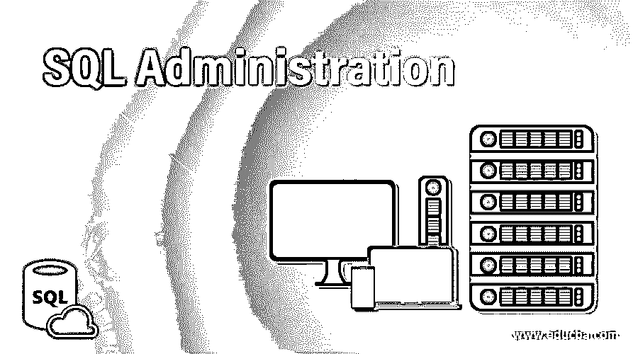

## SQL 管理简介

结构化查询语言(SQL)中的管理包括数据库服务器管理活动。这是一个常用术语，用于执行一些任务，例如为服务器中的用户和组定义角色以及它们各自的特权或权限。它涉及与还原、恢复和备份数据库相关的活动。它包括其他功能，如表空间和 VM(虚拟机)的创建、控制和维护。

在本文中，我们将讨论在 SQL server 数据库中创建和管理用户和组，尤其是 PostgreSQL。然后，我们将关注其他 SQL 管理活动，如数据库恢复和备份创建。最后，我们将了解表空间管理。

<small>Hadoop、数据科学、统计学&其他</small>

### 用于访问管理的 SQL 角色

我们有管理数据库访问权限的角色。

角色可以有两种类型:

1.  **用户角色**:用户是将要使用数据库的人。
2.  **组角色:**而一组用户称为一个组。

例如，如果我们想让学校的学生和教师访问学生数据库。每个学生和老师都将被视为一个用户。他们每个人都可以有一套单独的特权或权利，即他们可以查看、创建或删除什么？但是我们不想保留那么多学生用户，那么我们可以创建一个学生组，给他们类似的权限。

要在 pgSQL 中创建角色，我们可以使用以下语法。

`CREATE ROLE role_name/user_name WITH
List_privileges{LOGIN,SUPERUSER,CREATEDB, CREATEROLE, INHERIT, REPLICATION etc.}
CONNECTION LIMIT numeral;`

#### 因素

上述语法中使用的参数如下:

*   **角色名或用户名:**这是将被授予数据库访问权限的用户的名称。
*   **List_privileges:** 这是我们提到新用户可以执行的事情列表的部分。例如，他可以创建一个数据库，然后简单地编写 CREATEDB，但是他不能创建任何新的角色，然后编写 NOCREATEROLE。
*   **连接限制数字:**他可以访问数据库的次数。默认情况下，它被设置为-1。

上述参数中，role_name 是必需的，其他参数可以设置为默认值。

### 实现 SQL 管理的示例

下面是提到的例子:

#### 1.使用 SQL 创建新的登录/用户

我们可以创建一个学生角色，如下所示:

**代码:**

`CREATE ROLE student;`

**输出:**

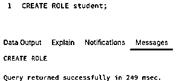

我们可以从浏览器中检查新角色是否已经创建。

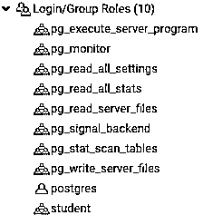

耶！我们可以看到，我们已经成功创建了学生登录。

#### 2.使用浏览器创建新的登录/用户

在浏览器中，我们可以通过以下方式成功地为组或用户创建新的登录。

**第一步:**右键单击要使用的数据库服务器，从菜单中选择创建，最后选择登录/组角色。

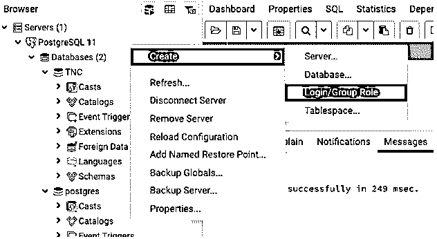

**步骤 2:** 在出现的对话框中输入用户名或角色名。

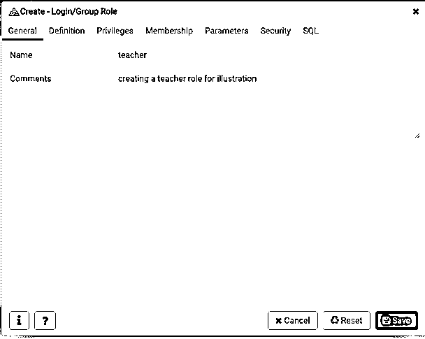

**步骤 3:** 继续检查权限，并根据您的选择编辑它们，最后保存更改。

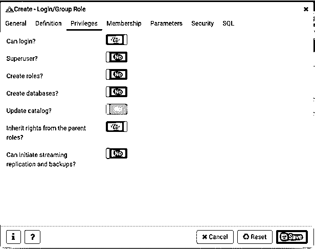

您甚至可以在对话框中检查用于登录创建的等效 SQL，如下所示。

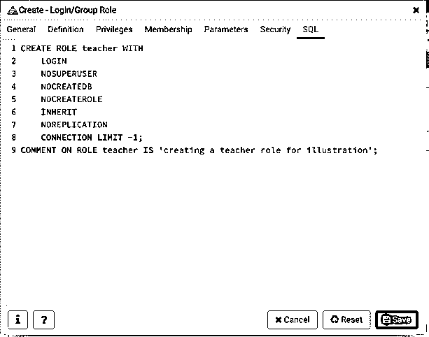

### 表空间管理

关系 SQL 数据库中的表空间是一个逻辑存储单元或文件系统，它集中存储数据库的所有数据。SQL 管理员可以控制和管理数据在表空间中的存储方式。

我们可以使用以下命令创建一个表空间:

`CREATE  TABLESPACE tablespace_name;`

运筹学

我们可以使用显示的步骤，从浏览器中直接创建一个表空间。

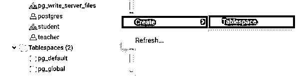

我们可以使用以下语句改变表空间:

`ALTER TABLESPACE tablespace_name
OWNER TO login/user_name;`

我们甚至可以使用 DROP 语句删除表空间:

`DROP TABLESPACE tablespace_name;`

### SQL 数据库中的备份和恢复

SQL 管理涉及一些非常关键的任务，例如数据备份创建和 SQL 数据库中备份文件系统的恢复。每个数据库管理服务器都有一些指定的功能来执行备份和恢复功能。在 PostgreSQL 中，我们有 pg_dump、pg_dumpall 等函数。创建备份。我们将在本节详细讨论上述功能。

使用浏览器创建备份的步骤。

**步骤 1:** 右键单击想要创建备份的数据库或数据表。

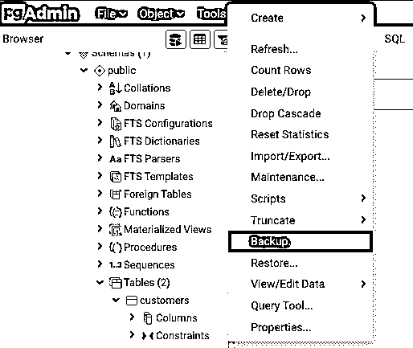

**第二步:**在打开的对话框中，输入创建备份文件的文件名、格式、编码和用户。

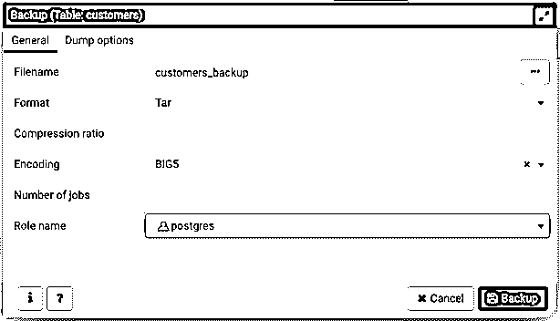

**步骤 3:** 在单击备份选项之前，确保并纠正转储选项(如果需要)。

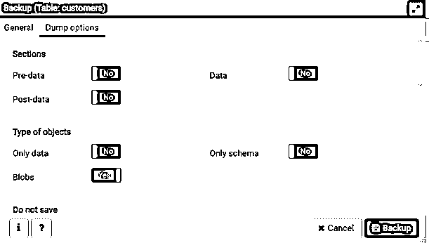

**步骤 4:** 您的备份已成功创建。在这种情况下，已经从“Postgres”用户名创建了 customers 表的备份。

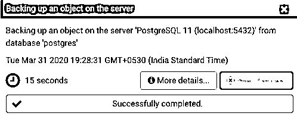

最后，让我们继续学习如何在 SQL 数据库管理服务器中恢复备份文件。

使用浏览器在数据库中恢复备份文件的步骤。

**步骤 1:** 右键单击您想要恢复备份文件的数据库或数据表。

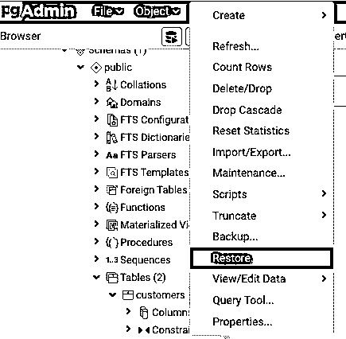

**第二步:**在屏幕上出现的对话框中提及文件名和类型，指定用户。

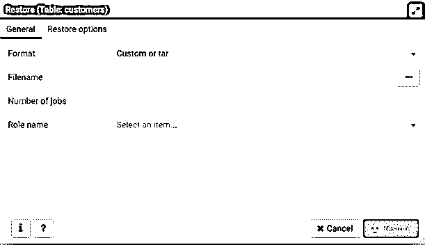

**步骤 3:** 在文件名中，如果文件不在上述文件夹中，上传备份文件，如下所示。

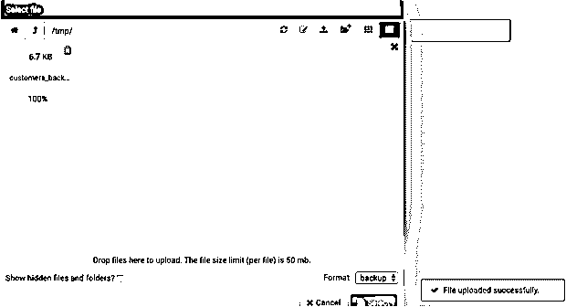

**步骤 4:** 现在，搜索您刚刚上传的备份文件，然后单击“restore”按钮。我们完成了备份文件的恢复。

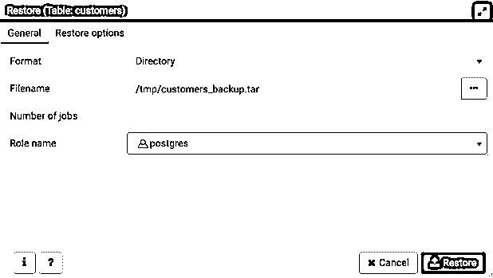

### 结论–SQL 管理

SQL 管理是一个集合术语，用于数据库管理活动，例如在数据库中创建备份文件和恢复备份文件，创建新的用户登录和用户组，以及在数据库中创建和维护表空间。

### 推荐文章

这是一个 SQL 管理指南。这里我们讨论两种类型的角色，实现的例子，表空间管理与备份和恢复数据。您也可以浏览我们的其他相关文章，了解更多信息——

1.  [SQL 逻辑运算符](https://www.educba.com/sql-logical-operators/)
2.  [SQL 提交](https://www.educba.com/sql-commit/)
3.  [SQL 中的 BETWEEN](https://www.educba.com/between-in-sql/)
4.  [SQL 中的多维数据集](https://www.educba.com/cube-in-sql/)

