# SQL 枚举

> 原文：<https://www.educba.com/sql-enum/>

## SQL 枚举简介

Enum 或 enumerated 是标准查询语言(SQL)中用户定义的数据类型，包含静态有序集或值列表。枚举是

人类可读的字符串值，有助于提高数据存储效率。可以认为它类似于一个数据类型的值列表。它们相当于 C 编程语言中的枚举类型。枚举数据类型的一个很好的例子是地球上的大陆。此大陆数据类型只能包含七个大陆名称。

<small>Hadoop、数据科学、统计学&其他</small>

在本文中，我们将借助一些实际例子详细了解 ENUM 数据类型。让我们从用于在 SQL 中创建枚举类型的语法和参数开始。

### 语法和参数

在 SQL 中创建枚举数据类型的基本语法如下:

`CREATE TYPE enum_name AS ENUM ('value_1','value_2',..., 'value_n' );`

将枚举数据类型合并到数据库表中的语法如下:

`CREATE TABLE table_name (
column_name_1  data type CONSTRAINT,
column_name_2  enum_name CONSTRAINT,
.
.
.
);`

上述语法中使用的参数如下:

*   **枚举名称:**枚举数据类型的名称。
*   **('值 _1 '，'值 _2 '，…，'值 _n' ) :** 作为此枚举数据类型的一部分可接受的值。该集合是用户定义的，您可以根据需要提及任意多的值。例如，彩虹只能有紫色、靛蓝色、蓝色、绿色、黄色、橙色和红色。
*   **注意:**默认情况下，枚举值区分大小写；因此,“红色”不同于“红色”或“红色”。

### SQL 枚举的示例

为了说明如何使用 ENUM 数据类型，让我们尝试几个基于它的例子。

#### 创建枚举数据类型

**举例:**

创建一个名为“continentals”的枚举数据类型，其中包含地球上七大洲的列表。

`CREATE TYPE continents AS ENUM ('Asia', 'Africa', 'North America', 'South America', 'Antarctica', 'Europe','Australia');`

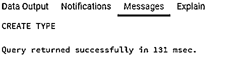

我们已经成功地创建了我们的第一个枚举类型“大陆”。现在让我们在数据库表中使用它。

这里，我们创建了一个名为“country_list”的数据库表。该表有一个字段“country_region ”,它属于我们刚刚创建的 enum 数据类型。按照给定的 sql 语句创建该表。

`CREATE TABLE country_list (
country_id  INT,
country_name VARCHAR(50),
country_region continents
);`

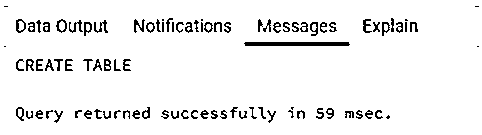

CREATE TABLE 语句已成功执行。下一个任务是在“country_list”表中插入一些记录，以了解如何在枚举类型中插入值。

下面是一个 INSERT 语句，用于插入一个包含 continents 类型的列的新行。

`INSERT INTO public.country_list(
country_id, country_name, country_region)
VALUES (1,'India','Asia');`

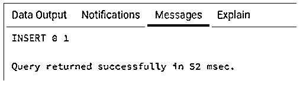

命令执行成功。

现在尝试下一个 insert 语句，它类似于上一个语句。

`INSERT INTO public.country_list(
country_id, country_name, country_region)
VALUES (2,'China','ASIA');`

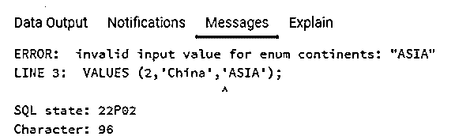

为什么我们会收到错误信息？这是因为枚举数据类型区分大小写。亚洲与亚洲或亚洲并不相似。因此，在创建和使用枚举数据类型时，请记住这一点。

#### 枚举数据类型中的排序

为了说明枚举数据类型的排序，让我们在“country_list”表中插入一些记录。我们可以使用下面的 INSERT 语句来完成这项任务。

`INSERT INTO public.country_list(
country_id, country_name, country_region)
VALUES (2,'China','Asia'),
(3,'South Africa', 'Africa'),
(4,'Brazil', 'South America'),
(5,'Canada', 'North America'),
(6,'U K ', 'Europe');`

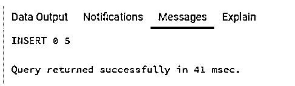

**举例:**

从 country_list 中查找 country_region 大于“北美”的国家的详细信息。

`SELECT country_id, country_name, country_region
FROM country_list
WHERE country_region > 'North America';`

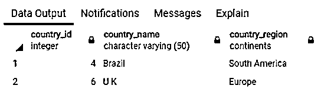

如上面的数据输出所示，服务器返回的“南美”和“欧洲”大于“北美”。这在词汇学上是不正确的。那我们为什么会收到这样的结果？这是因为在枚举列表中,“南美”和“欧洲”位于“北美”之后。向上滚动，看看“大陆”类型。所以这个故事的寓意是，枚举类型是有序集合，它们维护着创建时指定的排序顺序。

让我们再尝试几个关于订购的例子。

**举例:**

从 country_list 中查找 country_region 小于“北美”的国家的详细信息。

`SELECT country_id, country_name, country_region
FROM country_list
WHERE country_region < 'North America';`

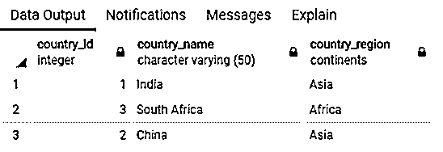

如果您还有任何疑问，只需看看 order by country_region 子句获得的结果。

`SELECT country_id, country_name, country_region
FROM country_list
ORDER BY country_region;`

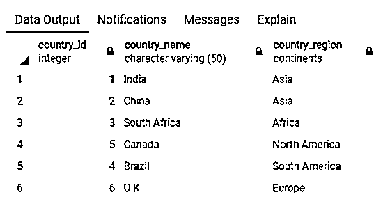

然而，我们可以如下所述比较枚举数据类型的值。

**举例:**

从 country_list 中查找国家/地区为“北美”的国家/地区的详细信息。

`SELECT country_id, country_name, country_region
FROM country_list
WHERE country_region = 'North America';`

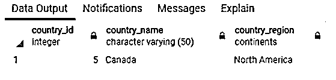

但是，我们应该记住，一种枚举类型的枚举值不能用于比较其他枚举类型的值。

#### 空白和枚举数据类型

枚举数据类型对空间敏感。也就是说，在枚举类型中指定值时，应该避免尾随和前导空格。下面举个例子详细说明一下。

创建枚举类型。

`CREATE TYPE status AS ENUM (' Active','Inactive ');`

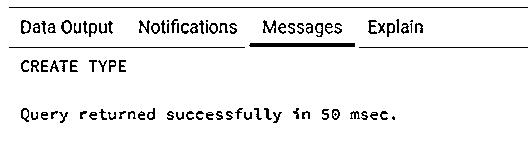

在表中使用状态类型。

`CREATE TABLE profile_status (
profile_id INT,
profile_status status
);`

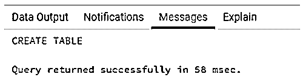

插入状态类型为的行，但不注意空格。

`INSERT INTO public.profile_status(
profile_id, profile_status)
VALUES (1,'Active');`

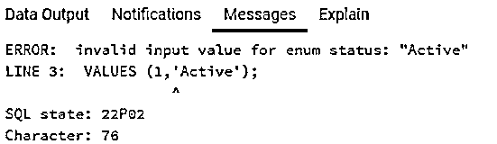

服务器未将“活动”识别为状态类型的值。

### 推荐文章

这是一个 SQL 枚举的指南。在这里，我们还将讨论 SQL enum 的语法和参数，以及不同的示例和代码实现。您也可以看看以下文章，了解更多信息–

1.  [SQL 中的数组](https://www.educba.com/array-in-sql/)
2.  PostgreSQL 中的[数组](https://www.educba.com/array-in-postgresql/)
3.  [PostgreSQL 日志](https://www.educba.com/postgresql-log/)
4.  [MySQL vs SQLite](https://www.educba.com/mysql-vs-sqlite/)

