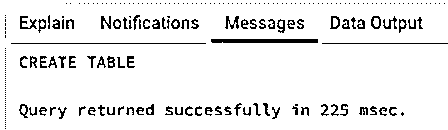
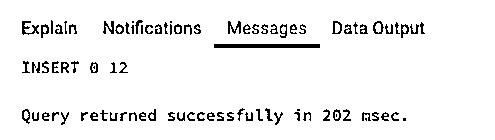
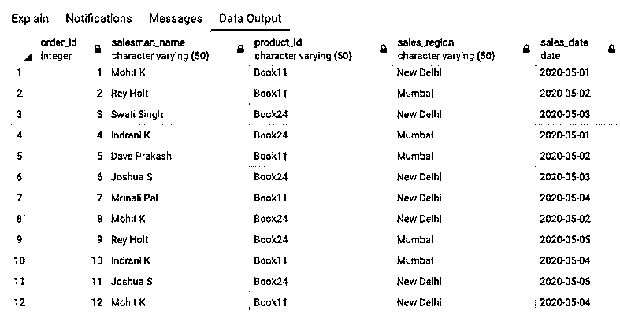
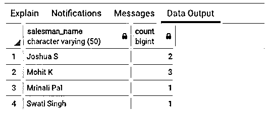
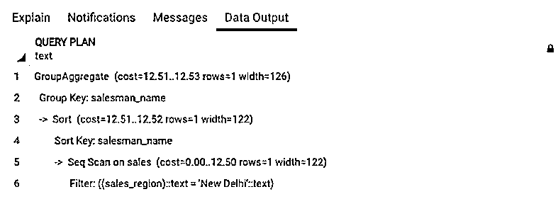
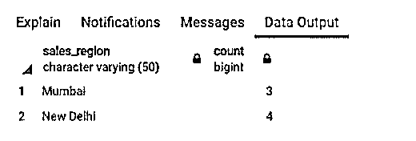
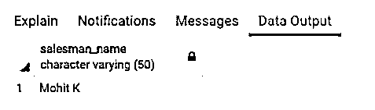
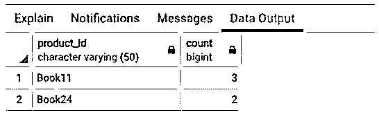

# SQL GROUP BY WHERE

> 原文：<https://www.educba.com/sql-group-by-where/>

## SQL GROUP BY WHERE 简介

在 SQL standard 中，GROUP BY 子句用于将指定字段中具有相同值的行分组在一起，并使用聚合函数为这些行准备一个汇总行。WHERE 子句用于根据指定的条件筛选行。当我们将 GROUP BY 子句与 WHERE 子句结合使用时，WHERE 子句首先根据提到的条件筛选行，然后 GROUP BY 子句只为筛选的行准备一个汇总行。当我们只想将特定的行组合在一起时，这非常有用。例如，值、日期等特定范围内的行。

**SQL GROUP BY WHERE 的语法和参数**

<small>Hadoop、数据科学、统计学&其他</small>

用于编写 GROUP BY with WHERE 子句的基本语法如下:

`SELECT column_name_1, aggregate_function(column_name_2)
FROM table_name
WHERE condition expression
GROUP BY column_name_1;`

上述语法中使用的参数如下:

*   **column_name_1:** 列或字段名称，根据该名称将行分组在一起。
*   **column_name_2:** 必须使用聚合函数进行汇总的列或字段名称。
*   **table_name:** 数据库表，将从该表中提取所述列。
*   **条件表达式:**WHERE 子句筛选行所依据的条件。

这里我们使用了尽可能少的子句和命令；我们可以使用连接、HAVING BY、ORDER BY 等。，基于要求。

### SQL GROUP BY WHERE 示例

以下是 SQL GROUP BY WHERE 的示例:

为了说明带有 WHERE 子句的 GROUP BY 子句的用法和功能，让我们首先创建一个名为“sales”的虚拟表。下面是相同的 CREATE TABLE 语句。

**代码:**

`CREATE TABLE sales (
order_id int,
salesman_name character varying(50),
product_id character varying(50),
sales_region character varying(50),
sales_date date
);`

**输出:**

该表已成功创建。我们的下一个任务是在其中插入一些要处理的记录。

下面是相同的 insert 语句。

**代码:**

`INSERT INTO public.sales(
order_id, salesman_name, product_id, sales_region, sales_date)
VALUES (1,'Mohit K','Book11','New Delhi','2020-05-01'),
(2,'Rey Holt','Book11','Mumbai','2020-05-02'),
(3,'Swati Singh','Book24','New Delhi','2020-05-03'),
(4,'Indrani K','Book24','Mumbai','2020-05-01'),
(5,'Dave Prakash','Book11','Mumbai','2020-05-02'),
(6,'Joshua S','Book24','New Delhi','2020-05-03'),
(7,'Mrinali Pal','Book11','New Delhi','2020-05-04'),
(8,'Mohit K','Book24','New Delhi','2020-05-02'),
(9,'Rey Holt','Book24','Mumbai','2020-05-05'),
(10,'Indrani K','Book11','Mumbai','2020-05-04'),
(11,'Joshua S','Book24','New Delhi','2020-05-05'),
(12,'Mohit K','Book11','New Delhi','2020-05-04');`

**输出:**

该命令已成功执行。让我们使用 SELECT 语句检查是否插入了所需的行。

**代码:**

`SELECT * FROM sales;`

**输出:**

#### 示例#1

找出每个销售人员在新德里地区的销售总数。

**代码:**

`SELECT salesman_name, count(order_id)
FROM sales
WHERE sales_region = 'New Delhi'
GROUP BY salesman_name;`

**输出:**

我们可以从 SELECT 查询的结果中清楚地看到，WHERE 子句首先过滤了包含“新德里”的行，然后 GROUP BY 子句将过滤后的行组合在一起。

有关详细信息，您可以参考下面的查询计划图像。

#### 实施例 2

查找 2020 年 5 月 1 日至 2020 年 5 月 3 日期间每个地区的总销售额。

**代码:**

`SELECT sales_region, count(order_id)
FROM sales
WHERE sales_date BETWEEN '2020-05-01' AND '2020-05-03'
GROUP BY sales_region;`

**输出:**

**GROUP BY WHERE with HAVING 子句:**

许多初级 SQL 开发人员发现很难理解 HAVING BY 和 WHERE 子句之间的区别，因为它们的目的是一样的；也就是说，他们过滤记录。当与 GROUP BY 子句结合使用时，HAVING 子句筛选分组的行，而 WHERE 子句在对记录进行分组之前筛选记录。HAVING 子句总是与 GROUP BY 一起使用，而 WHERE 可以用在任何 SELECT 语句中。

#### 实施例 3

找出在 2020 年 5 月 1 日至 2020 年 5 月 5 日期间销售超过 2 次的销售员。

**代码:**

`SELECT salesman_name
FROM sales
WHERE sales_date BETWEEN '2020-05-01' AND '2020-05-05'
GROUP BY salesman_name
HAVING count(order_id) > 2;`

**输出:**

**GROUP BY WHERE with ORDER BY 子句:**

#### 实施例 4

找到产品和在孟买地区销售特定产品的销售人员的数量。

**代码:**

`SELECT product_id, count(salesman_name)
FROM sales
WHERE sales_region = 'Mumbai'
GROUP BY product_id
ORDER BY count(salesman_name) DESC;`

**输出:**

### 结论

在本文中，我们看到了如何将 GROUP BY 子句与 WHERE 子句一起使用。WHERE 子句通常与 GROUP BY 结合使用，只为满足特定条件的行准备汇总行。

### 推荐文章

这是一个 SQL 分组指南。这里我们分别讨论 SQL GROUP BY WHERE 的介绍和例子。您也可以看看以下文章，了解更多信息–

1.  [SQL 窗口函数](https://www.educba.com/sql-window-functions/)
2.  [SQL UNION ALL](https://www.educba.com/sql-union-all/)
3.  [SQL DECODE()](https://www.educba.com/sql-decode/)
4.  [SQL SELECT DISTINCT](https://www.educba.com/sql-select-distinct/)

