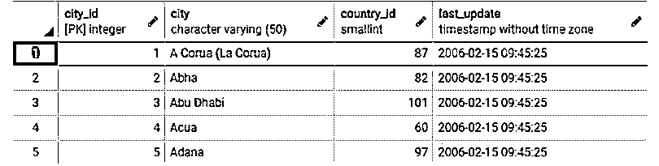
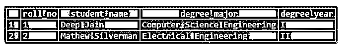
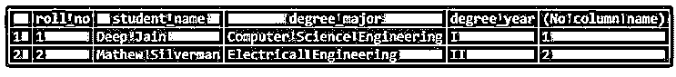
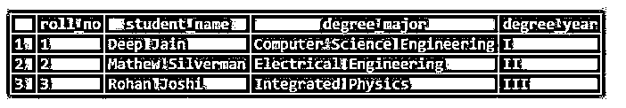

# SQL 行

> 原文：<https://www.educba.com/sql-row/>

## SQL 行简介

SQL 或任何关系数据库中的行基本上是一个元组，它在数据库表中保存隐式结构化的数据值。对于门外汉来说，任何编程语言中的元组都是一组多个数据值，构成特定关系的单个记录。SQL 中的行和列可以被认为类似于网格或矩阵中的行，其中每一行都包含每一列的值。行构成了任何关系数据库的构造块。

突出显示的元组或行在关系数据库中形成一行。

<small>Hadoop、数据科学、统计学&其他</small>

### 创建行结构

合乎逻辑的是，为了创建一行，我们必须首先创建一个表。桌子上的一排就像灵魂之于身体。因此，首先，让我们创建一个名为“学生”的数据库表。我们可以使用下面的代码片段来创建上述表格。

**代码:**

`CREATE TABLE students (
roll_no int NOT NULL PRIMARY KEY,
student_name VARCHAR(255),
degree_major VARCHAR(255) NOT NULL,
degree_year VARCHAR(255)
);`

给定的 CREATE TABLE 语句将创建一个结构，其中表中的每一行都由 roll_no、student_name、degree_major 和 degree_year 值组成。

### 在数据库表中添加行

数据库表就像一张没有任何值的空白表格。一旦我们将值添加到已定义的结构或大纲中，这些行就为添加的值保存了一个有意义的关系。因此，下面是如何在数据表中添加一行。

#### 1.用于添加行的 Insert 语句

**代码:**

`INSERT INTO students(
roll_no, student_name, degree_major, degree_year)
VALUES (1,'Deep Jain','Computer Science Engineering','I');`

该命令成功执行，从而在 students 表中创建了一行。可以使用选择查询来可视化所述行。我们可以使用 SELECT *或 SELECT ALL 语句从任何表中获取所有行。

**代码:**

`SELECT * FROM students;`

**输出:**

现在我们在学生的表中有了一行数据值。

#### 2.用于添加多行的 Insert 语句

您一定想知道如何在数据表中添加多行。很简单，我们可以按照下面的方式使用相同的 INSERT 语句。

**代码:**

`INSERT INTO public.students(
roll_no, student_name, degree_major, degree_year)
VALUES (2,'Drake G','Biotech Engineering','IV'),
(3,'Mathew Silverman','Electrical Engineering','II');`

插入查询只是在学生的表中创建了两行。使用 SELECT 语句自己看看。

**代码:**

`SELECT * FROM students;`

**输出:**

### 从数据库表中删除行

当从数据库表中删除一行或多行时，我们使用 DELETE 语句。

#### 1.用于删除行的 DELETE 语句

**代码:**

`DELETE FROM students
WHERE degree_year = 'IV';`

我们成功删除了学位年值为“IV”的行。

现在，学生的桌子看起来像这样。

**代码:**

`SELECT * FROM students;`

**输出:**

#### 2.用于删除所有行的 DELETE 语句

为了删除数据库表中的所有行，请使用不带 WHERE 子句的 delete 语句。

**代码:**

`DELETE FROM students;`

### 修改或更新数据表中的现有行

如果您不想删除一行，而是修改其中的一些值，该怎么办？这可以通过使用 UPDATE 语句来实现。

下面的示例将名为“Mathew Silverman”的学生的 roll_no 更新为 2，而不是 3。

**代码:**

`UPDATE students
SET roll_no = 2
WHERE roll_no = 3;`

命令已成功执行。让我们检查一下它是否反映在表格中。

**代码:**

`SELECT * FROM students;`

**输出:**

该行已成功更新。

### 为数据表中的行指定行号

假设我们希望根据列值在数据库中顺序排列行。我们可以通过使用 SQL 中的 ROW_NUMBER 函数来实现。它帮助我们根据行号获取数据行。

下面是如何向数据表中的现有行添加行号。

**代码:**

`SELECT
roll_no,
student_name,
degree_major,
degree_year,
ROW_NUMBER () OVER (ORDER BY roll_no)
FROM
students;`

**输出:**

**

** 

### 筛选最终结果集的行

当获取最终结果集的行时，我们可能不总是希望从上述表中获取所有的行。我们可以使用 WHERE、HAVING、LIMIT 或 TOP 子句过滤行。

下面是如何使用 WHERE 子句筛选行。

**代码:**

`SELECT
roll_no,
student_name,
degree_major,
degree_year
FROM
students
WHERE degree_major = 'Electrical Engineering';`

**输出:**

下面是如何限制最终结果集中出现的行数。

**代码:**

`SELECT * FROM students
LIMIT 1;`

**输出:**

### 向行值添加约束

我们不能在 SQL 中直接向行添加约束，但是我们可以添加诸如 NOT NULL、UNIQUE、CHECK 等约束。最终会反映到行中。

下面是我们如何向现有表添加约束的方法。

**代码:**

`ALTER TABLE students
ADD CONSTRAINT unique_class UNIQUE(degree_year);`

unique_class 约束已成功创建。

让我们尝试为 degree_year 插入一个具有重复值的新行。

**代码:**

`INSERT INTO students(
roll_no, student_name, degree_major, degree_year)
VALUES (3,'Rohan Joshi','Integrated Physics','I');`

**输出:**

看到新行不能插入表中。现在，使用 degree_year 的唯一值尝试下一个查询。

**代码:**

`INSERT INTO students(
roll_no, student_name, degree_major, degree_year)
VALUES (3,'Rohan Joshi','Integrated Physics','III');`

查询成功返回。新行如下所示。

**代码:**

`SELECT * FROM students;`

**输出:**

### 结论–SQL 行

可以将行视为任何关系数据库的构建块。元组将表中每个关系的数据值保存在一起。如果您知道如何处理行，那么您就知道如何处理任何关系数据库。

### 推荐文章

这是一个 SQL 行的指南。在这里，我们讨论介绍、创建行结构、添加、删除、修改或更新、赋值、在数据库表中过滤以及向行值添加约束。您也可以看看以下文章，了解更多信息–

1.  [SQL 克隆表](https://www.educba.com/sql-clone-table/)
2.  [SQL ORDER BY CASE](https://www.educba.com/sql-order-by-case/)
3.  [SQL 升序排序](https://www.educba.com/sql-order-by-ascending/)
4.  [SQL 表分区](https://www.educba.com/sql-table-partitioning/)

