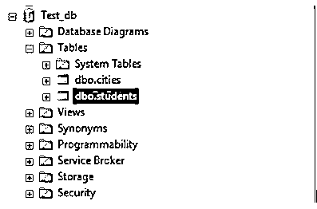
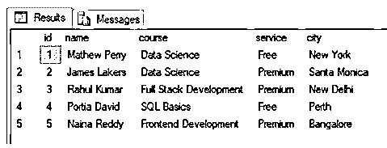
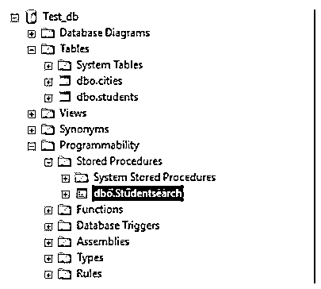
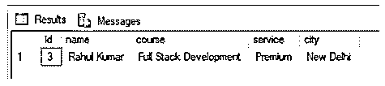
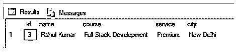
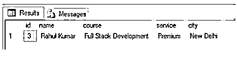
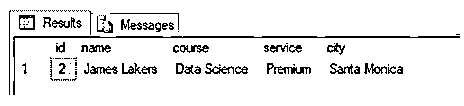
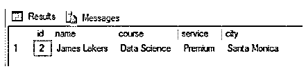
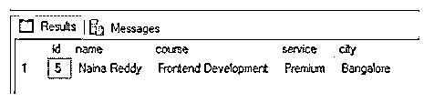
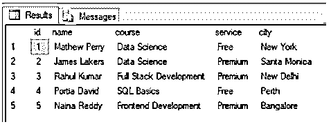

# SQL 执行

> 原文：<https://www.educba.com/sql-execute/>

## SQL 执行简介

标准 SQL 中的 EXECUTE 命令用于执行数据库服务器中的存储过程和查询字符串。对于外行来说，存储过程是一个 SQL 代码，可以保存并在以后重用。存储过程可以是系统定义的，也可以是用户定义的。执行命令通过允许在不同的服务器上由不同的用户执行命令，有助于上下文切换。

### 语法和参数

用 SQL 编写执行命令的基本语法如下:

<small>Hadoop、数据科学、统计学&其他</small>

`---Executing a stored procedure
EXECUTE | EXEC <stored_procedure_name> <stored_procedure_parameter>
{WITH {RECOMPILE | RESULT SETS} | AT <server_name>| AS <username>}
--- Executing a query string
EXECUTE | EXEC ('query string')
{WITH {RECOMPILE | RESULT SETS} | AT <server_name>| AS <username>}`

上述语法中使用的参数如下:

*   **存储过程名称:**存储过程名称
*   **存储过程参数:**带值的参数名或仅参数值
*   **服务器名称:**您希望在其上执行命令的另一台服务器的名称
*   **用户名:**您要模拟的当前服务器上的用户名或登录名
*   **查询字符串:**写在单引号内的 SQL 语句

### SQL EXECUTE 示例

下面是一些例子:

#### 1.对命令字符串执行

考虑下面给出的“城市”表。我们将使用这个表，通过 EXECUTE 命令查询其中的一行。

| 身份证明（identification） | 国家 | 城市 |
| One | 印度 | 新德里 |
| Two | 英国 | 伦敦 |

`EXECUTE ('SELECT country, city FROM cities WHERE id = 1');`

#### 2.对存储过程执行

如前所述，存储过程是 SQL 中预先保存的命令。在本节中，我们将学习创建一个存储过程，然后使用 EXECUTE 或 EXEC 命令来执行它。

考虑下面的 SQL 脚本。在这里，我们首先创建了一个名为“students”的虚拟表，其中包含 id、姓名、课程、服务类型和学生位置等字段。在创建表之后，我们在其中插入了一些记录来进行处理。一旦我们创建了一个虚拟表，我们就创建了一个存储过程来根据他或她的 id 搜索学生的详细信息。

使用 Test_db

**创建学生表:**

`CREATE TABLE students(
[id] [int] NOT NULL,
[name] [varchar](100),
[course] [varchar](255),
[service] [varchar](50) CHECK (service IN('premium', 'Free')),
[city] [varchar](50)
)
GO`

**在学生表中插入值:**

`INSERT INTO students VALUES(1,'Mathew Perry','Data Science','Free','New York'),
(2,'James Lakers','Data Science','Premium','Santa Monica'),
(3,'Rahul Kumar','Full Stack Development','Premium','New Delhi'),
(4,'Portia David','SQL Basics','Free','Perth'),
(5,'Naina Reddy','Frontend Development','Premium','Bangalore')
GO`

**在学生表上创建存储过程:**

`CREATE PROCEDURE [Studentsearch] (@student_id int)
AS
BEGIN
SELECT id,name,course,service,city FROM students WHERE id = @student_id
END
GO`

在 SQL server 中成功执行该脚本后，我们将在 Test_db 数据库中创建一个新的学生表。您可以在对象资源管理器中观察这一切。

学生表格中的数据如下所示:

`SELECT TOP 1000 [id] ,[name] ,[course] ,[service] ,[city] FROM [Test_db].[dbo].[students]`

一切都按计划进行。最后，让我们检查存储过程是否已经创建。存储过程存储在数据库的可编程性部分。

现在我们已经准备好在存储过程中使用 EXECUTE 命令了。这是第一个例子。假设如果我们想要查找 id 为 3 的学生的详细信息，我们可以简单地编写以下命令。

`EXECUTE Studentsearch @student_id = 3`

为了执行存储过程，我们在 execute the command 中提到了存储过程名称和存储过程参数，如上面提到的查询所示。

并不总是需要在 EXECUTE 命令中提到存储过程参数名。我们也可以尝试下面的变化。

`EXECUTE Studentsearch 3;`

在 SQL standard 中，EXEC 相当于 EXECUTE 命令。因此，我们也可以使用 EXEC。

`EXEC Studentsearch @student_id = 3`

#### 3.执行并重新编译

在 SQL SERVER 中，当我们对任何存储过程运行 EXECUTE 命令时，它的执行计划都存储在缓存中。每次我们运行一个查询，它不会被再次编译。因此，为了强制服务器创建一个新的执行计划来编译并在执行后丢弃它，我们可以使用如下所示的 EXECUTE WITH RECOMPILE 语句。

`EXECUTE Studentsearch @student_id = 2 WITH RECOMPILE;`

#### 4.对带有多个参数的存储过程执行

在前面的章节中，我们探索了一个简单存储过程的执行。如果我们想用多个参数进行查询呢？是啊！这也可以用存储过程来完成，并以下面的方式执行命令。

`CREATE PROCEDURE DetailedStudentSearch
@course_name nvarchar(50),
@service nvarchar (50)
AS
SELECT id, name, course, service, city FROM [dbo].[students] WHERE course  = @course_name AND service = @service;
GO`

这里我们创建了一个名为“DetailedStudentSearch”的新过程。假设我们想根据学生所学的课程和服务类型来查找学生的详细信息。这可以使用如下所示的执行命令来完成。

`EXECUTE DetailedStudentSearch 'Data Science', 'Premium';`

`EXECUTE DetailedStudentSearch 'Frontend Development', 'Premium';`

#### 5.由其他用户执行

执行 SQL 标准中的命令，帮助我们进行上下文切换。也就是说，我们可以作为不同的登录用户在不同于我们当前工作的服务器上执行命令。这里有一个例子来说明另一个用户执行一个 SQL 字符串。

`EXECUTE ('SELECT * FROM students')
AS USER = 'Q27H4-AM\acer';
GO`

#### 6.使用结果集执行

在 SQL Server 12 及更高版本中，借助 EXECUTE 命令中的 WITH RESULT SETS 关键字，我们甚至可以通过以下方式操作从存储过程的执行中获得的结果集。

`EXEC Studentsearch 3
WITH RESULT SETS
(
(
[Student Id] int NOT NULL,
[Student Name] nvarchar(50) NOT NULL,
[Course Name] nvarchar(50) NOT NULL,
[Service Type] nvarchar(50)NOT NULL,
[Student Location] nvarchar(50) NOT NULL,
)
);`

### 推荐 ed 文章

这是一个 SQL 执行指南。在这里，我们还将讨论 sql execute 的简介、语法和参数，以及不同的示例和代码实现。您也可以看看以下文章，了解更多信息–

1.  [带 AS 语句的 SQL](https://www.educba.com/sql-with-as-statement/)
2.  [MySQL 列表用户](https://www.educba.com/mysql-list-user/)
3.  [PostgreSQL 扩展](https://www.educba.com/postgresql-extensions/)
4.  [desc 的 PostgreSQL 顺序](https://www.educba.com/postgresql-order-by-desc/)

