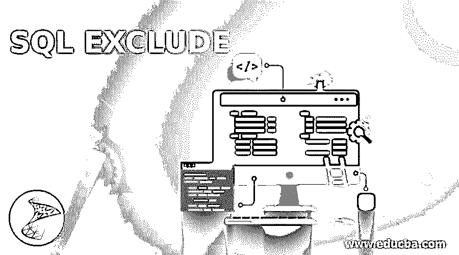
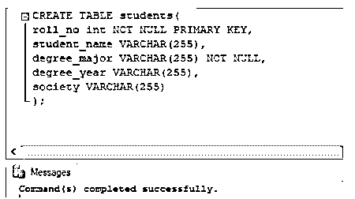
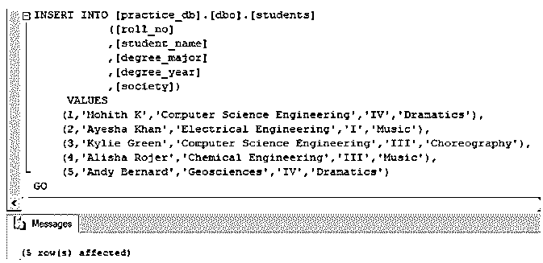
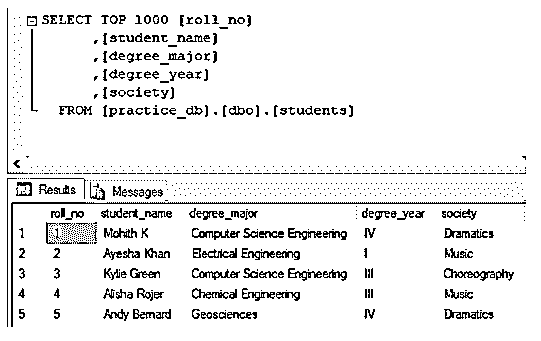
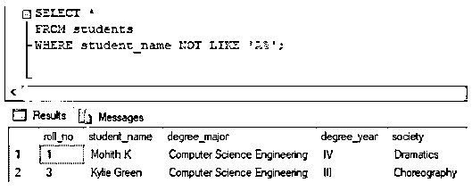
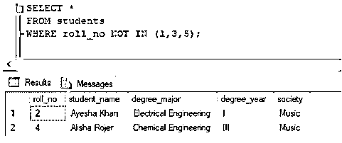
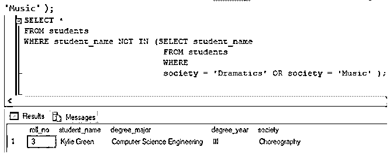
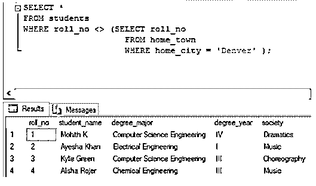
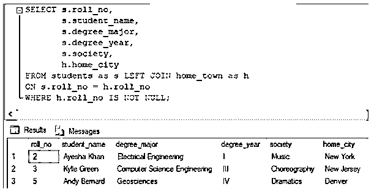
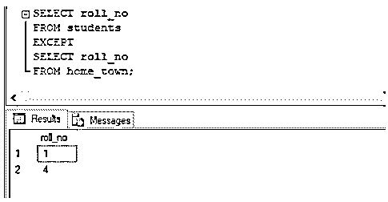

# SQL 排除

> 原文：<https://www.educba.com/sql-exclude/>

## SQL 排除简介

在 SQL 中，为了排除 SELECT 查询返回的某些行，我们使用一些基于某些标准的限制或排除条件。SQL 中的排除条件通常出现在语句的 WHERE 子句或聚合查询的 HAVING 子句中。SQL 中一些常用的 EXCLUDE 运算符有 NOT，NOT IN，NOT LIKE，'！= '、EXCEPT、NOT NULL 等。

您一定想知道当您在 SELECT 语句中提到限制条件时会发生什么。这其实很简单。当 SELECT 查询运行时，数据库服务器对搜索时提取的每一行应用限制条件。如果该行满足上述条件，它将被包含在内。

<small>Hadoop、数据科学、统计学&其他</small>

### 语法和参数

用 SQL 编写排除查询的基本语法如下:

`SELECT column_name1, column_name2, ...
FROM table_name
WHERE column_name1 conditional_operator comparision_expression;`

如果要使用 EXCEPT 运算符编写排除查询，语法如下:

`SELECT column_name1, column_name2, ...
FROM table_name1
EXCEPT
SELECT column_name1, column_name2, ...
FROM table_name2;`

**参数:**

上述语法中使用的参数如下:

*   **column_name1，column_name2，… :** 必须为最终结果集提取的列或字段名称。
*   **table_name1，table_name2:** 数据库表，必须从其中提取上述列。
*   **conditional _ operator:**运算符如(NOT IN，NOT LIKE，NOT NULL，NOT EQUAL TO(！=)等。)
*   **comparison_expression:** 要进行排除的子查询或表达式。

### SQL 排除的示例

为了说明 SQL 中某些行的排除或限制，让我们创建一个名为“students”的虚拟表。我们可以使用下面的 CREATE 语句来创建学生的表。

`CREATE TABLE students(
roll_no int NOT NULL PRIMARY KEY,
student_name VARCHAR(255),
degree_major VARCHAR(255) NOT NULL,
degree_year VARCHAR(255),
society VARCHAR(255)
);`

创建了学生表之后。让我们在其中插入一些记录来处理。

`INSERT INTO [practice_db].[dbo].[students] ([roll_no] ,[student_name] ,[degree_major] ,[degree_year] ,[society])
VALUES
(1,'Mohith K','Computer Science Engineering','IV','Dramatics'),
(2,'Ayesha Khan','Electrical Engineering','I','Music'),
(3,'Kylie Green','Computer Science Engineering','III','Choreography'),
(4,'Alisha Rojer','Chemical Engineering','III','Music'),
(5,'Andy Bernard','Geosciences','IV','Dramatics')
GO`

学生表中的数据如下所示:

现在，我们准备尝试一些排除 SQL 中的行的例子。

#### 示例#1

**使用不等于运算符**排除行

查找所有学生的详细信息，不包括编号为 4 的学生。

`SELECT *
FROM students
WHERE roll_no != 4 ;`

**T2】**

 **#### 实施例 2

**使用非相似运算符排除行**

查找除姓名以 a 开头的学生之外的所有学生的详细信息。

`SELECT *
FROM students
WHERE student_name NOT LIKE 'A%';`

#### 实施例 3

**使用 NOT IN 运算符排除行**

查找所有学生的详细信息，不包括 roll_no 不是 1、3 或 5 的学生。

`SELECT *
FROM students
WHERE roll_no NOT IN (1,3,5);`

#### 实施例 4

**使用 NOT IN 运算符在同一表上的子查询中排除行。**

查找所有学生的详细信息，不包括来自“戏剧”或“音乐”社团的学生。

`SELECT *
FROM students
WHERE student_name NOT IN (SELECT student_name
FROM students
WHERE
society = 'Dramatics' OR society = 'Music' );`

**使用 NOT IN 运算符在不同表上的子查询中排除行。**

为了说明这一点，让我们创建一个名为“home_town”的表，该表包含与 students 表中学生的家乡城市相关的详细信息。

`CREATE TABLE [dbo].[home_town](
[roll_no] [int] NOT NULL,
[home_city] [varchar](50) NULL
)
INSERT INTO [practice_db].[dbo].[home_town] ([roll_no] ,[home_city])
VALUES
(2, 'New York'),
(3, 'New Jersey'),
(5, 'Denver')
GO`

#### 实施例 5

查找所有学生的详细信息，不包括其姓名不在家庭城市为“丹佛”的姓名列表中的学生。

`SELECT *
FROM students
WHERE roll_no <> (SELECT roll_no
FROM home_town
WHERE home_city = 'Denver' );`

#### 实施例 6

**从左/右连接中排除具有空值的行**

查找学生的 roll_no、student_name、degree_major、society 和 home_city，不包括 home_city 为空或不存在的行。

`SELECT s.roll_no,
s.student_name,
s.degree_major,
s.degree_year,
s.society,
h.home_city
FROM students as s LEFT JOIN home_town as h
ON s.roll_no = h.roll_no
WHERE h.roll_no IS NOT NULL;`

#### 实施例 7

**使用 EXCEPT 运算符排除行**

为了排除只出现在第一个 select 语句结果中而不出现在第二个 select 语句结果中的行，我们可以使用 EXCEPT 运算符。

找出除了家乡表中提到的学生之外的所有学生的名单。

`SELECT roll_no
FROM students
EXCEPT
SELECT roll_no
FROM home_town;`

### 优势

下面给出了一些优点:

1.  有助于限制可以进入最终结果集的行数和种类。
2.  使用 SQL 查询时，有助于只提取和插入相关的结果，例如:SELECT、UPDATE 或 DELETE 语句。

### 结论

为了限制选择查询应该返回的行的种类和数量，我们使用一些排除条件作为过滤标准。SELECT、UPDATE 或 DELETE 语句的 WHERE 子句中提到了这些筛选条件。

### 推荐 ed 文章

这是一个 SQL 排除指南。在这里，我们还将讨论 sql exclude 的介绍、语法和参数，以及不同的示例和代码实现。您也可以看看以下文章，了解更多信息–

1.  [带 AS 语句的 SQL](https://www.educba.com/sql-with-as-statement/)
2.  [MySQL 列表用户](https://www.educba.com/mysql-list-user/)
3.  [PostgreSQL 扩展](https://www.educba.com/postgresql-extensions/)
4.  [desc 的 PostgreSQL 顺序](https://www.educba.com/postgresql-order-by-desc/)

**