# SQL 性能优化

> 原文：<https://www.educba.com/sql-performance-tuning/>

## SQL 性能调优简介

顾名思义，SQL 中的性能调优是一种提高数据库服务器性能的行为，即提高计算时间、查询运行时间等参数。SQL 性能调优不是一个单一的命令，而是一系列的最佳实践、工具和过程，我们应该利用它们来尽可能快地进行 SQL 查询。作为一名 SQL 分析师或开发人员，当涉及到可以用来提高处理器速度的工具和其他硬件时，我们的能力通常是有限的。但是我们掌握的是查询优化的实践。

一些众所周知的导致性能下降的实践是忽略索引、大表、相关查询、复杂连接以及复杂函数和计算的使用。这里，我们将借助几个例子来讨论改善上述每个问题的方法。

<small>Hadoop、数据科学、统计学&其他</small>

为了说明性能调整，我们使用了下表中的 5426 行进行说明:

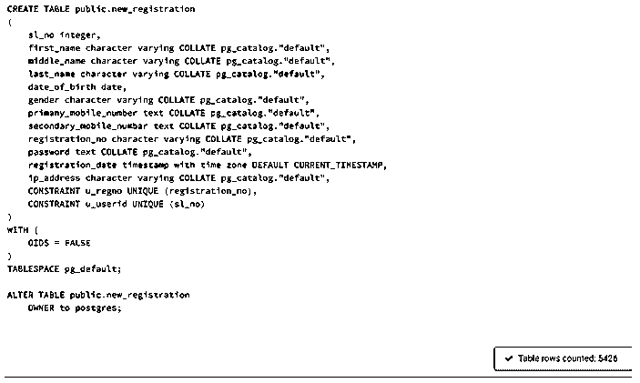

### 对大型表使用索引

索引是优化数据库服务器性能的一种非常有效的方法。没有索引，我们的数据库就像一本没有任何参考注释或内容页的大书。而有了索引，我们的数据库更像一本字典。因此，每次我们执行 SELECT 语句时，它更像是一个查找操作，然后搜索整个数据库。因此，索引提高了从数据库中检索数据的速度。我们的选择和排序查询更快。但是当涉及到修改数据时，比如说使用 UPDATE 语句，索引就是一个诅咒。返回查询需要更长的时间。

### 减小表格大小

在确定数据库服务器中的查询运行时间时，表大小是一个重要的参数。想象一下我们的表有无数行的情况。

减小表大小的一些方法是使用 LIMIT 或 TOP 关键字限制必须提取的记录数量，在临时表的帮助下处理表的子集，使用 WHERE 或 HAVING 子句过滤记录，避免使用 SELECT *语句等。

**避免使用 Select ***

避免选择表中的所有内容，而是尝试从数据库表中搜索特定的列。因此，避免使用 COUNT(*)、SELECT *等。在选择查询中。

`SELECT *
FROM new_registration;`

该查询提取 5426 行，耗时 145 毫秒。

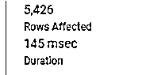

不要使用上面提到的查询，尝试更有针对性和更快的等价查询。

`SELECT first_name,
last_name,
registration_date
FROM new_registration;`

该查询提取了 5426 行，只花了一半的时间。

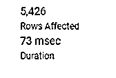

### 限制行数

数据库表可能非常大，因此如果您只是执行探索性分析，获取所有记录并不是一个好主意。使用如下所示的限制关键字(如 LIMIT)将大大减少运行时间。

`SELECT first_name,
last_name,
registration_date
FROM new_registration
LIMIT 100;`

这个查询只获取 100 条记录，比上一个查询快。您可能会觉得差别并不大，但对于大桌子来说，差别会更明显。

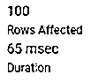

有时，我们可能必须分析表中的数据子集，在这种情况下，使用过滤器只获取所需的子部分是明智的。

`SELECT first_name,
last_name,
registration_date
FROM new_registration
WHERE registration_date BETWEEN '2019-11-14' AND '2019-11-27';`

该查询比第一个查询运行得更快，因为它只需获取 2 行，而且更有针对性。

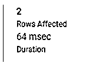

### 使用临时表

如果一个大表中的一组特定记录被频繁使用，那么最好的替代方法是将最频繁使用的部分复制到一个新的临时或常规表中。

`SELECT first_name,
last_name,
date_of_birth
INTO registration_temp
FROM new_registration
WHERE registration_date BETWEEN '2019-10-01' AND '2019-12-01';`

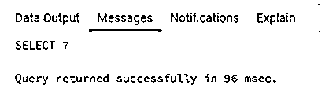

与我们在子部分上运行 SELECT *语句时的第一个查询相比，它要快得多。然而，你现在可能不会觉得它很棒。但是相信我们，对于大型数据集来说，这是值得的。

`SELECT * FROM registration_temp;`

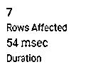

一般提示:如果您必须只选择上述日期内的记录子集，请避免使用 MONTH()、YEAR()等函数。只需按照上面的查询中所示写下日期。

### 明智地使用连接

为了提高服务器性能，我们应该明智地使用连接。如上所述，我们应该尽可能地减小表的大小，执行连接时也是如此，因为连接几乎会使连接表中的数据翻倍。考虑这个例子，其中我们连接两个表 new_registration 和 education _ details on registration _ no，以获取英语成绩超过 90%的候选人。

`SELECT r.registration_no, r.first_name
FROM new_registration as r
INNER JOIN educational_details as e
ON r.registration_no = e.registration_no
WHERE e.english_percentage > 90;`

该查询返回两行，耗时 74 毫秒。

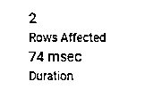

我们应该探索是否可以用一些简单的 cte 和子查询来执行任务，而不是直接执行连接。在这种情况下，我们使用了 CTE，如下所示。

`WITH english_toppers AS
(SELECT registration_no, english_percentage
FROM educational_details
WHERE english_percentage > 90)
SELECT registration_no, first_name
FROM new_registration
WHERE registration_no IN
(SELECT registration_no
FROM english_toppers);`

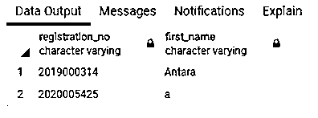

这个简单的查询也返回同样的两行，但是速度要快一些。当你在大型数据集上进行比较时，你会注意到巨大的差异。

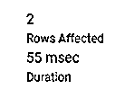

### 使用解释和解释分析关键字

为了分析您在编辑器中编写的任何查询的查询计划而不实际执行它，您可以在主查询之前使用 EXPLAIN 和 EXPLAIN ANALYZE 关键字。这将使我们对预期的执行时间有所了解。这里有一个例子。

`EXPLAIN ANALYZE SELECT r.registration_no, r.first_name
FROM new_registration as r
INNER JOIN educational_details as e
ON r.registration_no = e.registration_no
WHERE e.english_percentage > 90;`

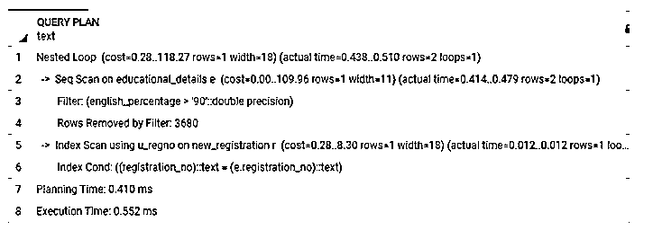

### 结论

在本文中，我们试图介绍一些用于 SQL 性能调优的最佳实践。简而言之，我们应该避免在大型数据库表上使用 SELECT*、JOINS 和复杂的相关查询。我们应该使用索引、临时表、简单的子查询和 cte 来提高处理器运行时间。

### 推荐文章

这是 SQL 性能调优指南。在这里，我们还将讨论大型表的介绍和使用索引，以及使用解释和解释分析关键字。您也可以看看以下文章，了解更多信息–

1.  [SQL 备份](https://www.educba.com/sql-backup/)
2.  [PostgreSQL 限制偏移量](https://www.educba.com/postgresql-limit-offset/)
3.  [MySQL sort_buffer_size](https://www.educba.com/mysql-sort_buffer_size/)
4.  [MySQL NOW](https://www.educba.com/mysql-now/)

