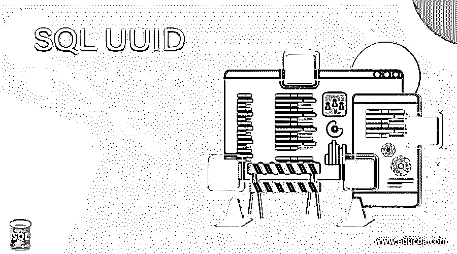
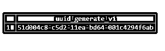
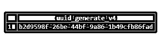
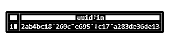
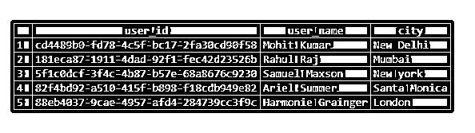

# SQL UUID

> 原文：<https://www.educba.com/sql-uuid/>

## SQL UUID 的定义

UUID(通用唯一标识符)是大多数编程语言中非常流行的数据类型。顾名思义，UUIDs 实际上是整个宇宙中唯一的值。也就是说，它们不仅对于数据库服务器是唯一的，对于不同的服务器也是唯一的。按照 RFC 4122 的定义，UUID 是由 128 位组成的五个十六进制数字的字符串。UUID 值可以是服务器时间、时钟序列、主网络的 MAC 地址等的组合。或者它可以是完全随机的或伪随机的，这取决于 UUID 版本。在本主题中，我们将学习 SQL UUID。

UUID 数据类型最常见的用法是作为主键。它们比传统的自动递增整数型主键更安全，因为它们是唯一的，并且难以猜测和复制。此外，它们是全局唯一的，因此在跨数据库执行迁移时不会产生问题。不会有任何冲突。但是，UUIDs 有一些缺点。例如，我们可以从自动递增类型的主键中查看插入顺序，但这对于 UUIDs 是不可能的。此外，UUIDs 是 128 位，与传统的主键相比要多得多。另一个缺点是，由于 UUIDs 的大小和复杂性，使用 UUIDs 进行调试可能是一个问题。

<small>Hadoop、数据科学、统计学&其他</small>

在这篇文章中，我们将讨论关于 UUIDs 的一切，从如何创建它们到如何在数据库表中使用它们。让我们从理解用于编写 UUID 生成函数的语法开始。

### SQL UUID 的语法和参数

通用 UUID 值如下所示:

AAAAAAAA-BBBB-CCCC-DDDD-eeeeeeeeee

用 SQL 编写 UUID 函数的基本语法如下:

`SELECT UUID_generate_version4();`

运筹学

`SELECT UUID_generate_version1();`

这个函数的语法可能会因数据库服务器的不同而不同，但是基本原理是相同的。这种特殊的语法对应于 postgreSQL。然而，在其他数据库中，它可能是 UUID _ 生成()、纽维()或 UUID()。

在数据库表中使用 UUID 数据类型的基本语法如下:

`CREATE TABLE tablename (
Column_name1 UUID CONSTRAINT,
column_name2 data type CONSTRAINT,
.
.
.
);`

上述语法中使用的参数类似于 CREATE TABLE 语句。唯一的区别是使用了 UUID，而不是其他任何数据类型。

### SQL UUID 的示例

为了使用 UUID 值，我们必须在数据库服务器中加载 UUID 生成函数，比如 uuid_generate_v4()，因为默认情况下它不会加载到数据库服务器中。下面是执行此任务的 CREATE EXTENSION 语句。

`CREATE EXTENSION IF NOT EXISTS "uuid-ossp";`

#### 示例#1

**SQL 查询来说明版本 1 类型的 UUID 值的生成。**

`SELECT UUID_generate_v1();`

**输出:**

#### 实施例 2

**SQL 查询来说明版本 4 的 UUID 值的生成类型。**

`SELECT UUID_generate_v4();`

**输出:**

#### 实施例 3

**不使用 UUID 生成函数生成 UUID 的 SQL 查询。**

在上述查询中，我们创建了一个系统生成的 UUID。我们还可以通过组合使用 clock_timestamp()和 random()函数来创建一个定制的 UUID 字符串，如下所示。

`SELECT uuid_in (md5(clock_timestamp()::text || random()::text)::cstring);`

**输出:**

#### 实施例 4

说明 UUID 值作为主键的用法的 SQL 查询？

接下来，为了说明 UUID 数据类型的一些实际用法，让我们创建一个名为“user_details”的虚拟表。该表包含版本 4 中 UUID 类型的用户 id。该表的 CREATE TABLE 语句如下:

`CREATE TABLE user_details (
user_id UUID DEFAULT uuid_generate_v4(),
user_name VARCHAR(225) NOT NULL,
city VARCHAR(50),
PRIMARY KEY (user_id)
);`

user_details 表已成功创建。默认情况下，每次向表中插入新记录时，都会使用 uuid_generate_v4()函数生成 UUID 值。

创建了表之后，让我们在其中插入一些记录。我们可以使用下面的 INSERT 语句来插入记录。

`INSERT INTO user_details(
user_name, city)
VALUES ('Mohit Kumar','New Delhi'),
('Rahul Raj','Mumbai'),
('Samuel Maxson','New york'),
('Ariel Summer', 'Santa Monica'),
('Harmonie Grainger', 'London');`

已成功插入 5 条记录。我们不需要为 user_id 字段插入任何值，因为它是默认生成的，并且 UUID_generate_v4()函数将确保为每个记录插入一个唯一的值。

让我们检查 user_id 列是否已经以期望的方式填充。

`SELECT * FROM user_details;`

**输出:**

使用 SELECT 语句获取的结果显示，已经成功生成了由 5 个十六进制值组成的 user _ ids。它们都是独一无二的，当然，很难记忆和复制。因此，UUIDs 通常被用作主键。

### 结论

在这篇文章中，我们学习了 SQL 中的 UUID 数据类型。它是一组唯一的 5 个十六进制值。UUIDs 用于创建唯一标识记录的主键。它不仅在数据库服务器中是唯一的，而且在全球范围内也是唯一的。因为它要么是随机生成的，要么是伪随机生成的，所以很难复制。因此，它提供了急需的安全性和唯一性。

### 推荐文章

这是一个 SQL UUID 的指南。在这里，我们讨论 SQL UUID 的介绍，包括适当的语法、相应的参数和查询示例。您也可以看看以下文章，了解更多信息–

1.  [SQL 子句](https://www.educba.com/sql-clauses/)
2.  [用 SQL 解释](https://www.educba.com/explain-in-sql/)
3.  [SQL Server 数据类型](https://www.educba.com/sql-server-data-types/)
4.  [SQL 减](https://www.educba.com/sql-minus/)

