# SQL 运算符

> 原文：<https://www.educba.com/sql-operators/>

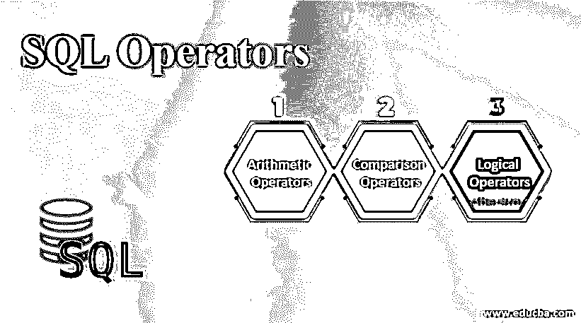

## SQL 运算符简介

SQL 操作符被定义为一个符号或特定的保留关键字，用于指定对给定表达式执行的一些操作，包括几个子句来告诉系统操作符的行为方式。运算符在数据项或操作数之间进行计算，并执行查询结果。它在 SQL 语句中提供一个条件，或者组合多个条件并在操作数之间进行处理(过滤结果)。数据之间使用的运算符可以带有单个或二进制操作数。所有的操作符都用 SQL 的条件语句和 [WHERE 子句指定。](https://www.educba.com/sql-where-clause/)

### SQL 运算符的类型

SQL 是处理各种数据操作的数据库管理系统的基础。因此，SQL 提供了一些 SQL 运算符来执行运算，评估表达式的优先顺序非常重要。以下是 SQL 中使用的各种运算符。

<small>Hadoop、数据科学、统计学&其他</small>

1.  算术运算符
2.  比较运算符
3.  逻辑运算符

下面就让我们一个一个来详细看看:

#### 1.算术运算符

在 SQL 查询中，这些运算符处理数学校准，如加、乘、除、减和其他模数数值。

**语法:**

`Select <expression 1> operator <expression 2>`

##### 1.添加

该运算符有助于将运算符两边的值相加。下面是一元运算符。示例:M + N

**代码:**

`SQL> select 11+ 20;`

**输出:**

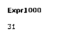

##### 2.减法

这个运算符意味着运算符两边的值相减(从左边减去)。示例:M–N

**代码:**

`SQL> select 30- 20;`

**输出:**

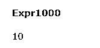

##### 3.增加

这个 SQL 运算符在两个操作数之间执行乘法运算。示例:M*N

**代码:**

`SQL> select 12 * 6;`

**输出:**

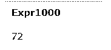

##### 4.分开

该运算符通过将一个表达式除以其他表达式来执行操作。示例:M/N

**代码:**

`SQL> select 120 / 5;`

**输出:**

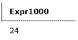

##### 5.系数

这个 SQL 运算符返回两个操作数之间除法运算的余数。对此的以下陈述是:

**代码:**

`SQL> select 12 / 7;`

**输出:**

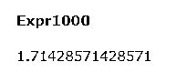

*   下面的查询使用特定数据库表上的算术运算。考虑一个有四列的表“Finance”。

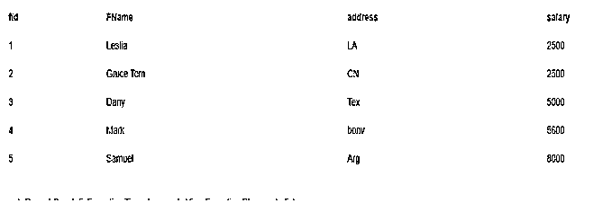

*   我对表中的特定字段使用算术运算符。在这里，我采用了 Salary 列来执行算术运算。

**例#1**

**代码:**

`SELECT fid, FName, salary, salary + 50
AS "Revised Sal" FROM finance;`

**输出:**

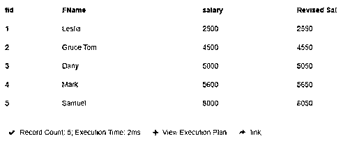

**例 2**

**代码:**

`SELECT fid, FName, salary, salary - 150
AS "Revised Sal" FROM finance;`

**输出:**

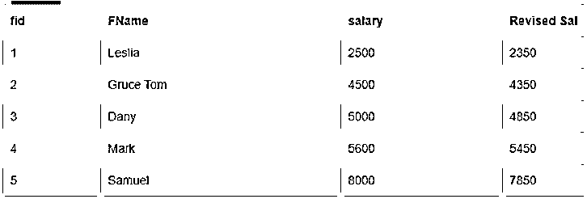

*   这就是 SQL 的算术运算。在下一节中，我们将看到比较运算符

#### 2.比较运算符或关系运算符

有条件接受两个表达式，进行有用的比较，并返回 True 或 False。它执行诸如等于、小于、大于或大于类似于等高级概念的操作。这个操作符用 where 子句来选择记录中的特定列。在下一节中，我们将描述不同类型的关系运算符以及它们的一些例子和语法。

**语法**:

`SELECT column FROM table WHERE condition1 Relational Operator condition2;`

##### 1.等于(=)

该运算符检查两个操作数的值是否相同。如果相等，则返回 true 如果不是，则返回 false。

**代码:**

`SELECT FName, salary FROM finance where salary =5000;`

**输出:**

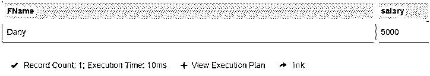

##### 2.不等于或不平等(！=)，(<>)

它验证两个操作数的值是否相等。如果它们不相同，则该语句返回 True。

**代码:**

`SELECT FName, salary FROM finance where salary <>2500;`

**输出:**

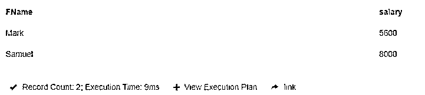

##### 3.大于(>)

它在 SQL 中用于检查两个操作数之间更重要的值。

**代码:**

`SELECT FName, salary FROM finance where salary>5000;`

**输出:**

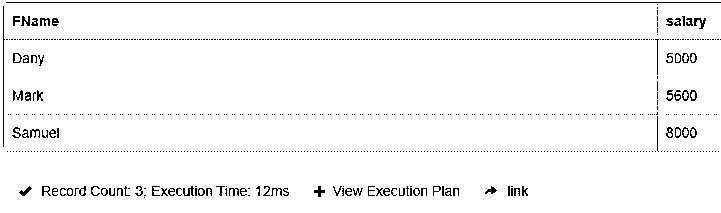

##### 4.大于等于(> =)

它在 SQL 中用于检查两个操作数之间的大于或等于值。

**代码:**

`SELECT FName, salary FROM finance where salary>=5000;`

**输出:**

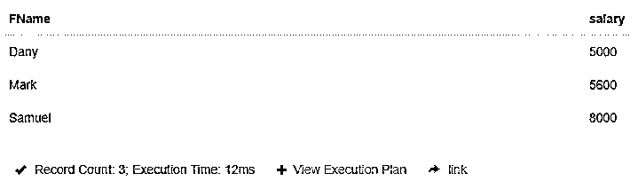

##### 5.小于(

SQL 中的这个运算符检查左操作数是否小于右操作数。如果是真的，就产生了结果。

**代码:**

`SELECT FName, salary FROM finance where salary < 5000;`

**输出:**

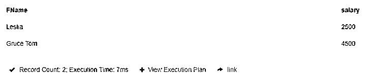

##### 6.小于或等于(< =)

SQL 中的这个运算符检查左操作数是否小于或等于右操作数。如果是真的，就产生了结果。

**代码:**

`SELECT FName, salary FROM finance where salary <=4500;`

**输出:**

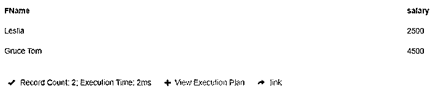

一些高级操作符是这样的，不为空，这一点我们以后会看到。

#### 3.逻辑运算符

逻辑运算符在 SQL 中执行逻辑运算，判断是真还是假。下面列出了这里使用的不同运算符:

*   和
*   运筹学
*   不
*   在…中间
*   任何的

**语法:**

`SELECT col name  * | expr [logical operator] [col name | * | expr..] FROM tablename
WHERE <expr> [ logical operator |
arithmetic operator | ...] <expressions>;`

考虑相同的数据库财务来执行逻辑操作符:

##### 1.逻辑积算符

它优先考虑在 WHERE 子句中使用多个条件。

**代号:**
`SELECT  fid,FName,address,salary
FROM finance
WHERE  FName  =  'Leslia' AND  salary  =  2500;`

**输出:**

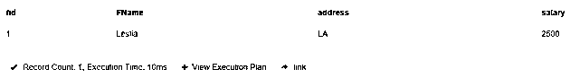

##### 2.运筹学

这将比较语句中的表达式，如果任一条件为真，则返回 true。

**代码:**

`SELECT  fid,FName,address,salary
FROM finance
WHERE  FName  =  'Gruce TOM' OR salary  =  2500;`

**输出:**

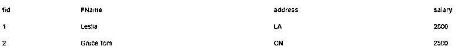

##### 3.不

该操作符将参数作为单个布尔值，如果为假，则返回真，反之亦然。

**代码:**

`SELECT Fid , address FROM finance WHERE NOT FName = "Dany";`

**输出:**

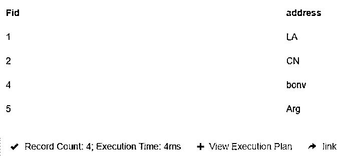

##### 4.任何的

取一个特定值，并与字段中的任何值进行比较。

**代码:**

`SELECT * FROM finance
WHERE salary > ANY (SELECT salary FROM finance WHERE salary > 5000);`

**输出:**

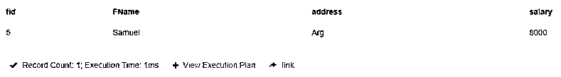

##### 5.在…中间

当值之间存在限制范围时，使用此运算符。

**代码:**

`SELECT * FROM finance
WHERE salary BETWEEN 2500 AND 5000;`

**输出:**

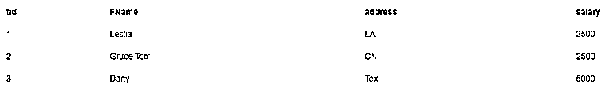

### 结论

因此，在本文中，我们学习了如何在 SQL 语句中使用不同的操作符。此外，我们遇到了使用各自的条件从数据库中过滤数据，因为操作符允许检查两个表达式是否相同。

### 推荐文章

这是 SQL 操作符的指南。在这里，我们详细讨论了三种不同类型的 SQL 的基本概念，并给出了相应的代码和输出。您也可以浏览我们的其他相关文章，了解更多信息——

1.  [SQL 集合运算符](https://www.educba.com/sql-set-operators/)
2.  [SQL 子句](https://www.educba.com/sql-clauses/)
3.  [PostgreSQL 排序依据](https://www.educba.com/postgresql-order-by/)
4.  [SQL 字符串运算符](https://www.educba.com/sql-string-operators/)

