# SQL 算术运算符

> 原文：<https://www.educba.com/sql-arithmetic-operators/>

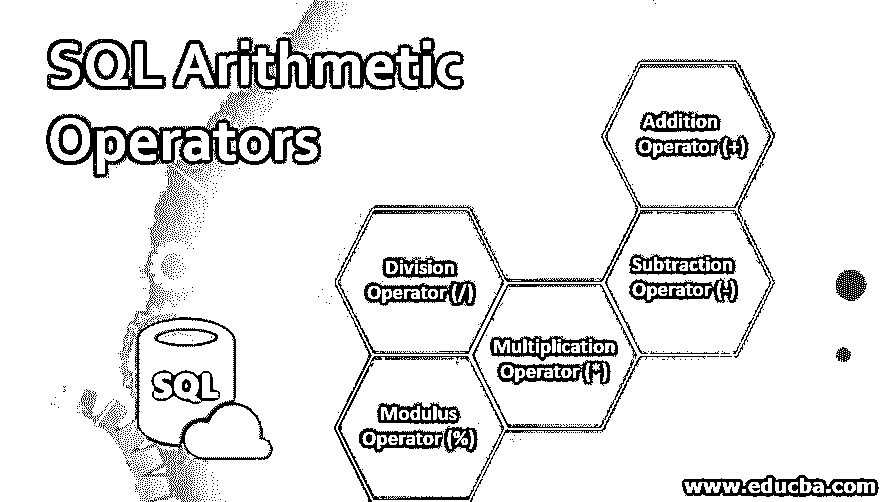

## SQL 算术运算符简介

SQL 中的算术运算符用于执行数学运算，如加、减、乘、除和取模等。如果在查询中需要满足多个条件，这些算术运算符可以与 SQL 语句中的 WHERE 子句一起使用，但是如果表中存在任何空值，在对空值执行算术运算时，我们将得到 Null 结果。

### SQL 中主要的前 5 个算术运算符

SQL 中的各种算术运算符是加法(+)、减法(-)、乘法(*)、除法(/)和模数(%)，用于对存储在数据库表中的数据执行数学运算。让我们通过下面的例子来理解 SQL 中各种算术运算符的工作原理。

<small>Hadoop、数据科学、统计学&其他</small>

#### 1.加法运算符(+)

运算符“+”用于对两个操作数执行加法运算。在下面的例子中，我们可以看到加法运算符用于将 100 和 220 相加。

`SELECT 100 + 220 as Addition;`

**输出:**

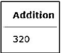

让我们以下面的“雇员”表为例来理解操作符是如何工作的。

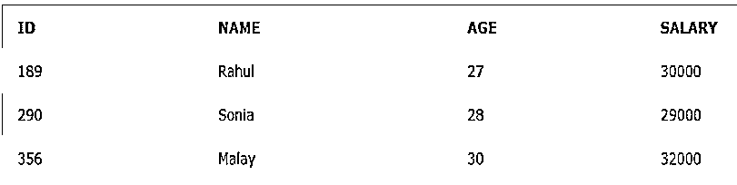

该表包含各种雇员及其详细信息。让我们对 SALARY 列执行加法运算。在下面的查询中，10000 被添加到 SALARY 列。

`SELECT SALARY+10000 as new_salary FROM EMPLOYEES;`

**输出:**

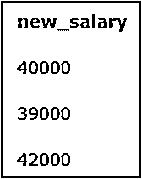

让我们使用加法运算符将两列相加，如下面的查询所示。

`SELECT SALARY+ID as added_salary FROM EMPLOYEES;`

上面查询的结果可以在下面看到，其中添加了 salary 和 ID 列。

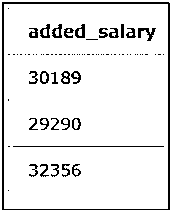

#### 2.减法运算符(-)

减法运算符“-”用于从左操作数中减去右操作数。让我们以下面的例子来从 260 中减去 99。

`SELECT 260-99 as Subtract;`

**输出:**

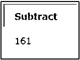

现在让我们以前面提到的表“雇员”为例。在下面的查询中，我们可以看到从 SALARY 列中减去了 5500。

`SELECT SALARY-5500 as Subtracted_Sal FROM EMPLOYEES;`

**输出:**

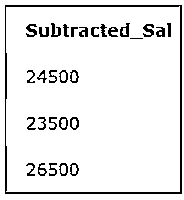

在下面的查询中，显示了 SALARY 和 ID 两列的减法运算。

`SELECT SALARY-ID as New_Sal FROM EMPLOYEES;`

我们可以看到，在上面的查询中，从 SALARY 列中减去了 ID 列，减法运算的结果如下所示。

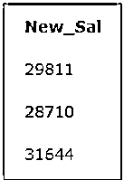

#### 3.乘法运算符(*)

该运算符执行两个操作数的乘法运算。在下面的例子中，我们可以看到 99 和 89 的乘法运算。

`SELECT 99*89 as Multiplication;`

**输出:**

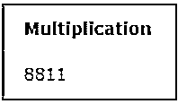

考虑到前面提到的 EMPLOYEES 表，让我们将列 SALARY 乘以 15，如下所示。

`SELECT SALARY*15 as Multiplied_Salary FROM EMPLOYEES;`

上面查询的结果可以在下面看到，我们可以看到 15 乘以薪金列。

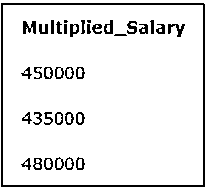

在下面的查询中，我们可以看到 EMPLOYEES 表中的两列(即 SALARY 和 ID)相乘已经完成。

`SELECT SALARY*ID as New_Salary FROM EMPLOYEES;`

**输出:**

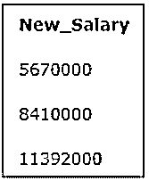

#### 4.除法运算符(/)

该运算符执行左侧操作数除以右侧操作数的操作。在下面的例子中，执行除法运算，其中 79 除以 6。

`SELECT 79/6 as Division;`

下面的结果表明，上述运算给出了除法的商，即 13 作为输出。

让我们再次考虑前面提到的“雇员”表。以下查询显示了在列 SALARY 除以 50 时执行的除法运算。

`SELECT SALARY/50 as Sal_Div FROM EMPLOYEES;`

**输出:**

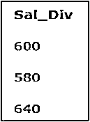

#### 5.模数运算符(%)

该算术运算符用于获得左侧操作数除以右侧操作数的余数。

`SELECT 23%4 as result;`

上面的查询显示，23 除以 4，得到的余数是 3，如结果所示。

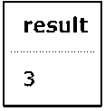

模数运算是在下面的 EMPLOYEES 表的 SALARY 列上执行的。

`SELECT SALARY%100 as result FROM EMPLOYEES;`

上述查询执行模数运算，当雇员的薪金除以 100 时，结果显示除法的余数为 0。

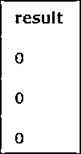

如果一个表包含任何空值，那么在对空值执行任何算术运算时，我们得到的结果都是 Null。

让我们考虑下面的 EMPLOYEES 表，其值为空，如下所示。

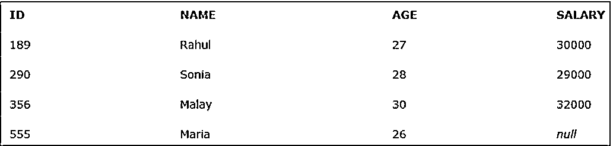

现在让我们对 SALARY 列执行加法和乘法运算，该列也包含一个空值。

`SELECT SALARY+500 as result FROM EMPLOYEES;`

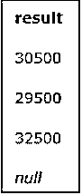

`SELECT SALARY*5 as result FROM EMPLOYEES;`

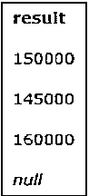

从上面的输出中，我们可以看到，如果存在一个空值，在对它执行乘法或加法运算时，我们得到的结果是 Null。

算术运算符可以与 WHERE 子句一起使用。

让我们以下表“学生”为例。

如果我们想计算学生获得的分数总和大于 150，那么我们可以使用算术运算符和 WHERE 子句，如下面的查询所示。

`SELECT NAME, MATHS_MARK+SCIENCE_MARK FROM STUDENTS WHERE MATHS_MARK+SCIENCE_MARK > 150;`

上面的查询将给出如下输出，其中显示了分数总和大于 150 的学生。

### 结论

SQL 算术运算符对于对存储在数据库表中的数据执行重要的数学运算至关重要。对于开发人员来说，很好地理解这些操作符是非常重要的。

### 推荐文章

这是 SQL 算术运算符的指南。在这里，我们将讨论简介、SQL 中主要的前 5 个算术运算符以及与查询和输出一起实现的各种运算符。您也可以浏览我们推荐的其他文章，了解更多信息——

1.  [SQL 集合运算符](https://www.educba.com/sql-set-operators/)
2.  [PostgreSQL 版本](https://www.educba.com/postgresql-versions/)
3.  [Tableau 中的自定义 SQL](https://www.educba.com/custom-sql-in-tableau/)
4.  [SQL 子句](https://www.educba.com/sql-clauses/)

