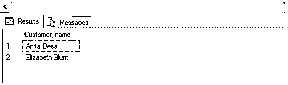
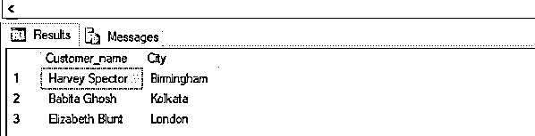
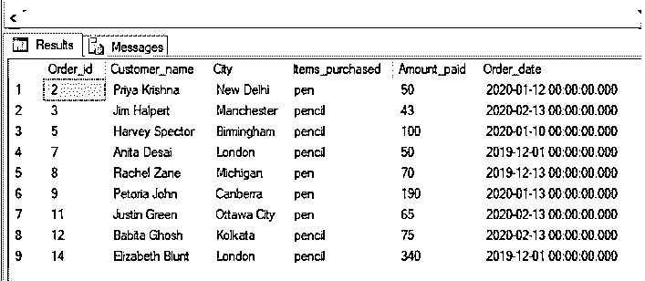
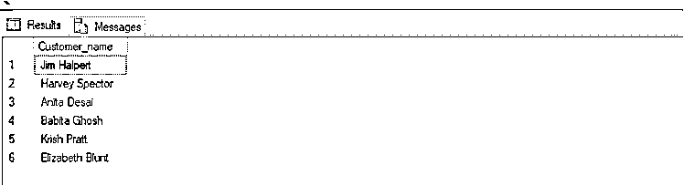
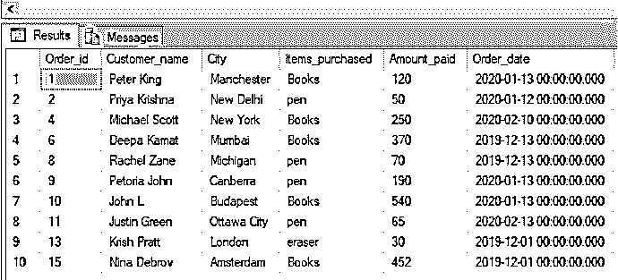

# SQL 逻辑运算符

> 原文：<https://www.educba.com/sql-logical-operators/>

## SQL 逻辑运算符简介

SQL 逻辑运算符(即 AND、OR 和 NOT)用于组合查询的 WHERE 子句中提到的多个条件，以从 SELECT 语句获得的结果集中筛选行。

有三种不同的逻辑运算符。它们执行以下功能:

<small>Hadoop、数据科学、统计学&其他</small>

| **逻辑运算符** | **功能** |
| 和 | WHERE 子句中提到的两个条件都应该为真。 |
| 运筹学 | WHERE 子句中提到的条件中至少有一个应该为真。 |
| 不 | WHERE 子句中提到的条件应为 false。 |

**语法和参数**

使用 SQL 逻辑运算符的一般语法如下:

`SELECT column_name(s)
FROM table_name_1
WHERE condition_1 LOGICAL OPERATOR condition_2 LOGICAL OPERATOR condtion_3…;`

语法中使用的不同参数是:

**选择列名:**用于从数据库中选择需要的数据。提及要对其执行逻辑运算并希望出现在结果集中的列名。

**FROM table_name_1:** 提及要从中提取列的表名。

**其中 condition_1:** 用于指定过滤记录的条件。

逻辑运算符:根据您希望被筛选的行满足的条件，说明您希望从{OR，AND}执行的逻辑运算的类型。NOT 运算符的语法与 AND 和 or 运算符稍有不同。我们将在讨论 NOT 运算符时讨论这一点。

上述参数中，所有参数都是强制的。您可以根据需要使用 GROUP BY、ORDER BY 和 HAVING 子句。

接下来，我们将详细讨论上面提到的逻辑运算符。

为了有效地演示和解释 SQL 中的逻辑运算符，我们将使用下面的“Orders”表。这张表是为一个电子商务网站做的。该表包含订单 id、客户名称、城市以及他们购买的商品的详细信息。

上述“订单”表的模式是:

记录数量:15 项

| **客户** |
| Order_id(主键) |
| 客户名称 |
| 城市 |
| 项目 _ 已购买 |
| 金额 _ 已付 |
| 订单日期 |

让我们看看订单表中的记录。以便稍后，我们可以理解逻辑运算符是如何有用的:

| **订单 id** | **客户名称** | **城市** | **物品 _ 已购买** | **已付金额** | **订单日期** |
| One | 彼得·金 | 曼彻斯特 | 书 | One hundred and twenty | 2020-01-13 00:00:00.000 |
| Two | 普里雅·克里希纳 | 新德里 | 围栏 | Fifty | 2020-01-12 00:00:00.000 |
| Three | 吉姆·哈尔珀特 | 曼彻斯特 | 铅笔 | Forty-three | 2020-02-13 00:00:00.000 |
| Four | 迈克尔·斯科特 | 纽约 | 书 | Two hundred and fifty | 2020-02-10 00:00:00.000 |
| Five | 哈维·斯佩克特 | 伯明翰 | 铅笔 | One hundred | 2020-01-10 00:00:00.000 |
| Six | 迪帕的钱 | 孟买 | 书 | Three hundred and seventy | 2019-12-13 00:00:00.000 |
| Seven | 安妮塔·德赛 | 伦敦 | 铅笔 | Fifty | 2019-12-01 00:00:00.000 |
| Eight | 雷切尔·赞 | 密歇根 | 围栏 | Seventy | 2019-12-13 00:00:00.000 |
| Nine | 彼得利亚·约翰 | 堪培拉 | 围栏 | One hundred and ninety | 2020-01-13 00:00:00.000 |
| Ten | 约翰·L | 布达佩斯 | 书 | Five hundred and forty | 2020-01-13 00:00:00.000 |
| Eleven | 贾斯汀·格林 | 渥太华市 | 围栏 | Sixty-five | 2020-02-13 00:00:00.000 |
| Twelve | 巴比塔·戈什 | 加尔各答 | 铅笔 | Seventy-five | 2020-02-13 00:00:00.000 |
| Thirteen | 克里斯·普拉特 | 伦敦 | 橡皮擦 | Thirty | 2019-12-01 00:00:00.000 |
| Fourteen | 伊丽莎白·布朗特 | 伦敦 | 铅笔 | Three hundred and forty | 2019-12-01 00:00:00.000 |
| Fifteen | Nina Debrov | 阿姆斯特丹 | 书 | Four hundred and fifty-two | 2019-12-01 00:00:00.000 |
| 空 | 空 | 空 | 空 | 空 | 空 |

**与逻辑运算符**

SQL AND 运算符用于组合查询的 WHERE 子句中提到的两个或多个条件。只有那些满足语句中 WHERE 部分提到的所有条件的行才会成为最终结果集。

这里有几个例子来说明 AND 运算符的用法。

### SQL 逻辑运算符的示例

下面是下面提到的 SQL 逻辑运算符的例子

#### 示例#1

查找伦敦购买了铅笔类商品的客户的姓名。

**代码:**

`SELECT Customer_name
FROM Orders
WHERE City = 'London' AND Items_purchased = 'pencil';`

#### 实施例 2

查找购买了图书类别中的商品并且在订单上花费超过 50 英镑的客户及其所在城市的名称。

**代码:**

`SELECT Customer_name, City
FROM Orders
WHERE Items_purchased = 'pencil' AND Amount_paid > 50;`

**或逻辑运算符**

SQL OR 运算符用于组合查询的 WHERE 子句中提到的两个或多个条件。只有那些满足语句 WHERE 部分中提到的至少一个条件的行才会成为最终结果集。

这里有几个例子来说明 OR 运算符的用法。

#### 实施例 3

查找客户购买铅笔或钢笔类别商品的订单详情。

**代码:**

`SELECT *
FROM Orders
WHERE Items_purchased = 'pencil' OR Items_purchased = 'Pen';`

#### 实施例 4

查找购买过铅笔或橡皮擦类商品的伦敦顾客的姓名。

**代码:**

`SELECT Customer_name
FROM Orders
WHERE Items_purchased = 'pencil' OR Items_purchased = 'eraser' AND City = 'London';`

**非逻辑运算符**

SQL NOT 运算符用于组合查询的 WHERE 子句中提到的两个或多个条件。它仅用于筛选那些不符合查询中 WHERE 部分所述条件的行。

NOT 运算符的语法与 AND 和 or 运算符稍有不同。内容如下:

SELECT column _ name FROM table _ name WHERE NOT condition；

这里有几个例子来说明 NOT 运算符的用法。

#### 实施例 5

查找客户购买物品的订单详细信息，而不是铅笔类别。

**代码:**

`SELECT *
FROM Orders
WHERE NOT Items_purchased = 'pencil';`

#### 实施例 6

在图书类别中查找不是在二月份下的订单的详细信息。

**代码:**

`SELECT *
FROM Orders
WHERE NOT MONTH(Order_date)='2' AND Items_purchased = 'Books';`

### 结论

正如我们在上面看到的，SQL 逻辑操作符用于在 WHERE 子句中组合多个条件，以便从数据集中过滤行。SQL 中的 AND、OR 和 NOT 运算类似于二元运算。

### 推荐文章

这是 SQL 逻辑运算符的指南。这里我们讨论 SQL 逻辑操作符的例子以及语法和参数。您也可以看看以下文章，了解更多信息–

1.  [SQL 子句](https://www.educba.com/sql-clauses/)
2.  [SQL 集合运算符](https://www.educba.com/sql-set-operators/)
3.  [Tableau 中的自定义 SQL](https://www.educba.com/custom-sql-in-tableau/)
4.  [像 SQL 中的查询](https://www.educba.com/like-query-in-sql/)

