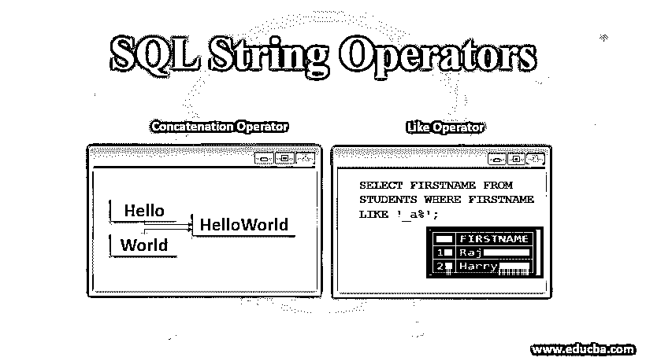
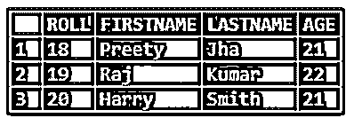
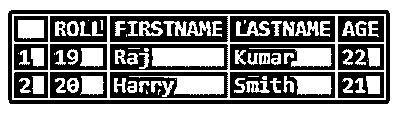

# SQL 字符串运算符

> 原文：<https://www.educba.com/sql-string-operators/>

## SQL 字符串运算符简介

SQL 中的字符串操作符用于执行重要的操作，如模式匹配、连接等。在执行模式匹配时，通过使用通配符(如“%”和“_”)以及 Like 运算符来搜索字符串中的特定模式，并通过使用串联操作，可以将表中的一个或多个字符串或列组合在一起。

### SQL 字符串运算符的示例

字符串的连接以及模式匹配可以通过使用 SQL 中的以下操作符来执行。让我们看几个例子。

<small>Hadoop、数据科学、统计学&其他</small>

#### 1.并置算符

串联操作用于组合字符串、表格的列，也可用于组合列和字符串。

在下面的例子中，我们可以看到两个字符串“Hello”和“World！”通过在字符串值之间使用“+”来组合。

`SELECT 'Hello' + 'World!' AS StringConcatenated;`

上面的语句给出了下面的结果，其中两个字符串被组合在一起，并且在输出中显示相同的内容。

在下面的语句中，可以看到这两个字符串是用空格连接在一起的。

`SELECT 'Hello' + ' ' + 'World!' AS StringConcatenated;`

在下面的结果中，字符串“Hello”和“World！”的连接被执行中间有一个空间。

在上面的示例中，我们可以看到执行了连接操作，并且在字符串中使用了“+”来组合字符串以及字符串值之间的空格。也可以在表的列上执行串联。

让我们以如下所示的表“学生”为例。

`select * from STUDENTS;`

在下面的示例中，表“STUDENTS”的“FIRSTNAME”和“LASTNAME”列由两列之间的空格组合而成。

`SELECT FIRSTNAME + ' ' + LASTNAME AS ConcatenatedName FROM STUDENTS;`

在下面的结果中，我们可以看到名字和姓氏以及它们之间的空格被连接在一起。

#### 2.Like 运算符

该运算符用于判断特定字符串是否与特定模式匹配，该模式可以是常规字符或通配符。在模式匹配时，常规字符应该与字符串的特定字符完全匹配，但是当我们想要匹配字符串的任意片段时，可以使用通配符。

让我们以下面的查询为例。

`SELECT * FROM STUDENTS WHERE FIRSTNAME='Preety';`

上述查询的结果如下所示。

在这里，如果我们需要检索学生 Preeti 的详细信息，我们需要记住完整的名字。在其他一些情况下，可能会出现不容易记住名字的情况，在这种情况下，使用模式匹配是有帮助的，这样，即使学生的名字部分匹配，也可以检索数据。在下面的查询中使用 Like 将检查列中的数据值是否与特定模式匹配。这里的模式也可能包含通配符。以下查询中使用的通配符是%，任何零个或多个字符的序列都由%匹配。

因此，前面的查询现在修改如下，使用 Like 和通配符。

`SELECT * FROM STUDENTS WHERE FIRSTNAME LIKE 'p%';`

在上面的查询中，FIRSTNAME 列与模式“p%”进行比较，然后查找以“p”开头的学生姓名，如下所示。

在下面的查询中，可以看到通配符%用在了' j '之前，这将查找以' j '结尾的值。

`SELECT * FROM STUDENTS WHERE FIRSTNAME LIKE '%j';`

下面上面语句的结果显示了以' j '结尾的学生姓名的输出。

在下面的查询中，可以找到以特定字符开头和结尾的任何值。

`SELECT FIRSTNAME FROM STUDENTS WHERE FIRSTNAME LIKE 'p%y';`

上述语句的结果如下所示。

在下面的查询中，找到了在任何位置匹配模式的值。

`SELECT * FROM STUDENTS WHERE FIRSTNAME LIKE '%a%';`

上面语句的结果可以在下面看到。

“%a%”查找在名字的任何位置包含“a”的任何值，我们可以看到“a”同时出现在学生 Raj 和 Harry 的名字中，并且在结果中显示相同的内容。

另一个通配符“_”用于匹配任何单个字符。如果我们想在特定位置查找任何字符，我们可以通过使用字符' _ '来实现，如下面的查询所示。

`SELECT FIRSTNAME FROM STUDENTS WHERE FIRSTNAME LIKE '_a%';`

上面的查询将显示学生“Raj”和“Harry”的名字，因为他们名字的第二个位置是“a”。

此外，我们可以看到，在下面的查询中，可以找到以“p”开头且字符长度至少为 2 的名字的值。

`SELECT FIRSTNAME FROM STUDENTS WHERE FIRSTNAME LIKE 'p_%';`

结果，可以看到名字‘Preeti’以‘p’开始，长度至少为两个字符。

### 结论

SQL 中的连接操作和模式匹配有着重要的作用。在串联操作中，可以组合字符串和列，在模式匹配中，列中的数据值与特定的模式匹配。开发人员需要更好地理解这些操作。

### 推荐文章

这是 SQL 字符串操作符的指南。这里我们讨论 SQL 示例中不同字符串操作符的基本概念及其代码实现。您也可以看看以下文章，了解更多信息–

1.  [PostgreSQL ORDER BY |排序&分组](https://www.educba.com/postgresql-order-by/)
2.  [在 SQL 中引入右连接](https://www.educba.com/sql-right-join/)
3.  [在 SQL 中使用通配符](https://www.educba.com/wildcard-in-sql/)
4.  [SQL 子句教程](https://www.educba.com/sql-clauses/)

