# sqlcommand

> 原文：<https://www.educba.com/sql-commands/>

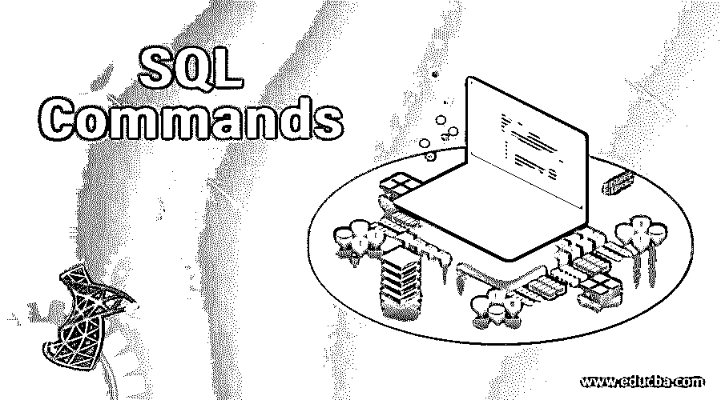

## SQL 命令简介

SQL 或一般称为结构化查询语言，是数据库的基本查询语言，也是关系数据库管理系统的特定领域语言。当数据类型是结构化的，并且数据的各种属性之间存在依赖关系时，这是很有用的。它被广泛使用，并且是最流行的查询语言之一，因为它具有通过使用单个查询语句获取多条记录的独特能力。它由 [DDL(数据定义语言)](https://www.educba.com/data-definition-language/)和 [DML(数据操作语言)](https://www.educba.com/data-manipulation-language/)命令组成，这使得查询的使用更加高效。SQL 是一种基于集合的声明式编程语言，因此不是 C 或 BASIC 等命令式编程语言。为了从数据库中获取数据结果，您需要了解我们将在本文中学习的 SQL 命令。

### 基本 SQL 命令

下面给出了基本命令。

<small>Hadoop、数据科学、统计学&其他</small>

**1。SELECT:** 这可能是最基本的 SQL 命令。select 命令用于从数据库的特定表中获取或检索结果。这通常后跟特定的列名或所有列名(通过使用*)。

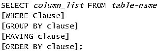

**2。CREATE:** 这是一个基本的 DDL 命令，用于在数据库中创建一个表。创建表的先决条件包括知道列名及其数据类型。

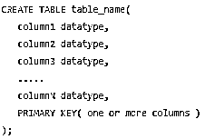

**3。ALTER:** 这个 DML 命令用于对表格进行修改。它包括根据需要修改表格。

**4。WHERE:**WHERE 子句是最重要的 SQL 命令之一，因为它用于检索或获取特定案例所需的特定数据。这很有帮助，因为它排除了所有不相关的数据。

**5。SQL ALIAS:**ALIAS 是最常用的 SQL 命令之一，用于为属性或列指定一个有意义的名称。它们是为列和表定义的，这有助于提高查询的可读性。

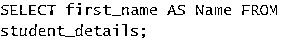

**6。AND:** 这是一个 SQL 操作符，用于组合两个条件。对于要出现在数据结果集中的行，这两个条件都应该为真。

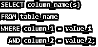

**7。AVG():** 这是一个聚合函数，用于返回特定数值列的平均值。

**8。ORDER BY:** 与 select 语句一起使用，以升序或降序对结果进行排序。如果 ORDER BY 子句后没有给定参数，默认情况下，它将作为升序查询。

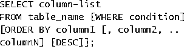

**9。GROUP BY:**SQL 命令中的 GROUP BY 子句用于根据与一个或多个列相关的特定分组来检索数据。

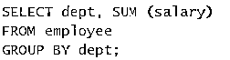

10。插入:插入命令用于在表格中添加新的一行数据。INSERT 命令的要求是应该已经创建了表。

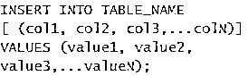

### 中间命令

中间命令如下所示:

**1。更新:**该命令用于更新或修改表格中的现有行。

**2。DELETE:** 顾名思义，这个命令用来从一个表中删除行。

**3。HAVING:**HAVING 子句用于根据一个或多个组函数过滤数据。这与使用 WHERE 子句非常相似，但这包括使用组函数。

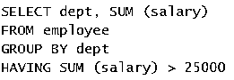

**4。LIKE:** 该操作符用于比较两个条件，并列出表中列名与 LIKE 子句指定的模式相匹配的所有行。当您不确定特定的模式时，可以使用通配符运算符，如%。

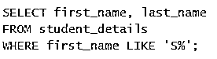

**5。IN:** 用多个值对一列进行比较时的 IN 运算符。它或多或少类似于 or 条件。

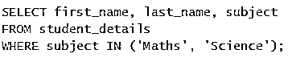

**6。IS NULL:**IS NULL 操作符是另一个基于 SQL 的操作符，用于显示特定的列名是否有空值。它用于获取指定列的所有行，这些列的数据尚未找到或已被发现为空。

**7。BETWEEN:** 顾名思义，这个操作符过滤一组特定范围的结果。在这种情况下，该值可以是数字、日期或文本。

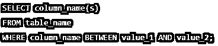

**8。CASE:** 这个 CASE 和 Java 等其他编程语言中使用的是一样的。，其中决策控制语句由[获取，case 语句](https://www.educba.com/case-statement-in-pl-sql/)和其中的参数用于获取匹配特定条件的案例结果。

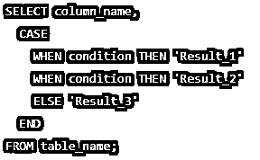

**9。COUNT():** 这是最有用的 SQL 命令之一，用于显示所有非空数据的总行数。它使用列名作为参数。

10。INNER JOIN: 这是最重要的 SQL 命令之一，当需要基于一个固定的公共属性在两个表的属性之间建立关系时，它就会发挥作用。换句话说，为了使内部联接起作用，联接条件必须为真。

### 高级 SQL 命令

高级命令如下所示:

**1。LIMIT:**LIMIT 子句将帮助您指定结果集中允许的最大行数。

**2。OUTER JOIN:** 这是一个 JOIN 函数，当两个表的所有字段都需要基于某个公共输入列条件时，这个函数就会发挥作用。如果不满足连接条件，则在列的右侧将填充一个空值。

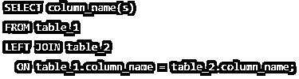

### 使用 SQL 命令的提示和技巧

无论何时使用 SQL 命令，花更多的时间分析表，而不是查询和执行它。通过最少使用动态 SQL，利用更简单、不太复杂的查询。此外，为了更好的可读性，我们更喜欢使用表别名。

### 结论

这篇文章是关于构成数据库查询语言基础的重要的 SQL 命令。

### 推荐文章

这是 SQL 命令的指南。在这里，我们讨论了基本、中级和高级 SQL 命令以及使用的技巧和诀窍。你也可以看看下面的文章来了解更多-

1.  [SQL GROUP BY WHERE](https://www.educba.com/sql-group-by-where/)
2.  [SQL Server 版本](https://www.educba.com/sql-server-versions/)
3.  [SQL now](https://www.educba.com/sql-now/)
4.  [sql 项目](https://www.educba.com/sql-projects/)

