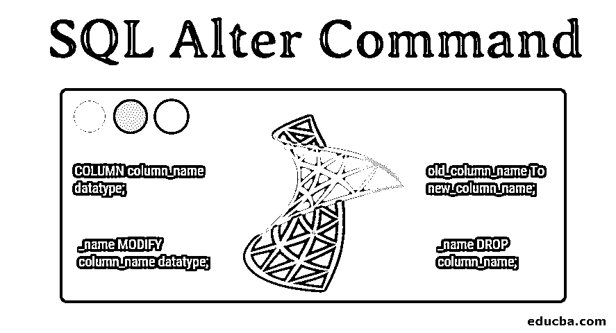

# SQL Alter 命令

> 原文：<https://www.educba.com/sql-alter-command/>

## SQL Alter 命令简介

SQL Alter 命令可以应用于各种级别的数据库，如数据库、表和列。顾名思义，它用于对数据库系统进行任何更改，因此被认为是 DML(数据操作语言)命令之一。最常用的 Alter 操作是 Add、Drop、Modify、change 命令，用于添加、删除或更改表或列的内容。

**语法**

<small>Hadoop、数据科学、统计学&其他</small>

ALTER 命令可用于向现有表中添加列、从表中删除列、重命名现有列以及更改列的数据类型。以下是可使用 Alter 命令执行的不同操作的语法。

**向现有表格添加新列的语法如下:**

`ALTER TABLE table_name ADD COLUMN column_name datatype;`

**将带有默认值的列添加到现有表的语法如下:**

`ALTER TABLE table_name ADD COLUMN column_name datatype DEFAULT ‘value’;`

**改变现有列的数据类型的语法如下:**

`ALTER TABLE table_name MODIFY column_name datatype;`

**重命名列的语法如下:**

`ALTER TABLE table_name RENAME old_column_name To new_column_name;`

**删除列的语法如下:**

`ALTER TABLE table_name DROP column_name;`

**向列添加 NOT NULL 约束的语法如下:**

`ALTER TABLE table_name MODIFY column_name datatype NOT NULL;`

### 如何结合实例使用 SQL Alter 命令？

为了理解 ALTER 命令的操作，让我们以下面的表‘EMPLOYEE’为例。已经创建了表‘EMPLOYEE ’,使用 Alter 命令可以进行许多修改，比如添加列、重命名列、删除列等。，可按如下所述完成。

员工表如下:

| **ID** | **名称** | **年龄** | **工资** |
| One hundred and thirty-four | 声音的 | Twenty-four | Twenty-three thousand |
| One hundred and forty-five | Nikhil | Twenty-seven | Twenty-eight thousand nine hundred and ninety |
| One hundred and sixty-seven | Soham | Twenty-six | Twenty-five thousand |
| Two hundred and thirty-four | 亚什 | Thirty-two | Thirty-five thousand |
| One hundred and eighty-nine | 日土 | Twenty-five | Twenty-nine thousand |
| One hundred and ninety | 拉杰什 | Twenty-eight | Twenty-nine thousand |

#### 向雇员表中添加一列，如下所示

`ALTER TABLE EMPLOYEE ADD COLUMN DOB DATE;`

上面的 ALTER 命令将把列' DOB '添加到现有的表' EMPLOYEE '中。这里，对于现有表中的每一行，列“DOB”都有一个空值。

我们可以使用下面的语句来查看结果:

`Select * from EMPLOYEE;`

| **ID** | **名称** | **年龄** | **工资** | **出生日期** |
| One hundred and thirty-four | 声音的 | Twenty-four | Twenty-three thousand | 空 |
| One hundred and forty-five | Nikhil | Twenty-seven | Twenty-eight thousand nine hundred and ninety | 空 |
| One hundred and sixty-seven | Soham | Twenty-six | Twenty-five thousand | 空 |
| Two hundred and thirty-four | 亚什 | Thirty-two | Thirty-five thousand | 空 |
| One hundred and eighty-nine | 日土 | Twenty-five | Twenty-nine thousand | 空 |
| One hundred and ninety | 拉杰什 | Twenty-eight | Twenty-nine thousand | 空 |

#### 添加具有默认值的列

让我们假设这些员工是在同一天加入的，因此所有员工的“加入日期”列可以具有相同的默认值。

`ALTER TABLE EMPLOYEE ADD COLUMN DOJ DATE DEFAULT '1990-08-09';`

上面的 ALTER 语句将把默认值为“1990-08-09”的列“DOJ”添加到雇员表中。通过使用下面的语句，我们可以看到上面命令的结果:

`Select * from EMPLOYEE;`

| **ID** | **名称** | **年龄** | **工资** | **DOJ** |
| One hundred and thirty-four | 声音的 | Twenty-four | Twenty-three thousand | 1990-08-09 |
| One hundred and forty-five | Nikhil | Twenty-seven | Twenty-eight thousand nine hundred and ninety | 1990-08-09 |
| One hundred and sixty-seven | Soham | Twenty-six | Twenty-five thousand | 1990-08-09 |
| Two hundred and thirty-four | 亚什 | Thirty-two | Thirty-five thousand | 1990-08-09 |
| One hundred and eighty-nine | 日土 | Twenty-five | Twenty-nine thousand | 1990-08-09 |
| One hundred and ninety | 拉杰什 | Twenty-eight | Twenty-nine thousand | 1990-08-09 |

#### 重命名现有列

通过使用下面的命令，我们可以将现有的“EMPLOYEE”表中的列“ID”重命名为“EMP_ID”。

`ALTER TABLE EMPLOYEE rename ID to EMP_ID;`

我们可以通过下面的语句看到上面命令的结果:

`Select * from EMPLOYEE;`

| **雇员标识** | **名称** | **年龄** | **工资** | **DOJ** |
| One hundred and thirty-four | 声音的 | Twenty-four | Twenty-three thousand | 1990-08-09 |
| One hundred and forty-five | Nikhil | Twenty-seven | Twenty-eight thousand nine hundred and ninety | 1990-08-09 |
| One hundred and sixty-seven | Soham | Twenty-six | Twenty-five thousand | 1990-08-09 |
| Two hundred and thirty-four | 亚什 | Thirty-two | Thirty-five thousand | 1990-08-09 |
| One hundred and eighty-nine | 日土 | Twenty-five | Twenty-nine thousand | 1990-08-09 |
| One hundred and ninety | 拉杰什 | Twenty-eight | Twenty-nine thousand | 1990-08-09 |

#### 从现有表中删除列

`ALTER TABLE EMPLOYEE DROP COLUMN DOJ;`

上述命令将从“雇员”表中删除列“DOJ”。

我们可以通过下面的语句看到结果:

`Select * from EMPLOYEE;`

| **雇员标识** | **名称** | **年龄** | **工资** |
| One hundred and thirty-four | 声音的 | Twenty-four | Twenty-three thousand |
| One hundred and forty-five | Nikhil | Twenty-seven | Twenty-eight thousand nine hundred and ninety |
| One hundred and sixty-seven | Soham | Twenty-six | Twenty-five thousand |
| Two hundred and thirty-four | 亚什 | Thirty-two | Thirty-five thousand |
| One hundred and eighty-nine | 日土 | Twenty-five | Twenty-nine thousand |
| One hundred and ninety | 拉杰什 | Twenty-eight | Twenty-nine thousand |

#### 向列添加 NOT NULL 约束

这里已经创建了表‘EMPLOYEE ’,如果我们想要向列‘SALARY’添加一个 NOT NULL 约束，那么我们可以如下所示。

`ALTER TABLE EMPLOYEE MODIFY SALARY DECIMAL(18, 2) NOT NULL;`

#### 修改列的数据类型

以下语句可用于修改现有列的数据类型，如下所示:

`ALTER TABLE EMPLOYEE MODIFY NAME CHAR(50);`

### 优势

以下是使用 Alter 命令的优点:

*   当我们想要修改数据库或数据库中包含的表时，Alter 命令非常有用。
*   在 Alter 命令的帮助下，如果需要对数据库的设计进行任何更改，可以在不干扰现有数据库或与其相关的对象的情况下进行许多修改。
*   即使在创建了表之后，我们也可以向列添加约束。

### 结论

如果在设计完成后出现任何业务需求，当我们想要更改或修改现有数据库时，ALTER 命令的需要就变得非常方便。我们可以使用 Alter 命令轻松地修改数据库或其中的表。但是开发人员在对数据库表使用 Alter command 时，应该检查为用户提供的 ALTER 权限。此外，当我们使用 Alter command 添加主键时，我们应该注意主键列必须已经创建，也就是说，当表第一次创建时，不能包含空值。

### 推荐文章

这是一个 SQL Alter 命令指南。在这里，我们讨论如何使用 SQL，添加带有示例和优点的 Alter 命令。您也可以阅读以下文章，了解更多信息——

1.  [SQL 管理工具](https://www.educba.com/sql-management-tools/)
2.  [T-SQL 字符串函数](https://www.educba.com/t-sql-string-functions/)
3.  [什么是 SQL 注入？](https://www.educba.com/what-is-sql-injection/)
4.  [如何将数据库连接到 MySQL？](https://www.educba.com/connect-database-to-mysql/)

