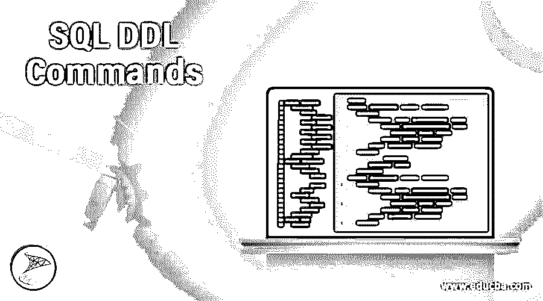
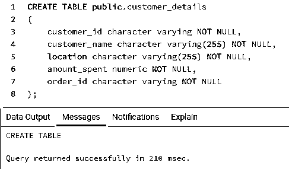
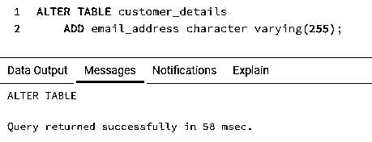
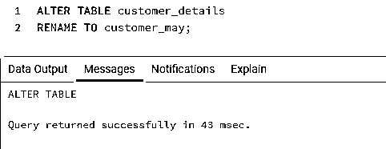
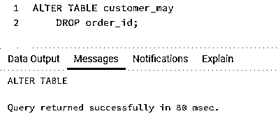
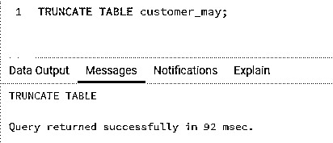
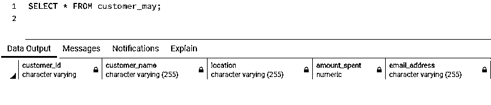
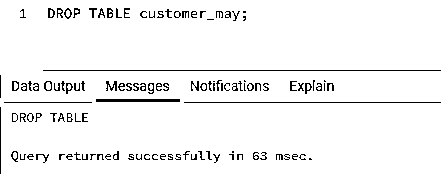
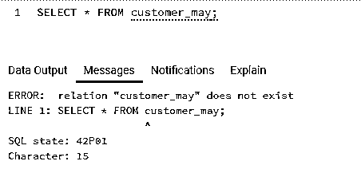

# SQL DDL 命令

> 原文：<https://www.educba.com/sql-ddl-commands/>

## SQL DDL 命令简介

标准查询语言(SQL)中的数据定义语言或 DDL 命令用于描述/定义数据库模式。这些命令处理数据库模式的创建及其进一步的修改。一些广为人知的 DDL 命令是 CREATE、ALTER、DROP、TRUNCATE 和 COMMENT。

对于上一句中提到的 DDL 命令名称，没有什么可大惊小怪的。在这篇文章中，我们将探究每一个命令，但是首先，让我们看看这个汇总表。

<small>Hadoop、数据科学、统计学&其他</small>

| **命令** | **描述** |
| 创造 | 用于创建数据库对象，如数据库和数据库表。 |
| 改变 | 用于修改和重命名现有数据库表的元素。 |
| 滴 | 用于删除整个数据库或数据库表。 |
| 缩短 | 用于从数据库表中删除所有记录。 |
| 评论 | 用于在 SQL 查询中编写注释。 |

### SQL DDL 的命令

现在，我们将在随后的章节中详细理解上述每个 DDL 命令。

#### 1.创造

CREATE 是一个数据定义语言(DDL)命令，用于创建数据库对象，如数据库和数据库表。

创建数据库的语法如下:

`CREATE DATABASE database_name;`

这里有一个例子来说明用 SQL 创建数据库。

`CREATE database practice_db;`

我们已经创建了数据库。现在让我们创建一个数据库表。但为此，我们首先需要知道语法。

在 SQL 中创建表的基本语法如下:

`CREATE TABLE public.customers
(
column_name_1  datatype [NULL | NOT NULL],
column_name_2  datatype [NULL | NOT NULL],
.
.
.
column_name_n  datatype [NULL | NOT NULL] )`

下面是一个使用 CREATE 命令创建数据库表的示例。

`CREATE TABLE public.customer_details
(
customer_id character varying NOT NULL,
customer_name character varying(255) NOT NULL,
location character varying(255) NOT NULL,
amount_spent numeric NOT NULL,
order_id character varying NOT NULL
);`

#### 2.改变

SQL 中的 ALTER 命令用于添加、重命名或修改、删除现有数据库表中的列。它还可以用来添加和删除现有数据库表上的各种约束。

通过添加新列来改变 SQL 中的表的语法如下:

`ALTER TABLE table_name
ADD (Columnname_1  datatype)`

下面是一个向现有表中添加新列的示例。

`ALTER TABLE customer_details
ADD email_address character varying(255);`

用于重命名表的语法如下:

`ALTER TABLE table_name_1
RENAME TO table_new_name;`

下面是一个重命名现有数据库表的示例。

`ALTER TABLE customer_details
RENAME TO customer_may;`

通过删除现有列来修改 SQL 中的表的语法如下:

`ALTER TABLE table_name
DROP columnname_1 , columnname_2, ...`

下面是一个从数据库表中删除现有列的示例。

`ALTER TABLE customer_may
DROP order_id;`

#### 3.缩短

TRUNCATE TABLE 命令用于从数据库表中删除所有数据记录。它会永久删除所有行。因此，我们不能执行回滚操作来撤消截断命令。

用于编写 TRUNCATE 命令的通用语法如下:

`TRUNCATE TABLE table_name;`

现在让我们看一个说明 TRUNCATE 命令的例子。

`TRUNCATE TABLE customer_may;`

我们已经成功地从数据库中删除了所有记录。让我们使用下面的 SELECT 语句来检查它。

`SELECT * FROM customer_may;`

那么我们观察到了什么？我们注意到 TRUNCATE 命令删除了表中的所有数据，但保留了表的结构。

#### 4.滴

DROP TABLE SQL 命令用于从数据库中删除一个数据库对象。我们甚至可以使用 DROP 命令删除数据库。我们不能执行回滚操作来撤消删除数据库/表命令。

用 SQL 编写删除数据库的 DROP 命令的基本语法如下:

`DROP DATABASE database_name;`

用 SQL 编写删除数据库的 DROP 命令的语法如下:

`DROP TABLE table_name;`

这里有几个例子来说明在 SQL 中使用 DROP 命令。

`DROP TABLE customer_may;`

我们已成功删除该表。在上一节中，我们学习了 TRUNCATE 命令。让我们看看 DROP 与 TRUNCATE 命令有何不同。

`SELECT * FROM customer_may;`

从上图可以清楚地看到，与 TRUNCATE 命令不同，DROP 语句删除整个表，包括表结构。

#### 5.评论

SQL 中的注释类似于 Java、C++、Python 等其他编程语言中的注释。它们主要用于定义代码段，以便于理解。注释可以是单行、多行，甚至是行内类型。

这里有几个例子来说明 SQL 中的注释。

(I)单行注释。

`-- this is a single line comment
SELECT * FROM customers;`

(二)多行注释。

`/* this is a multi line comment
SELECT * FROM customers; */
SELECT customer_id FROM customers;`

(iii)行内注释。

`SELECT customer_id FROM customers /* WHERE store_state = 'KA'*/;`

### 结论

SQL DDL 命令用于创建新的数据库对象(CREATE 命令)、修改现有的数据库对象(ALTER 命令)以及删除或移除数据库对象(DROP 和 TRUNCATE 命令)。

### 推荐文章

这是一个 SQL DDL 命令指南。在接下来的章节中，我们将详细讨论 DDL 命令。您也可以看看以下文章，了解更多信息–

1.  [SQL UNION ALL](https://www.educba.com/sql-union-all/)
2.  [SQL 窗口函数](https://www.educba.com/sql-window-functions/)
3.  [PostgreSQL 平均值](https://www.educba.com/postgresql-average/)
4.  [MySQL 文本](https://www.educba.com/mysql-text/)

