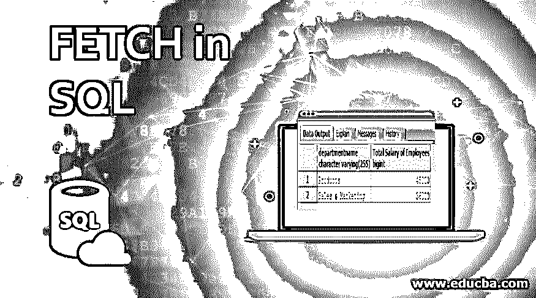
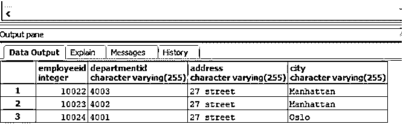
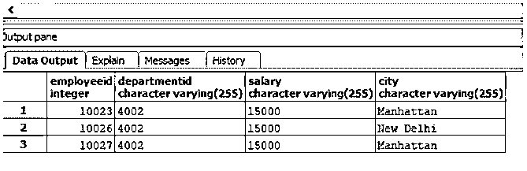
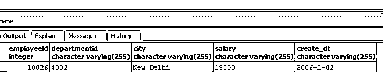
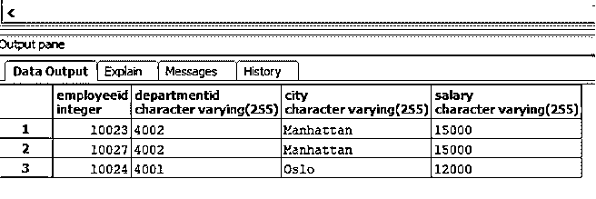
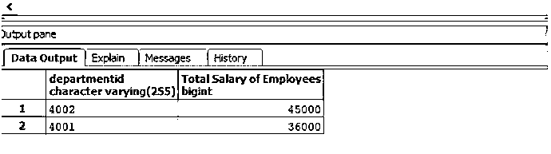
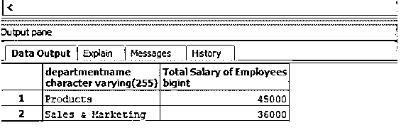

# 在 SQL 中提取

> 原文：<https://www.educba.com/fetch-in-sql/>

## SQL 中的 FETCH 简介

FETCH 是一个结构化查询语言(SQL)命令，与 ORDER BY 子句和 OFFSET 一起使用，使用游标顺序检索或提取选定的行，该游标逐行前进，并顺序处理行，直到游标达到命令中提到的终止条件。

声明获取命令所涉及的基本步骤是:

<small>Hadoop、数据科学、统计学&其他</small>

*   游标的声明，它将按顺序一次处理一行
*   打开声明的游标
*   一次提取一行
*   在终止条件下关闭光标，即到达要处理的行数中的最后一行时(如 FETCH 命令的一部分所述)。

### 语法和参数

在 SQL 中使用 FETCH 命令的基本语法如下:

**语法:**

`SELECT column_name(s)
FROM table_name
ORDER BY column_name
OFFSET starting_point
FETCH NEXT terminating_point ROWS ONLY;`

上述语法中使用的参数是:

**选择:**用于从数据库中选择需要的数据。

**列名:**指定希望包含在结果集中的列名。

**FROM:** 用于指定要从哪个来源提取数据。

**ORDER BY column _ name:**ORDER BY 用于将数据按升序或降序排列。指定记录排序所依据的 column_name。

**OFFSET starting _ point:**OFFSET 总是用在 ORDER BY 子句中。它用于指定游标应该开始处理/计算行数的行号。

**仅提取下一个 terminating_point 行:**提取命令是顺序选择提到的行数。下一步是让游标理解它必须获取下一个行数(terminating_point)。只有游标知道它必须关闭获取操作。

上述参数中，所有参数都是强制的。您可以根据需要使用连接、WHERE、GROUP BY 和 HAVING 子句。

接下来，我们将详细讨论上述 FETCH 命令。

为了更好地理解这个概念，我们将借助这两个表，“employees”(包含所有雇员的个人详细信息)和“department”(包含部门 id、名称和 hod 等详细信息)。

“部门”表中的数据如下所示:

| **部门编号** | **部门名称** | **头** |
| Four thousand and one | 销售和营销 | Ten thousand and twenty-four |
| Four thousand and two | 制品 | Ten thousand and twenty-three |
| Four thousand and three | 人力资源 | Ten thousand and twenty-two |

“雇员”表中的数据如下:

| **员工 id** | **姓氏** | **名字** | **部门编号** | **地址** | **城市** | **创建于** | **工资** |
| Ten thousand and twenty-eight | １９８９．　贝克尔 | 托德 | Four thousand and one | 27 街 | 奥斯陆 | 2007-1-03 | Twelve thousand |
| Ten thousand and twenty-nine | 丽贝卡(女子名ˌ寓意迷人的美) | 杜松子酒的 | Four thousand and one | 27 街 | 曼哈顿 | 2007-12-03 | Twelve thousand |
| Ten thousand and twenty-seven | Tobby | 丽雅 | Four thousand and two | 31 街 | 曼哈顿 | 2006-1-03 | Fifteen thousand |
| Ten thousand and twenty-six | 夏尔马 | 迪帕克（男子名） | Four thousand and two | 第十街 | 新德里 | 2006-1-02 | Fifteen thousand |
| Ten thousand and twenty-four | 克利须那 | 丽娜 | Four thousand and one | 27 街 | 奥斯陆 | 2002-1-31 | Twelve thousand |
| Ten thousand and twenty-three | 杰克逊 | 大卫 | Four thousand and two | 27 街 | 曼哈顿 | 2001-12-31 | Fifteen thousand |
| Ten thousand and twenty-two | 迈耶斯 | 大卫 | Four thousand and three | 27 街 | 曼哈顿 | 2000-12-31 | Ten thousand |

### SQL 中的 FETCH 示例

这里有几个例子来详细理解 FETCH 命令。

#### 示例#1

说明偏移和获取命令的基本 SQL 查询。

**代码:**

`SELECT employeeid,departmentid,address,city
FROM employees
ORDER BY employeeid
OFFSET 0
FETCH NEXT 3 ROWS ONLY;`

**输出:**

在上面的示例中，SQL 游标从所提到的偏移量“0”开始，一直提取行，直到到达行号“3”。

#### 实施例 2

根据薪水查找前三名雇员的详细信息，如 employeeid、departmentid、城市和薪水。

**代码:**

`SELECT employeeid,departmentid,salary,city
FROM employees
ORDER BY salary DESC
OFFSET 0
FETCH NEXT 3 ROWS ONLY;`

**输出:**

#### 实施例 3

找到详细信息，如雇员 id、部门 id、城市和在中间某处加入公司的雇员的工资。(假设第一个员工是在公司成立时加入的，总共有 7 个员工)。

**代码:**

`SELECT employeeid,departmentid,city, salary, create_dt
FROM employees
ORDER BY create_dt
OFFSET 3
FETCH NEXT 1 ROWS ONLY;`

**输出:**

在本例中，我们尝试调整偏移量，使光标从所需的行号(即 3)开始，并检索下一个 1 行。

#### 实施例 4

根据来自“曼哈顿”或“奥斯陆”的前三名雇员的工资，查找他们的详细信息，如 employeeid、departmentid、城市和工资。

**代码:**

`SELECT employeeid,departmentid,city, salary
FROM employees
WHERE city = 'Manhattan' OR city = 'Oslo'
ORDER BY salary DESC
OFFSET 0
FETCH NEXT 3 ROWS ONLY;`

**输出:**

#### 实施例 5

找出公司在支付员工工资上花费最多的两个部门。

**代码:**

`SELECT departmentid,SUM(salary :: integer) as "Total Salary of Employees"
FROM employees
GROUP BY departmentid
ORDER BY 2 DESC
OFFSET 0
FETCH NEXT 2 ROWS ONLY;`

**输出:**

在上面的例子中，仅仅是部门 id 并不能很好地描述不认识他们的人。因此，让我们尝试添加部门名称。为此，我们需要一个连接操作。

**代码:**

`SELECT d.departmentname,
SUM(e.salary :: integer) as "Total Salary of Employees"
FROM employees as e JOIN department as d
ON e.departmentid :: integer = d.departmentid
GROUP BY d.departmentname
ORDER BY 2 DESC
OFFSET 0
FETCH NEXT 2 ROWS ONLY;`

**输出:**

### 结论

SQL FETCH 命令用于从表中顺序提取或检索选定的行。它总是与 ORDER BY 子句和 OFFSET 一起使用。它们从不作为独立的语句使用。如果您想从有序集合中选择有限数量的行，比如前 3 行、前 10 行或后 3 行等，这非常方便。

### 推荐文章

这是一个在 SQL 中获取的指南。这里我们讨论一些例子来理解 FETCH 命令以及语法和参数。您也可以阅读以下文章，了解更多信息——

1.  [SQL 外部连接](https://www.educba.com/sql-outer-join/)
2.  [SQL 交叉连接](https://www.educba.com/sql-cross-join/)
3.  [SQL 中的主键](https://www.educba.com/primary-key-in-sql/)
4.  [PostgreSQL 中的索引](https://www.educba.com/indexes-in-postgresql/)
5.  [PostgreSQL 偏移量指南](https://www.educba.com/postgresql-offset/)
6.  [Oracle 中的 FETCH |如何工作？](https://www.educba.com/fetch-in-oracle/)

