# SQL 选择不同的多列

> 原文：<https://www.educba.com/sql-select-distinct-multiple-columns/>


## SQL SELECT DISTINCT 多列简介

Sql select distinct multiple columns 用于从我们使用 distinct 子句的多个列中检索特定记录。我们还可以使用 sql select distinct 子句添加多个表列，因为我们知道 sql select distinct 会删除所有字段都相同的行，这是我们已经选择的。通过使用它，我们可以从多个列中过滤数据。

SQL select distinct on multiple columns 在 RDBMS 系统中更有用，可以从单个表的各个列中获取唯一的记录。我们可以使用 SQL 从查询中定义的指定表的多个列中选择不同的关键字。它将从列中删除重复的记录。它将在不同的列上工作，以找到唯一的记录。它从多个列中检索所有唯一记录的计数。因此，它将消除所有重复的记录。

<small>Hadoop、数据科学、统计学&其他</small>

### 如何使用 SQL SELECT DISTINCT 多列？

SQL select distinct 将对多个列起作用；我们可以在从中检索唯一记录的表的单个和多个列上使用相同的方法。

下面是 sql select distinct 多列语句的语法，如下所示:

**语法:**

```
Select DISTINCT name_of_column1, name_of_column2, …., name_of_columnN
From name_of_table;
```

```
Select DISTINCT name_of_column1, name_of_column2, …., name_of_columnN
From name_of_table where condition;
```

```
Select DISTINCT name_of_column1, name_of_column2, …., name_of_columnN from name_of_table where condition order by name_of_column;
```

下面是 SQL select distinct multiple columns 语句的描述语法:

*   **Select:** 使用 Select，我们可以根据查询中给定的条件选择数据。例如，我们可以选择 distinct 语句从表中检索唯一的记录。
*   **表名:**这只是我们从多个列中检索唯一记录的表名。
*   **列名:**这是与 distinct 关键字一起使用的列名，用于从多个列中检索数据。
*   **Order by:** 该条件与 sql select distinct multiple columns 语句一起使用，以按列提取记录，我们已经将它与 Order by 条件一起使用。
*   **where 条件:**任何 SQL 语句中的 Where 条件都将用于选择或检索我们在 Where 条件中定义的指定行。

为了定义如何使用 SQL select distinct 多列，我们使用了 orders 表。此外，我们正在使用 Postgres 数据库来执行定义我们如何使用它的查询。

**代码:**

```
 Select * from orders;
```

**输出:**

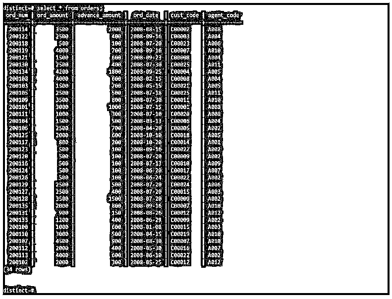


在下面的查询中，我们在 sql select distinct 子句中使用了两列。使用两列后，我们可以看到从两列中检索唯一值的输出。

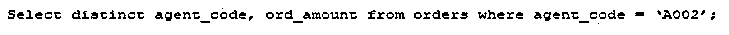


下面是上述查询的关系代数表达式。

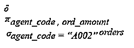


下面是上面查询的关系代数树。

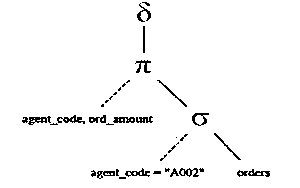


下面是上述输出的图示。

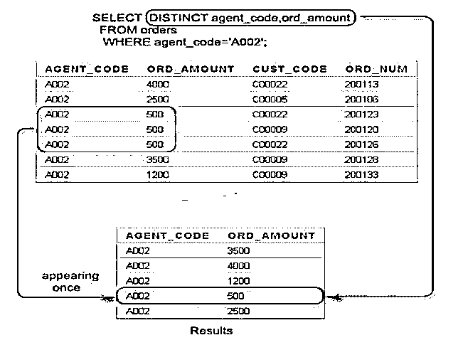


在下面的查询中，我们从三列中检索数据。在对三列使用 distinct 子句后，它将从两行中检索唯一值。

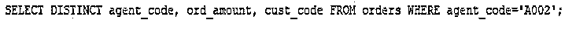


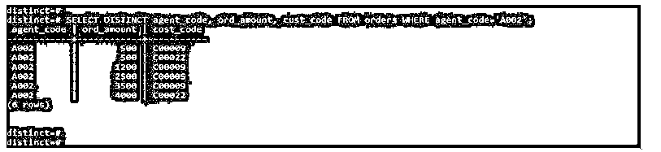


下面是上述查询的关系代数表达式。

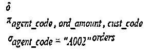


下面是上面查询的关系代数树。

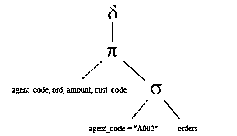


下面是上述输出的图示。

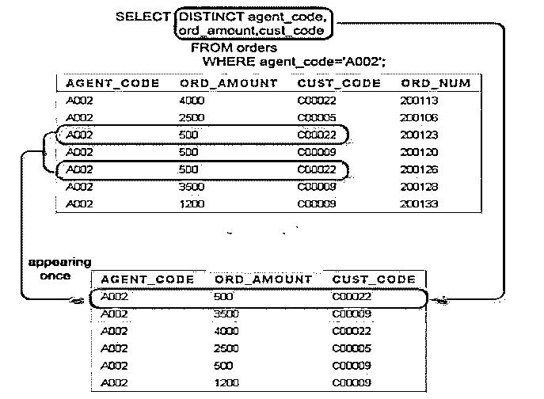


在下面的查询中，我们从所有列中检索数据。对所有列使用 distinct 子句后，将从所有列中检索唯一值。


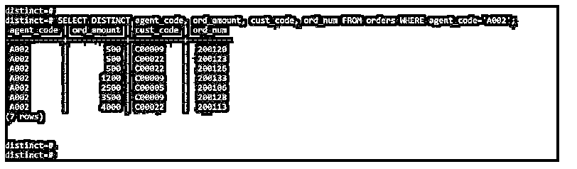


下面是上述查询的关系代数表达式。

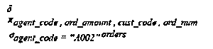


下面是上面查询的关系代数树。

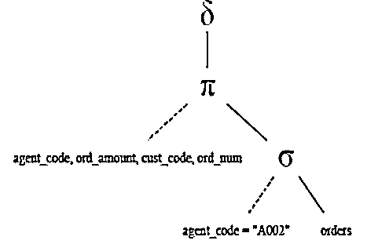


下面是上述输出的图示。

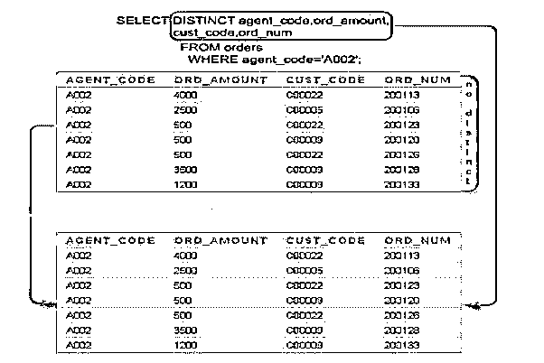


在下面的查询中，我们按照 order by 子句从两列中检索数据。


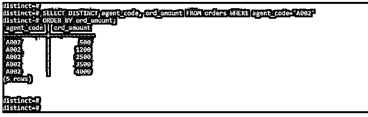


下面是上述查询的关系代数表达式。

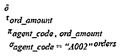


下面是上面查询的关系代数树。

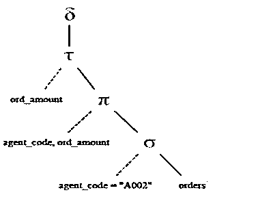


下面是上述输出的图示。

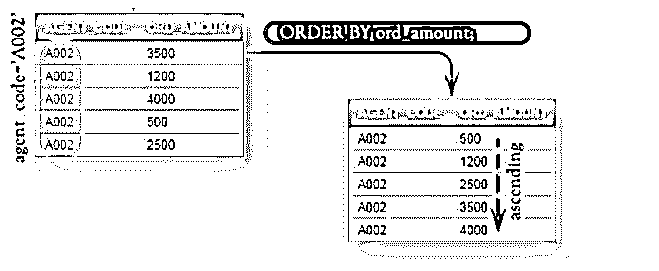


### SQL SELECT DISTINCT 多列示例

下面提到了不同的例子:

我们使用 distinct_multiple 表来定义示例。

**代码:**

```
Select * from distinct_multiple;
```

**输出:**

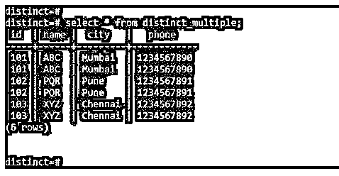


#### 示例#1

在下面的示例中，我们使用 distinct 子句从多个列中检索唯一记录的计数。

**代码:**

```
Select count(distinct id), count(distinct name), count(distinct city), count(distinct phone) from distinct_multiple;
```

**输出:**

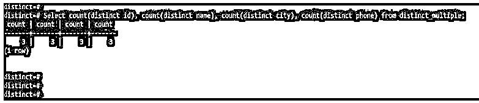


#### 实施例 2

下面的示例通过使用 where 条件显示了所有列的不同计数，如下所示。

**代码:**

```
Select count(distinct id), count(distinct name), count(distinct city), count(distinct phone) from distinct_multiple where id = 101;
```

**输出:**

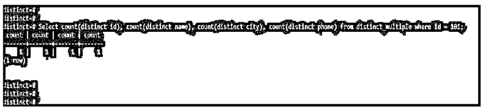


#### 实施例 3

在下面的示例中，我们使用 order by 条件从所有表列中检索唯一记录，如下所示。我们对 id 列使用 order by 条件，如下所示。

**代码:**

```
Select distinct id, name, city, phone from distinct_multiple order by id;
```

**输出:**


#### 实施例 4

在下面的示例中，我们在同一个查询中使用了 where 条件和 order by 子句。此外，我们在 name 列上使用 where 条件，在 id 列上使用 order by 条件。此外，我们使用了所有带有 distinct 子句的列。

**代码:**

```
Select distinct id, name, city, phone from distinct_multiple where name = ‘ABC’ order by id;
```

**输出:**

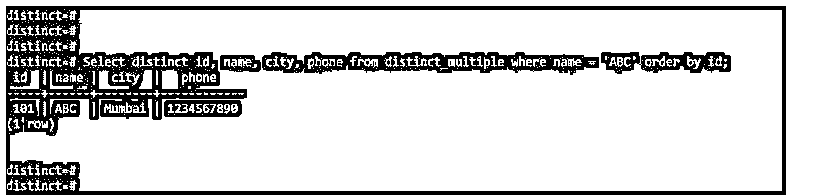


#### 实施例 5

在下面的示例中，我们使用 where 条件从所有列中检索数据。我们使用 id、姓名、城市和电话列来检索数据。在使用 where 条件对所有列使用 distinct 子句后，它将从我们在 where 条件中定义的行中检索唯一值。

**代码:**

```
Select distinct id, name, city, phone from distinct_multiple where id = 102;
```

**输出:**

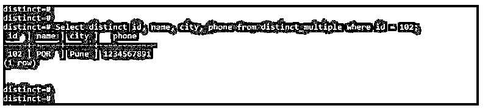


### 结论

选择多个列上的非重复计数将从多个列中检索所有唯一记录。它将消除所有重复的记录。它从我们使用 distinct 子句的多个列中检索不同的记录。

### 推荐文章

这是 SQL SELECT DISTINCT 多列的指南。这里我们分别讨论入门、如何使用和例子。您也可以看看以下文章，了解更多信息–

1.  [desc 的 SQL 订单](https://www.educba.com/sql-order-by-desc/)
2.  [SQL 执行](https://www.educba.com/sql-execute/)
3.  [SQL 排除](https://www.educba.com/sql-exclude/)
4.  [MySQL InnoDB 集群](https://www.educba.com/mysql-innodb-cluster/)


