# SQL LIKE

> 原文：<https://www.educba.com/sql-like/>


## SQL LIKE 简介

SQL LIKE 操作符用于查找我们在 LIKE 和 where 条件中定义的指定模式行。在 SQL 中，like 运算符中使用了两种类型的通配符。首先，运算符用于替换指定字符串中的一个或多个字符。在模式匹配时，重复出现的字符需要与字符完全匹配。

### SQL 是什么样的？

我们可以使用通配符来选择、更新和删除带有 where 条件的语句。类似 SQL 的模式包括通配符或常规字符。模式将检查字符串是否与指定的模式匹配。该模式包含通配符和重复出现的字符；运算符最有用的模式是通配符。

<small>Hadoop、数据科学、统计学&其他</small>

使用运算符时，如果我们的参数不是字符类型，那么如果可能，SQL server 数据库引擎会将其转换为字符的字符串数据类型。

我们在 like 子句中使用两个通配符操作符，如下所示。

下面是我们在 like 操作符中使用的通配符。

*   **%:** 这个通配符将代表一个、零个或多个字符。
*   **下划线(_):** 这个通配符只代表一个字符。
*   **字符的通配符列表:**这个通配符操作符就是具有指定集合的单个字符。
*   **【字符-字符】:**这个通配符只不过是在指定范围内使用的单个字符。
*   **^:** 这个通配符是一个没有在范围列表中使用的单个字符。

在 SQL 中，通过使用 where 子句来匹配指定行的条件，类似 SQL 的操作符是方便而必要的。

### 类似 SQL 的使用

下面是类似 SQL 的操作符的用法。首先，我们可以使用 like 操作符来查找使用指定模式的匹配字符串。

*   我们可以将运算符与 select 和 where 子句结合使用，从表中查找匹配的字符串行。
*   我们可以使用通配符从 SQL 表中找到指定的行。将返回符合 like 运算符指定条件的行。
*   通过使用 select、update 和 delete 查询，我们可以使用运算符来更新和删除指定的条件记录。
*   我们还可以在 like 操作符中使用转义符，它将通配符操作符视为重复出现的字符。
*   当符合指定条件时，运算符返回行数。
*   我们可以使用操作符来选择、删除和更新模式中的指定记录。
*   假设我们想从表中删除指定模式的记录，那么操作符是比=和更好的选择！=运算符。
*   我们还可以在 SQL 和 order by、group by 以及许多其他子句中使用 like 运算符。

下面的例子显示了我们如何使用我们的查询如下。

在下面的例子中，我们对 city 列使用 like 运算符。

**代码:**

```
select id, name, city from like_test where city like '%u%';
```

**输出:**

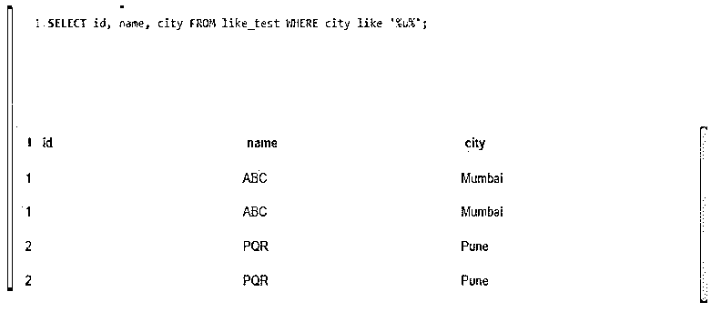


### SQL LIKE 子句

定义了一个类似 SQL 的子句来按照我们在查询中使用的指定模式检索数据。

下面是带有 select 语句的类似 SQL 的子句的语法，如下所示。

**语法:**

```
Select name_of_column1, name_of_column2, …, name_of_columnN from name_of_table where name_of_column like ‘xxx%’;
```

```
Select name_of_column1, name_of_column2, …, name_of_columnN from name_of_table where name_of_column like ‘%xxx%’;
```

```
Select name_of_column1, name_of_column2, …, name_of_columnN from name_of_table where name_of_column like ‘%xxx’;
```

```
Select name_of_column1, name_of_column2, …, name_of_columnN from name_of_table where name_of_column like ‘xxx_’;
```

```
Select name_of_column1, name_of_column2, …, name_of_columnN from name_of_table where name_of_column like ‘_xxx_’;
```

```
Select name_of_column1, name_of_column2, …, name_of_columnN from name_of_table where name_of_column like ‘_xxx’;
```

下面是 delete 语句子句的语法，如下所示。

**语法:**

```
Delete from name_of_table where column_name like ‘xxx%’;
```

```
Delete from name_of_table where column_name like ‘%xxx%’;
```

```
Delete from name_of_table where column_name like ‘%xxx’;
```

```
Delete from name_of_table where column_name like ‘xxx_’;
```

```
Delete from name_of_table where column_name like ‘_xxx_’;
```

```
Delete from name_of_table where column_name like ‘_xxx’;
```

以下示例显示了 SQL-like 子句将如何对 delete 查询进行如下操作。

**代码:**

```
DELETE FROM like_test where city like ‘che%’;
select * from like_test;
```

**输出:**


下面的例子显示了操作符不区分大小写。这是因为，在第一个例子中，我们在大写字母中使用了 like 操作符名称。在第二个例子中，我们两次都使用小写字母 like 操作符名称；它将返回相同的结果，不会发出任何错误。所以我们可以说操作符不区分大小写。

**代码:**

```
select * from like_test where city like 'pu%';
select * from like_test where city LIKE 'pu%';
```

**输出:**

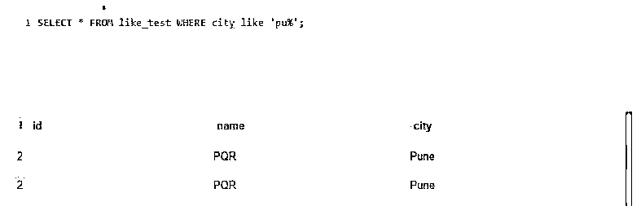


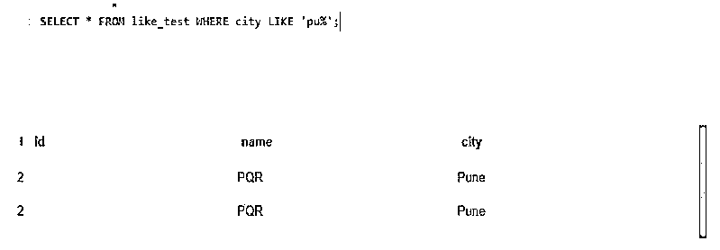


### 类似 SQL 的例子

下面提到了不同的例子:

#### 示例#1

带有%通配符的运算符如下。

**代码:**

```
select * from like_test where city LIKE 'Mu%';
select * from like_test where city LIKE '%u%';
select * from like_test where city LIKE 'p%';
```

**输出:**

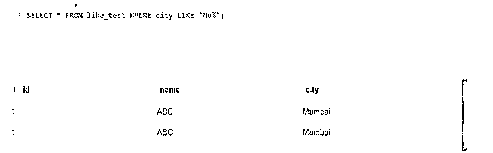


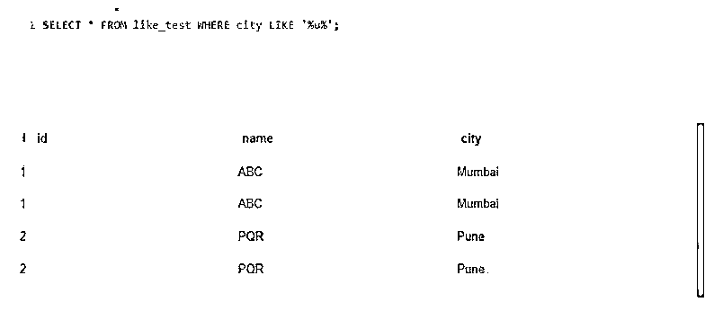


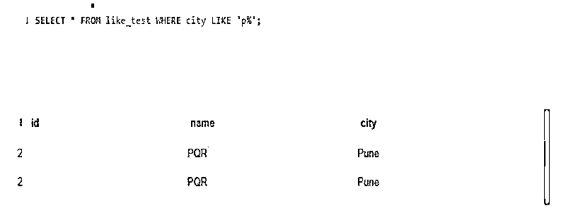


#### 实施例 2

运算符和(_)通配符运算符，如下所示。

**代码:**

```
select * from like_test where city LIKE 'Mumba_';
select * from like_test where city LIKE '_une';
select * from like_test where city LIKE '_un_';
```

**输出:**

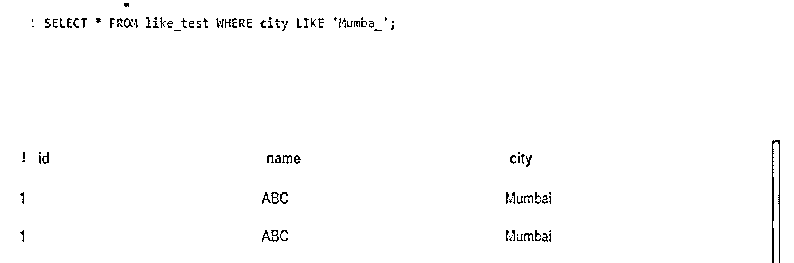


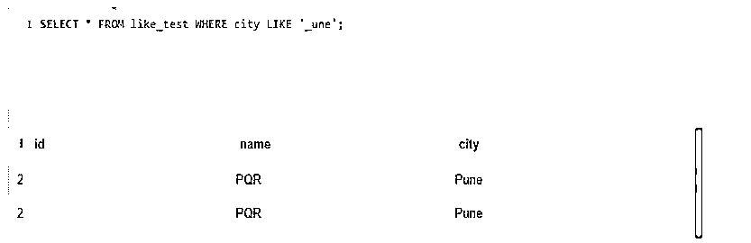


#### 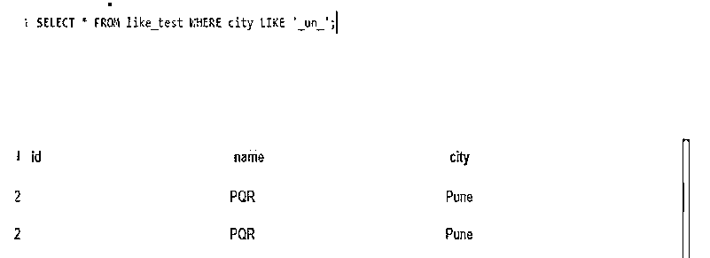


#### 实施例 3

带有(_)、%通配符的运算符使用删除查询。

**代码:**

```
DELETE FROM like_test where city like ‘che%’;
DELETE FROM like_test where city like ‘%he%’;
DELETE FROM like_test where city like ‘%ai’;
DELETE FROM like_test where city like ‘chenna_’;
DELETE FROM like_test where city like ‘_henna_’;
DELETE FROM like_test where city like ‘_hennai’;
```

**输出:**

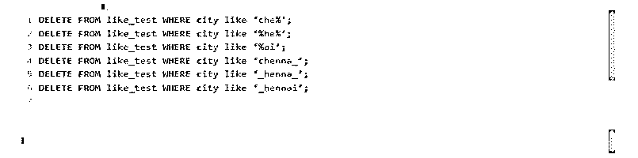


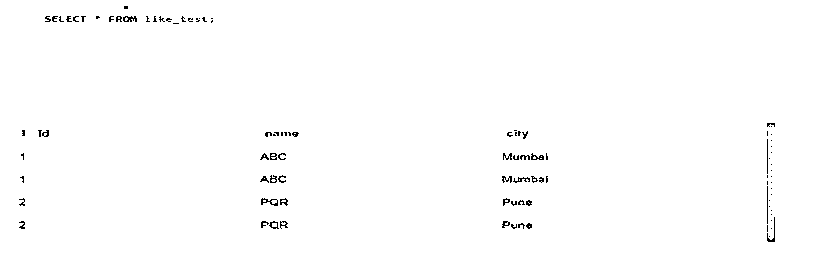


#### 实施例 4

使用更新查询的带有(_)、%通配符的运算符。

**代码:**

```
update like_test set id = 10 where city like '%um%';
update like_test set id = 20 where city like '%un%';
```

**输出:**

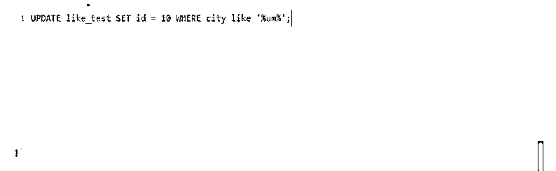


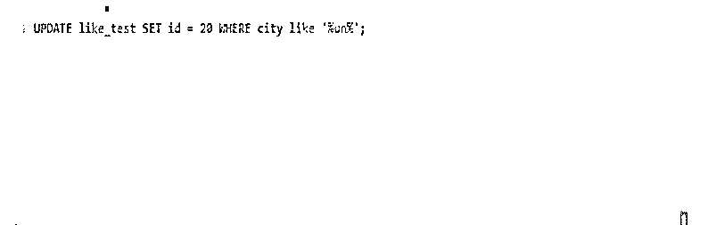


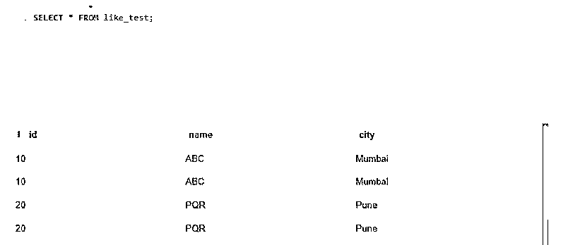


### 结论

在模式匹配时，重复出现的字符需要与字符串中指定的字符完全匹配。因此，与使用=和相比，在 like 子句模式匹配中使用通配符非常容易！=字符串的比较运算符。

### 推荐文章

这是一个类似 SQL 的指南。为了更好地理解，我们在这里讨论介绍、使用、SQL LIKE 子句和示例。您也可以看看以下文章，了解更多信息–

1.  [desc 的 SQL 订单](https://www.educba.com/sql-order-by-desc/)
2.  [SQL 执行](https://www.educba.com/sql-execute/)
3.  [MySQL DROP 表](https://www.educba.com/mysql-drop-table/)
4.  [MySQL InnoDB 集群](https://www.educba.com/mysql-innodb-cluster/)


