# SQL NOT 运算符

> 原文：<https://www.educba.com/sql-not-operator/>

## SQL NOT 运算符简介

标准查询语言(SQL)中的 NOT 运算符是一种逻辑运算符，当与 WHERE 子句中提到的条件结合使用时，用于筛选记录。它只返回那些不满足上述条件的行或记录。也就是说，只有当条件为假或不为真时，它才显示一行。我们可以将 NOT 与其他运算符结合使用，如 BETWEEN、OR、AND 等。不要担心，我们将借助一些实际问题来学习所有这些。不要再等了，让我们从使用 NOT 操作符编写查询的语法和参数开始。

**语法和参数:**

<small>Hadoop、数据科学、统计学&其他</small>

在 SQL 查询中使用 NOT 运算符的基本语法如下:

`SELECT column_name_1, column_name_2, ...
FROM table_name
WHERE NOT condition_expression;`

上述语法中使用的参数如下:

*   column_name_1，column_name_2，…:必须在最终结果集中显示的列或字段。
*   table_name:必须从中提取上述列的数据库表。
*   condition_expression:过滤记录所依据的条件。更具体地说，就是行必须返回 FALSE 才能成为最终结果集的条件。

讨论了使用 NOT 操作符编写 SQL 查询的语法和参数后，让我们尝试几个基于它的例子来详细理解这个概念。

### 例子

为了说明 NOT 操作符在 SQL 中的用法，让我们创建一个名为“学生”的虚拟表。顾名思义，此表包含学生的详细信息，如 id、姓名、社会、专业等。我们可以使用下面的代码段来创建此表。

`CREATE TABLE students
(
student_id character varying(50) NOT NULL,
student_name character varying(255) NOT NULL,
degree_major character varying(255) NOT NULL,
degree_year character varying(255),
society character varying(255)
);`

创建了 students 表之后，让我们在其中插入一些记录来进行操作。

`INSERT INTO students(
student_id, student_name, degree_major, degree_year, society)
VALUES ('1','Mohith K','Computer Science Engineering','IV','Dramatics'),
('2','Ayesha Khan','Electrical Engineering','I','Music'),
('3','Kylie Green','Computer Science Engineering','III','Choreography'),
('4','Alisha Rojer','Chemical Engineering','III','Music'),
('5','Andy Bernard','Geosciences','IV','Dramatics'),
('6','Ron Weasley','chemistry','II','Music'),
('7','Ross Geller','Paleontology',NULL,'Dramatics'),
('8','Harvey Ross','Chemistry','III','Music');
select * from students;`

成功插入学生表后的数据如下所示:

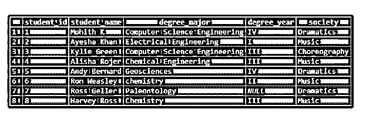

现在，在学生表的帮助下，我们准备尝试几个基于 NOT 运算符的示例。

### NOT 运算符的基本功能

让我们用例子来讨论 NOT 操作符的基本功能。

#### 例 1:查找非四年级学生的学号和学位年份。

**代码:**

`SELECT student_id, degree_year FROM students
WHERE NOT degree_year = 'IV';`

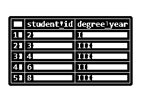

在这种情况下，我们可以使用'<>'代替 NOT 运算符，即不等于运算符。上面的查询看起来会像这样。

`SELECT student_id, degree_year FROM students
WHERE degree_year <>'IV';`

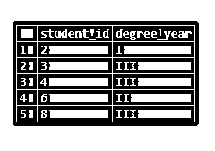

**非与或逻辑运算符**

#### 例#2:查找非四年级或一年级学生的学号和学位年份。

**代码:**

`SELECT student_id, degree_year FROM students
WHERE NOT (degree_year = 'IV' OR degree_year = 'I');`

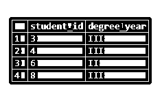

**非与逻辑运算符**

#### 例 3:查找非三年级学生和不属于音乐社团的学生的学号、姓名、专业、年份和社团。

**代码:**

`SELECT student_id, student_name, degree_major, degree_year, society FROM students
WHERE NOT (society = 'Music' AND degree_year = 'III');`

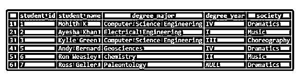

**NOT with IN 运算符**

#### 例 4:找出不是来自音乐和戏剧社团的学生的学号、姓名和社团。

**代码:**

`SELECT student_id, student_name, society FROM students
WHERE society NOT IN ('Music', 'Dramatics');`

**不与操作员之间**

#### 例 5:查找 id 不在 2 到 5 之间的学生的 id、姓名、年份和社团。

**代码:**

`SELECT student_id,student_name, degree_year, society FROM students
WHERE student_id NOT BETWEEN '2' AND '5';`

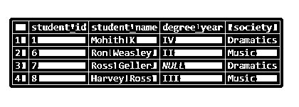

**不含空值**

#### 示例 6:查找学位年份值不为空的学生的学号、姓名、年份和社团。

**代码:**

`SELECT student_id,student_name, degree_year, society FROM students
WHERE degree_year is NOT NULL;`

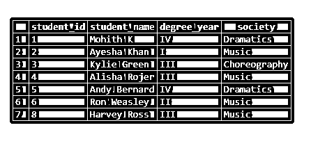

**不含 LIKE 通配符**

#### 例#7:查找姓名不以' A '开头的学生的学号、姓名、年份和社团。

**代码:**

`SELECT student_id,student_name, degree_year, society FROM students
WHERE student_name NOT LIKE 'A%';`

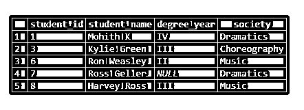

**NOT with EXISTS 运算符**

#### 例 8:仅当“音乐”社团中没有学生时，才查找学生 id、姓名和年份。

**代码:**

`SELECT student_id, student_name, degree_year FROM students
WHERE NOT EXISTS (SELECT student_id FROM students WHERE society = 'Music');
select * from students;`

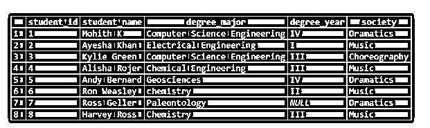

**NOT in UPDATE 语句的用法**

#### 例 9:对于不属于音乐协会的学生，将“学位年份”字段的值更新为“IV”。

**代码:**

`UPDATE students
SET degree_year = 'IV'
WHERE student_id NOT IN (SELECT student_id FROM students WHERE society = 'Music');`

该列已成功更新，我们可以借助 SELECT 查询来检查这一点。

`SELECT * FROM students;`

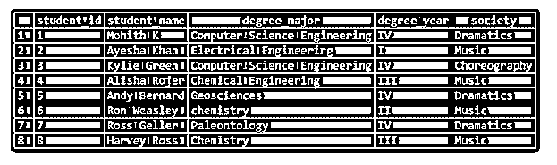

**NOT in DELETE 语句的用法**

#### 例#10:删除四年级学生的所有记录。

**代码:**

`DELETE FROM students
WHERE NOT degree_year = 'IV';`

记录已被成功删除，我们可以在选择查询的帮助下进行检查。

`SELECT * FROM students;`

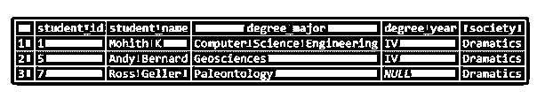

### **结论:SQL NOT 运算符**

NOT 运算符用于根据 SQL 查询的 WHERE 或 HAVING 子句中指定条件的否定来筛选记录。

### 推荐文章

这是一个 SQL NOT 运算符的指南。这里我们讨论 NOT 运算符的定义、语法、参数和基本功能，并给出例子和代码实现。您也可以看看以下文章，了解更多信息–

1.  [SQL 选择顶部](https://www.educba.com/sql-select-top/)
2.  [SQL 集群](https://www.educba.com/sql-cluster/)
3.  [SQL 合并两个表](https://www.educba.com/sql-merge-two-tables/)
4.  [SQL 删除触发器](https://www.educba.com/sql-drop-trigger/)

