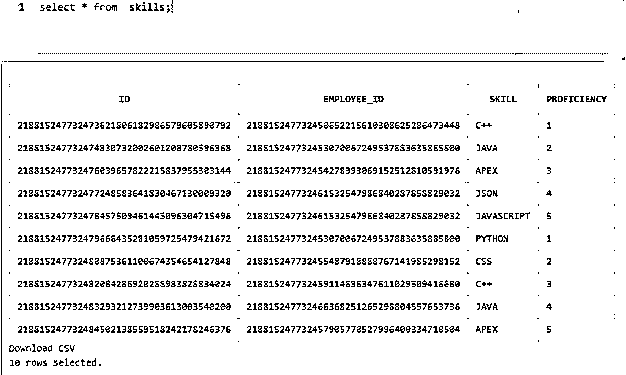
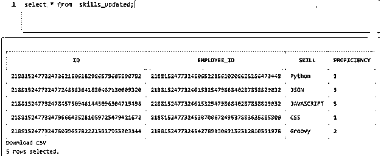
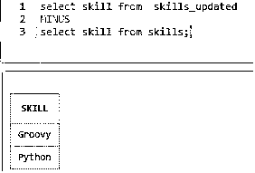
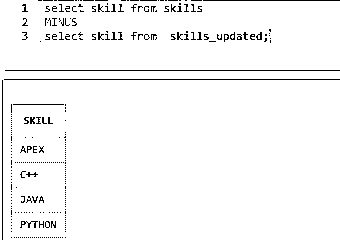
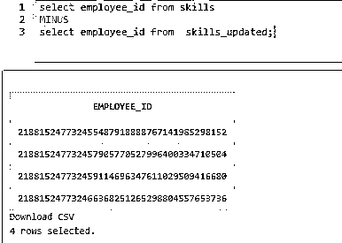
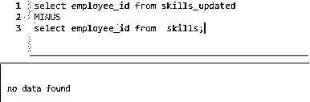
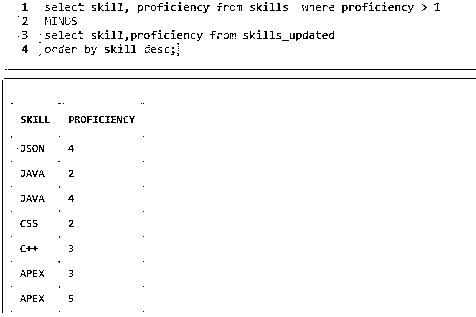
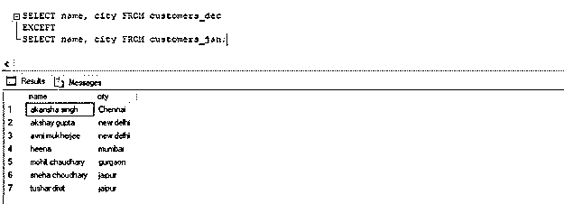

# SQL 减

> 原文：<https://www.educba.com/sql-minus/>

## SQL Minus 简介

减号是标准查询语言(SQL)中四个重要的集合运算符之一。集合运算符用于将两个或多个查询的结果组合成一个结果。包含两个或更多子查询的查询称为复合查询。负集运算符用于组合两个或多个 SELECT 语句的所有结果。它只返回那些只出现在第一个表中的记录。

**Note:** The MINUS operator is supported only in Oracle databases. For other databases like SQL Server, PostgreSQL, and SQLite, we can use the EXCEPT operator to perform similar operations.

### 句法

使用 SQL 减运算符的一般语法如下:

<small>Hadoop、数据科学、统计学&其他</small>

`SELECT column_name
FROM table_name_1
MINUS
SELECT column_name
FROM table_name_2
MINUS
SELECT column_name
FROM table_name_3
.
.
.`

#### 因素

语法中使用的不同参数是:

*   **column_name:** 提及要对其执行集合操作并希望出现在结果集中的列名
*   **FROM table_name_1:** 提及第一个要从中提取列的表名
*   **FROM table_name_2:** 提及要从中提取列的第二个表名

上述参数中，所有参数都是强制的。您可以根据需要使用 WHERE GROUP BY 和 HAVING 子句。

### SQL 减集运算符

以下是我们在使用 SQL 减运算符或除运算符时应该记住的几点:

*   我们应用了 SQL 集合运算符的 SELECT 语句中的列数必须相同。
*   所选列必须具有相同的数据类型。
*   列的顺序必须与 SELECT 语句中提到的顺序相同。

接下来，我们将详细讨论上面提到的 SQL 减集操作符。

为了说明这一点，让我们首先创建两个表“skills”和“skills_updated”。前者包含雇员的旧技能，后者包含雇员的更新技能以及技能 id、雇员 id 和熟练程度。两个表具有相同的结构。我们可以使用下面的代码片段来创建上面提到的表。

**代码:**

`create table skills(
id number not null constraint skills_id_pk primary key,
employee_id number
constraint skills_employee_id_fk
references employees on delete cascade,
skill varchar2(255),
proficiency number constraint skills_proficiency_cc
check (proficiency in (1,2,3,4,5))
);
create table skills_updated (
id number not null constraint skills_id primary key,
employee_id number
constraint skills_employee_id
references employees on delete cascade,
skill varchar2(255),
proficiency number constraint skills_proficiency
check (proficiency in (1,2,3,4,5))
);`

在执行一些随机插入操作之后,“skills”表中的数据看起来像这样。

“skills_updated”表中插入的数据如下所示。

### 实现 SQL Minus 的示例

以下是实现 SQL Minus 的一些示例:

#### 示例#1

找到新的技能，只有在技能升级练习后才添加。

**代码:**

`select skill from  skills_updated
MINUS
select skill from skills;`

**输出:**

#### 实施例 2

找出技能升级表中没有提到的技能。

**代码:**

`select skill from skills
MINUS
select skill from skills_updated;`

**输出:**

#### 实施例 3

在升级表中查找没有更新技能的员工。

**代码:**

`select employee_id from skills
MINUS
select employee_id from skills_updated;`

**输出:**

#### 实施例 4

查找旧技能表中没有的员工或员工标识。

**代码:**

`select employee_id from skills_updated
MINUS
select employee_id from  skills;`

**输出:**

#### 实施例 5

找到旧技能表中熟练程度分数大于 1 的技能和熟练程度。

**代码:**

`select skill, proficiency from skills  where proficiency > 1
MINUS
select skill,proficiency from skills_updated
order by skill desc;`

**输出:**

**Note:** Not all databases support MINUS set operators. As discussed above, it is only supported in the ORACLE database server. Other SQL database management servers such as PostgreSQL, SQL Server, etc. support EXCEPT set operators. It is exactly similar to the MINUS operator.

**举例说明 EXCEPT 运算符的用法:**

出于演示目的，考虑两个名为“customers_jan”和“customers_dec”的表。其中的数据如下所示:

**客户 _ 一月表:**

| **客户标识** | **名称** | **城市** |
| One | 拉胡尔·维亚斯 | 新德里 |
| Two | 斯内哈·斯里瓦斯塔瓦 | 新德里 |
| Three | kabita Pandey | 加尔各答 |
| Four | 阿克萨·古普塔 | 班加罗尔 |
| Five | 阿布舍克·谢尔 | 班加罗尔 |
| Six | 阿坎沙·辛格 | 浦那 |
| Seven | 普纳姆·马哈詹 | 苏拉特 |
| Eight | Aditya Awasthi | 新德里 |
| Nine | 穆希特·肖汉 | 塘鹅 |
| Ten | 内哈·辛格 | 孟买 |

**客户 _ 十二月表:**

| **客户标识** | **名称** | **城市** |
| One | 阿克萨·古普塔 | 新德里 |
| Two | 希娜 | 孟买 |
| Three | Sneha Choudhary | 斋浦尔 |
| Four | 阿布舍克·谢尔 | 班加罗尔 |
| Five | 图沙尔·迪克西特 | 斋浦尔 |
| Six | 穆希特·肖汉 | 塘鹅 |
| Seven | 阿坎沙·辛格 | 金奈 |
| Eight | 穆希特·乔德里 | 古尔冈 |
| Nine | 阿夫尼·慕克吉 | 新德里 |
| Ten | 普纳姆·马哈詹 | 苏拉特 |

#### 实施例 6

查找只在 12 月购物而不在 1 月购物的客户的详细信息。

**代码:**

`SELECT name, city FROM customers_dec
EXCEPT
SELECT name, city FROM customers_jan;`

**输出:**

### 结论

因此，在本文中，我们学习了 SQL 减集操作符，它在检查数据的成员资格时非常有用。它返回只出现在第一个表中的结果。它还有助于总结和理解大型数据集中的模式。

### 推荐文章

这是一个 SQL 减的指南。这里我们讨论 SQL Minus 的介绍、语法、参数、集合操作符、代码示例和输出。您也可以浏览我们的其他相关文章，了解更多信息——

1.  [SQL 集合运算符](https://www.educba.com/sql-set-operators/)
2.  [PostgreSQL NOW()](https://www.educba.com/postgresql-now/)
3.  [PostgreSQL For 循环](https://www.educba.com/postgresql-for-loop/)
4.  [SQL IN 运算符](https://www.educba.com/sql-in-operator/)

