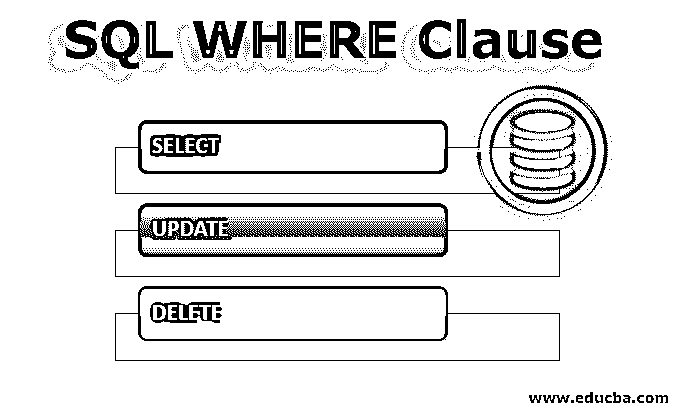

# SQL WHERE 子句

> 原文：<https://www.educba.com/sql-where-clause/>

## WHERE 子句介绍

我们都[知道 SQL](https://www.educba.com/what-is-sql/) (结构化查询语言)是关系数据库(记录以行和列的形式保存的数据库)最常用的语言之一。在 SQL 中，启动查询来命中数据库以执行所需的操作，无论是 [DML(数据操作语言)](https://www.educba.com/data-manipulation-language/)、 [DDL(数据定义语言)](https://www.educba.com/data-definition-language/)还是 [DCL(数据控制语言)](https://www.educba.com/data-control-language/)操作。SQL 使用一些执行特定操作的子句，如 WHERE、GROUP BY、HAVING、ORDER BY。WHERE 子句用于在从数据库中检索或操作任何数据时应用条件并筛选出结果。它还与 SELECT、UPDATE 和 DELETE 语句一起使用；WHERE 子句可选择与它们一起使用。

一般来说，术语、WHERE 子句，

<small>网页开发、编程语言、软件测试&其他</small>

*   用于根据给定标准过滤行。
*   限制返回的行数。
*   后跟返回真或假的逻辑条件。
*   仅当上述条件返回 true 时才起作用。
*   它可以与 SELECT、UPDATE 或 DELETE 语句一起使用。

**1。SELECT 的语法**

`SELECT column1, column2, column3… from table_name WHERE condition;`

这里 SELECT 将从表(名为 table_name)中检索 column1、column2、column3 的所有数据，WHERE 子句将条件应用于 SELECT 语句检索的数据，并根据语句中提到的条件对其进行筛选。

**2。带更新的语法**

`UPDATE table_name SET column_name = value WHERE condition;`

这里，Update 将使用提供的 where 条件更新 column_name 的值。

比较和逻辑运算符也可以与 WHERE 条件一起使用，如 and、or、not、like、

**3。带删除的语法**

`DELETE from table_name WHERE condition;`

在上面的语法中:

| 表名 | 需要对其执行操作的表的名称。 |
| 情况 | 指定需要筛选记录的筛选条件 |
| 列 _ 列表 | 表中列的名称 |

### 例子

假设一个学生表具有下面提到的不同列和值:

| **Stu_id** | **Stu_name** | **Stu_address** | 【t0 _ phno】t1 | **Stu_percentage** |
| One | 拉胡尔 | 阿格拉 | Nine billion five hundred and fifty-seven million eight hundred and six thousand six hundred and twenty-five | Eighty-five |
| Two | 鸭子！鸭子 | 德里 | Eight billion eight hundred and fifty-five million six hundred and sixty-four thousand four hundred and seventy-one | Seventy-five |
| Three | Shailendra | 诺伊达 | Seven billion two hundred and thirteen million four hundred and fifty-seven thousand eight hundred and ninety-six | Ninety-two |

#### 场景#1

检索学生 id、学生姓名、地址以及所有得分超过 80%的学生的百分比。

**查询**

`SELECT Stu_id, Stu_name, Stu_address from students WHERE Stu_percentage > 80;`

**结果:**

记录数量:2

| **Stu_id** | **Stu_name** | **Stu_address** | **Stu_percentage** |
| One | 拉胡尔 | 阿格拉 | Eighty-five |
| Three | Shailendra | 诺伊达 | Ninety-two |

#### 场景#2

将 Rahul 的百分比更新 2%。

**查询**

`UPDATE students SET Stu_percentage = Stu_percentage+2 WHERE Stu_name =‘Rahul’;`

**结果:**

受影响的行数:1

如果我们点击查询来查看更新的字段:

**查询**

`SELECT * from students WHERE Stu_name =’Rahul’;`

**结果:**

记录数量:1

| **Stu_id** | **Stu_name** | **Stu_address** | **Stu_percentage** |
| One | 拉胡尔 | 阿格拉 | Eighty-seven |

#### 场景#3

学生 Ankit 已经离开了学校，所以从表中删除他的整个记录。

**查询**

`DELETE from students WHERE Stu_name = ’Ankit’;`

**结果:**

受影响的行数:1

要查看更新的表格，学生:

**查询**

`SELECT * from students;`

**结果:**

受影响的行数:2

| **Stu_id** | **Stu_name** | **Stu_address** | 【t0 _ phno】t1 | **Stu_percenta ge** |
| One | 拉胡尔 | 阿格拉 | Nine billion five hundred and fifty-seven million eight hundred and six thousand six hundred and twenty-five | Eighty-seven |
| Three | Shailendra | 诺伊达 | Seven billion two hundred and thirteen million four hundred and fifty-seven thousand eight hundred and ninety-six | Ninety-two |

### WHERE 子句操作

WHERE 子句包含筛选数据库值的条件。WHERE 子句可以使用各种运算符。下面的表格举例说明了其中的一些:

| **序列号** | **操作员** | **描述** | **例子** |
| 1. | 和 | 如果两个条件都匹配，则返回 true | SELECT * from students 其中 Stu_name ='Rahul '和 Stu _ percentage = 85 |
| 2. | 运筹学 | Returns true if either of the条件匹配 | SELECT * from Stu _ name = ' Rahul '或 Stu_name = 'Shalendra '的学生； |
| 3. | 在…里 | 该值与指定的多个值中的任何一个匹配 | SELECT * from Stu _ city IN(' AGRA '，' no IDA ')； |
| 4. | 不在 | 该值与指定的多个值都不匹配 | SELECT * from Stu _ city 不在的学生(' AGRA '，' no IDA ')； |
| 5. | = | 平等的 | SELECT * from students WHEREStu _ name = ' Rahul |
| 6. | > | 大于 | SELECT * from Stu _ percentage > 80 的学生； |
| 7. | < | 不到 | SELECT * from Stu _ percentage < 78 的学生； |
| 8. | >= | 大于或等于 | SELECT * from Stu _ perce netage > = 70 的学生； |
| 9. | <= | 小于或等于 | SELECT * from Stu _ perce netage < = 70 的学生； |
| 10. | <> | 不等于 | SELECT * from Stu _ percentage<>75； |
| 11. | 在…中间 | 该值在一定范围内 | SELECT * from students WHEREStu _ 到 85 之间的百分比； |
| 12. | 喜欢 | 值符合特定的模式。用于执行通配符搜索 | SELECT * from Stu _ city WHERE Stu _ city LIKE ' AG % '； |

**注意:**在使用 WHERE 子句时，有一点需要记住，即在指定条件时，数值不能用单引号(')引起来，而文本值(varchar)需要用单引号(')引起来。

### SQL 中的 WHERE 子句是如何工作的？

虽然上面的例子清楚地显示了如何使用 WHERE 子句根据用户指定的条件过滤数据，并且允许条件限制了 SQL 代码的更快执行，因为返回的记录数。SQL 查询优化器首先使用(需要对其执行操作的表)对查询进行检索、删除或更新，然后将 WHERE 子句应用于结果。

WHERE 子句只能在我们需要过滤单个表或表的连接中的结果时使用，因为它对行数据起作用，但是在聚合函数的情况下，WHERE 不能用于将条件应用于查询。

让我们考虑不能使用 where 子句的情况:

**场景:**在“电影”表中，检索特定年份(如 2000 年、2010 年、2012 年)收入超过 10 亿美元的电影的所有详细信息..等等。)

**查询:**

`SELECT * from movies GROUP BY Year_released HAVING earnings > 10;`

上面的例子[使用 HAVING 子句](https://www.educba.com/oracle-having-clause/)而不是 WHERE，因为 WHERE 子句不能用在聚合函数中，而 HAVING 可以，这也是 WHERE 和 HAVING 子句的主要区别之一。

### 结论–SQL WHERE 子句

上面的解释清楚地显示了 WHERE 子句的使用及其在 SQL 查询中不同场景的实现。在编写任何查询之前，必须记住每个子句的用法以及应该使用该特定子句或关键字的场景。

### 推荐文章

这是一个 SQL WHERE 子句的指南。这里我们讨论 WHERE 子句的使用及其在不同场景中的实现。您还可以浏览我们推荐的其他文章——

1.  [SQL 中的连接类型](https://www.educba.com/types-of-joins-in-sql/)
2.  [MySQL 中的通配符](https://www.educba.com/wildcards-in-mysql/)
3.  [SQL 插入查询](https://www.educba.com/sql-insert-query/)
4.  [SQL 中的外键](https://www.educba.com/foreign-key-in-sql/)

