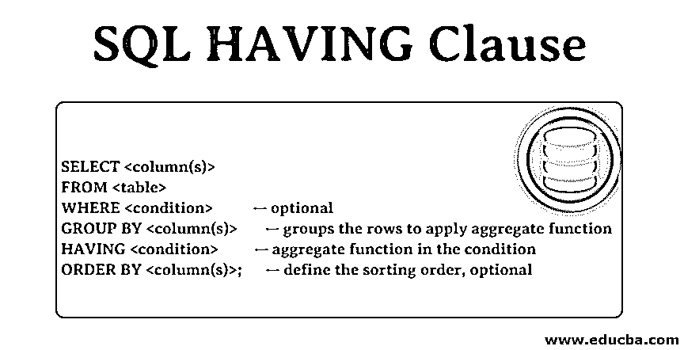
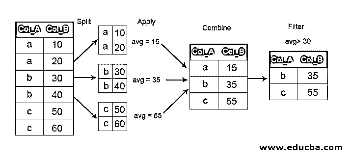

# SQL HAVING 子句

> 原文：<https://www.educba.com/sql-having-clause/>

## SQL HAVING 子句介绍

SQL 中的“Having”子句与“Where”、“group by”和“order by”条件语句一起用于聚合操作。它应用于需要过滤聚合结果的表/数据库，并允许“分组依据”和“排序依据”条件。当在查询中使用“having”子句时，预计产生的输出数据集可以包含表/数据库中的多条记录。

### 为什么有而没有在哪里？

我们看到 HAVING 和 WHERE 子句执行非常相似的任务来过滤结果。那么 HAVING 子句有什么必要呢？为什么 WHERE 子句不能与聚合函数一起使用？

<small>网页开发、编程语言、软件测试&其他</small>

要回答这个问题，我们需要了解 SQL 引擎如何处理这两个子句。每个 [SQL 命令](https://www.educba.com/sql-commands/)中的 FROM 子句告诉引擎从哪里读取行。数据存储在磁盘上，并提取到内存中进行处理。当这些行被一行一行地从磁盘读入内存时，会对它们进行 WHERE 子句检查。WHERE 子句失败的行不会加载到内存中。因此，在 SQL 引擎处理每行时，都会对 WHERE 子句进行计算。

相反，HAVING 子句仅在将行加载到内存中之后才出现。一旦加载到内存中，聚合函数就在具有所需条件的行上执行其任务。

现在，如果我们将一个 WHERE 子句与 avg()之类的聚合函数放在一起，这将使 SQL 引擎在是否包含用于计算平均值的行上感到困惑。本质上，我们将命令引擎不读取该行，因为它没有通过 WHERE 子句中的 avg()标准。但是，为了确定是否通过了 avg()计算标准，需要将该行读入内存。僵局状态。

**语法:**

`SELECT <column(s)>
FROM <table>
WHERE <condition>          -- optional
GROUP BY <column(s)>       -- groups the rows to apply aggregate function
HAVING <condition>         -- aggregate function in the condition
ORDER BY <column(s)>;      -- define the sorting order, optional`

**Note:** GROUP BY clause is required with the HAVING clause. This is because the Having clause needs a group of data to apply an aggregate function and filter out the results.

### HAVING 子句如何工作？

GROUP BY 子句总是伴随 HAVING 子句。GROUP BY 子句将符合特定条件的数据组合在一起。它有三个阶段——分割、应用和组合。分相将行分成组。应用阶段对数据组应用[一些集合函数](https://www.educba.com/mysql-aggregate-function/)。组合阶段通过组合组和聚合函数结果来产生单个结果。

既然组已经形成了，HAVING 子句就开始起作用了。HAVING 子句然后过滤掉不满足给定条件的组。

**代码:**

`SELECT Col_A, avg(Col_B) as Col_B
FROM MyTable
GROUP BY Col_A
HAVING avg(Col_B)>30`

因此，在上面的示例中，我们看到首先根据 Col _A 列将表分成三个组，然后将计算 Col _B 值平均值的聚合函数应用于这些组。这导致每个组只有一行。然后根据 HAVING 子句中的条件对行进行组合和筛选。

### 例子

现在让我们看一个真实世界的例子。

假设我们有下表中的客户以及他们向我们下的订单。

| **客户 ID** | **客户名称** | **城市** | **国家** |
| **1** | 安雅·达米安 | 柏林 | 德国 |
| **2** | 丹尼·科基特 | 墨西哥发展基金会 | 墨西哥 |
| **3** | 埃莉诺·卡尔南 | 墨西哥发展基金会 | 墨西哥 |
| **4** | 亚伯达 | 伦敦 | 英国 |
| **5** | 拉蒂纱·内姆巴德 | 露拉 | 瑞典 |
| **6** | Madalene Bing | 曼海姆 | 德国 |
| **7** | 丽贝卡 | 斯特拉斯堡 | 法国 |
| **8** | 罗西·蒂皮 | 马德里 | 西班牙 |
| **9** | 奥迪·汗 | 【法国】提（花）马塞双层布 | 法国 |
| **10** | 希尔德加德·布伦斯 | 察瓦森 | 加拿大 |
| **11** | cordell dutremble(可兑换货币) | 伦敦 | 英国 |
| **12** | Nora Reyna | 布宜诺斯艾利斯 | 阿根廷 |
| **13** | 乌苏拉·拉福瑞斯特 | 墨西哥发展基金会 | 墨西哥 |
| **14** | 克劳迪娅 | 伯尔尼 | 瑞士 |
| **15** | 鲍西娅·伊 | 圣保罗州 | 巴西 |
| **16** | Angila Segarra | 伦敦 | 英国 |
| **17** | 莉斯韦斯勒 | 亚琛 | 德国 |
| **18** | 内德·门迪维尔 | 南特 | 法国 |
| **19** | 莎拉·维多利 | 伦敦 | 英国 |
| **20** | 泰娜·纳文 | 格拉茨 | 奥地利 |
| **21** | 普拉射线 | 圣保罗州 | 巴西 |
| **22** | 艾丽卡·拜亚德 | 马德里 | 西班牙 |
| **23** | 吉米·卢克 | 里尔 | 法国 |
| **24** | 谢拉·宾顿 | 布雷克 | 瑞典 |
| **25** | 克里斯蒂娜·博登 | 慕尼黑 | 德国 |
| **26** | 伊琳娜·尼塔 | 南特 | 法国 |
| **27** | 布里安娜·奥尔斯 | 都灵 | 意大利 |
| **28** | 诺拉·皮肯 | 里斯本 | 葡萄牙 |
| **29** | 莫瑞亚 | 巴塞罗那 | 西班牙 |
| **30** | 埃德拉·哈里奥特 | 塞维利亚 | 西班牙 |

| **订单 ID** | **客户 ID** | **订购日期** |
| **10254** | Fourteen | 11-07-1996 |
| **10258** | Twenty | 17-07-1996 |
| **10259** | Thirteen | 18-07-1996 |
| **10263** | Twenty | 23-07-1996 |
| **10264** | Twenty-four | 24-07-1996 |
| **10265** | Seven | 25-07-1996 |
| **10267** | Twenty-five | 29-07-1996 |
| **10278** | Five | 12-08-1996 |
| **10280** | Five | 14-08-1996 |
| **10289** | Eleven | 26-08-1996 |
| **10290** | Fifteen | 27-08-1996 |
| **10297** | Seven | 04-09-1996 |
| **10303** | Thirty | 11-09-1996 |
| **10308** | Two | 18-09-1996 |
| **10311** | Eighteen | 20-09-1996 |
| **10326** | Eight | 10-10-1996 |
| **10327** | Twenty-four | 11-10-1996 |
| **10328** | Twenty-eight | 14-10-1996 |
| **10331** | Nine | 16-10-1996 |
| **10337** | Twenty-five | 24-10-1996 |
| **10340** | Nine | 29-10-1996 |
| **10342** | Twenty-five | 30-10-1996 |
| **10347** | Twenty-one | 06-11-1996 |
| **10351** | Twenty | 11-11-1996 |
| **10352** | Twenty-eight | 12-11-1996 |
| **10355** | Four | 15-11-1996 |
| **10360** | Seven | 22-11-1996 |
| **10362** | Nine | 25-11-1996 |
| **10363** | Seventeen | 26-11-1996 |
| **10364** | Nineteen | 26-11-1996 |
| **10365** | Three | 27-11-1996 |
| **10366** | Twenty-nine | 28-11-1996 |
| **10368** | Twenty | 29-11-1996 |
| **10370** | Fourteen | 03-12-1996 |
| **10378** | Twenty-four | 10-12-1996 |
| **10382** | Twenty | 13-12-1996 |
| **10383** | Four | 16-12-1996 |
| **10384** | Five | 16-12-1996 |
| **10386** | Twenty-one | 18-12-1996 |
| **10389** | Ten | 20-12-1996 |
| **10390** | Twenty | 23-12-1996 |
| **10391** | Seventeen | 23-12-1996 |
| **10396** | Twenty-five | 27-12-1996 |
| **10400** | Nineteen | 01-01-1997 |
| **10402** | Twenty | 02-01-1997 |
| **10403** | Twenty | 03-01-1997 |
| **10408** | Twenty-three | 08-01-1997 |
| **10410** | Ten | 10-01-1997 |
| **10411** | Ten | 10-01-1997 |
| **10414** | Twenty-one | 14-01-1997 |
| **10422** | Twenty-seven | 22-01-1997 |
| **10426** | Twenty-nine | 27-01-1997 |
| **10430** | Twenty | 30-01-1997 |
| **10431** | Ten | 30-01-1997 |
| **10434** | Twenty-four | 03-02-1997 |
| **10435** | Sixteen | 04-02-1997 |
| **10436** | Seven | 05-02-1997 |
| **10442** | Twenty | 11-02-1997 |

现在，我们想知道哪些国家的客户总共向我们下了 5 个或更多的订单。可能是单个客户下了 5 个以上的订单，也可能是 5 个客户各下了 1 个订单。

为此，我们需要:

**第一步:**连接两个表。

**第二步:**根据客户所在的国家对他们进行分组。

**第三步:**统计每组的订单数。

**第四步:**过滤 5 个或以上订单的结果。

让我们制定命令:

**代码:**

`SELECT C.Country, COUNT(O.OrderId) as NumberOfOrders         -- Step 1,3
FROM Customers C                                                -- Step 1
INNER JOIN Orders O on C.CustomerID = O.CustomerID              -- Step 1
GROUP BY C.Country                                              -- Step 2
HAVING COUNT(O.OrderId) >= 5                                    -- Step 4
ORDER BY COUNT(O.OrderId) DESC`

结果如下:

| **国家** | **订单数量** |
| **奥地利** | Ten |
| **法国** | Nine |
| **瑞典** | Seven |
| **德国** | Six |
| **英国** | Six |

### 结论–SQL HAVING 子句

因此，我们已经看到 HAVING 子句的目的是什么以及它是如何工作的。理解基本的工作原理是很重要的，否则你可能会弄不清 HAVING 子句为什么没有产生预期的结果。继续使用 HAVING 子句处理各种表、连接和组合。

### 推荐文章

这是一个 SQL HAVING 子句的指南。在这里，我们讨论 SQL 中 HAVING 子句的工作方式，并以下面的客户表为例。您还可以浏览我们推荐的其他文章——

1.  [SQL 插入查询](https://www.educba.com/sql-insert-query/)
2.  [SQL 中的外键](https://www.educba.com/foreign-key-in-sql/)
3.  [SQL 中的 Distinct 关键字](https://www.educba.com/distinct-keyword-in-sql/)
4.  [SQL 视图](https://www.educba.com/sql-views/)

