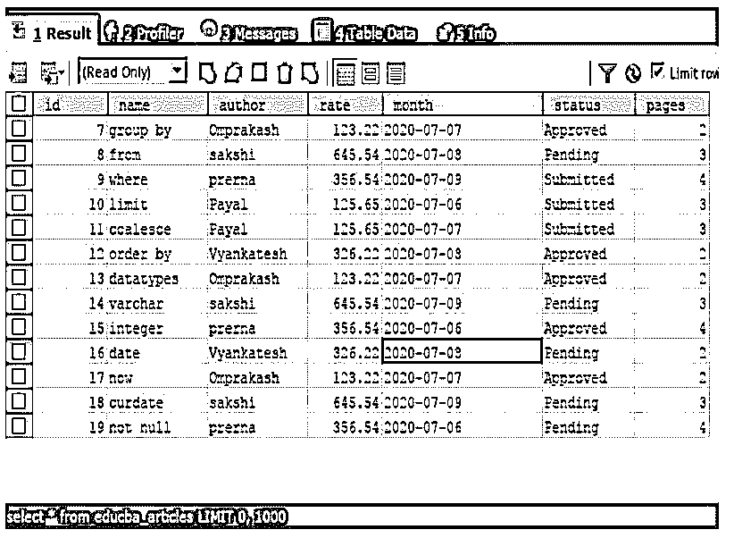
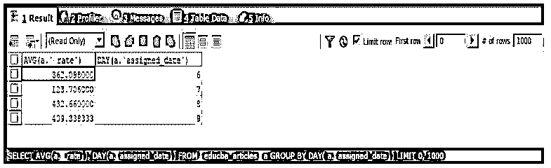
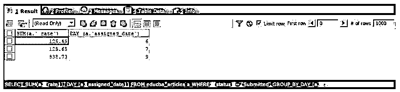
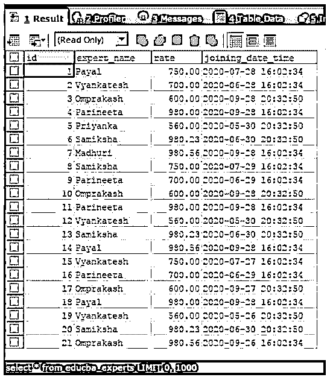
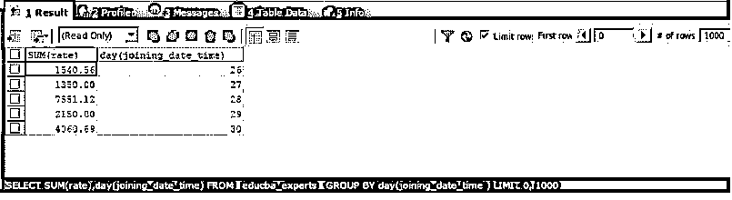

# SQL 按天分组

> 原文：<https://www.educba.com/sql-group-by-day/>

## SQL GROUP BY DAY 简介

SQL GROUP BY DAY 用于根据 SQL 表中的每一天以汇总方式获取分组数据。在我们需要组织、销售、提交、测试等的按天数据的场景中，我们可以使用 group by 子句，并将分组标准定义为表记录中显示的天记录值，或者使用 SQL 中的函数从日期和时间数据类型的列值中检索天值，以根据天对结果进行分组。在这里，我们将看到使用 SQL group by day 对查询语句的结果集进行分组的语法，它的工作原理，以及从结果集中检索列值以将其作为分组标准的多个示例。

### 按天分组的语法

GROUP BY DAY 子句的语法如下:

<small>Hadoop、数据科学、统计学&其他</small>

`SELECT
column1, column2,..., columnm, aggregate_function(columni)
FROM
target_table
WHERE
conditions_or_constraints
GROUP BY expressionDerivingDayOfColumn ;`

GROUP BY 子句的语法如上所示。每当我们需要对结果集进行汇总和归约时，它都是 select 子句中使用的可选子句。它应该始终放在 SELECT 子句中的 FROM 和 WHERE 子句之后。

上述语法中使用的一些术语如下所示:

*   **column1，column2，…，columnm:** 这些是 target_table 表中需要在结果集中检索和获取的列的名称。
*   **aggregate _ function(column I):**这些是在 target_table 的列上定义的聚合函数，需要从 SELECT 查询中检索。
*   **target_table:** 从中获取结果的表的名称。
*   **conditions _ or _ constraints:**如果您想对某些列应用某些条件，可以在可选的 WHERE 子句中提到它们。
*   **expressiondrivingdayofcolumn:**这是在 MySQL 查询中根据日值创建组时要考虑的标准。可以有一个或多个需要应用标准的列名。我们甚至可以将表达式作为分组标准，它可以包含 SQL 中可用的函数，以便从与日期和时间相关的数据类型中检索日。它也可以是存储表中记录的日值的单个列名。

### SQL GROUP BY DAY 示例

下面给出了一个例子:

考虑一个名为 educba_ articles 的表，其内容和结构如以下 select 查询语句的输出所示。

**代码:**

`SELECT * FROM educba_articles;`

执行上述查询语句的输出如下，显示了 educba_articles 表的结构和内容:

**输出:**

现在，我们将根据一个名为 assigned_date 的列对 educba_articles 表内容的结果集进行分组，从该列中将获取日值，这样，对于具有相同日值的行，检索到的记录将只有一条记录，并且数据将以日格式显示。为了从分配的日期中检索日值，我们将使用 SQL DAY()函数。此外，我们将从查询语句中检索每天的平均利率和每天的名称。

**代码:**

`SELECT
AVG(a.` rate`), DAY(a.` assigned_date`)
FROM
educba_articles a
GROUP BY DAY( a.` assigned_date`);`

**输出:**

我们可以观察到，输出包含所有四天，结果集按天分组，检索到的比率值是每一天的平均比率。

现在，我们将检索 educba_articles 表中状态为 submitted 的记录，检索到的记录应该包含每天的 rate 列的总和以及每天的名称。为此，我们首先需要通过应用条件来限制 where 子句语句，以便只检索提交的文章，并进一步根据分配日期列的日期对记录进行分组，并对费率列应用 SUM()函数来检索提交的文章每天的总费率。

**代码:**

`SELECT
SUM(a.` rate`), DAY (a.`assigned_date`)
FROM
educba_articles a
WHERE ` status` = "Submitted"
GROUP BY DAY (a.`assigned_date`);`

执行上述查询语句的输出如下，其中不包括日期 8 的记录，因为表记录在该日期没有任何已提交的文章。

**输出:**

现在，考虑一个名为 educba_experts 的表，其内容和结构如以下 select 查询语句的输出所示。

**代码:**

`SELECT * FROM educba_experts;`

执行上述查询语句的输出如下所示，显示了 educba_experts 表的结构和内容:

现在，我们希望根据每位专家加入的日期对 rate 列进行分组。为了获得按天的数据，我们首先需要从 joining date 和 time 列中检索这一天，并将该值作为分组标准。此外，我们希望以每天的格式检索比率的总和。因此，我们将使用名为 SUM()的聚合函数来获取 rate 列的总值。

**代码:**

`SELECT
SUM(rate),DAY(joining_date_time)
FROM
`educba_experts`
GROUP BY DAY(joining_date_time );`

执行上述查询语句的输出如下，显示了 educba_experts 表中的总天数:

从上面的输出中，我们可以观察到检索到了每天的总速率。你可以通过查看每天的总费用栏来进行交叉核对。例如，id 为 19 和 21 的名为 vyankatesh 和 Omprakash 的专家在 2020 年的第 26 天加入，而不管他们加入的月份，因此在对他们的费率进行分组时，将得出总计 560.00 和 980.56，相当于 1540.56 的值。同样，我们可以确认其他日期。

### 结论

我们可以通过根据日期对结果集进行分组来检索日期格式的数据。为此，需要数据的表中的某些列必须包含日值或日期或日期时间值，从中可以检索日。可以使用 SQL 函数 Day()从日期时间数据类型列中检索日值。这主要是为了构建报表查询。

### 推荐文章

这是一个按天分组的 SQL 指南。这里我们分别讨论 SQL GROUP BY DAY 的介绍和查询示例。您也可以看看以下文章，了解更多信息–

1.  [SQL UNION ALL](https://www.educba.com/sql-union-all/)
2.  [SQL 窗口函数](https://www.educba.com/sql-window-functions/)
3.  [SQL 用户](https://www.educba.com/sql-users/)
4.  [SQL SELECT DISTINCT](https://www.educba.com/sql-select-distinct/)

