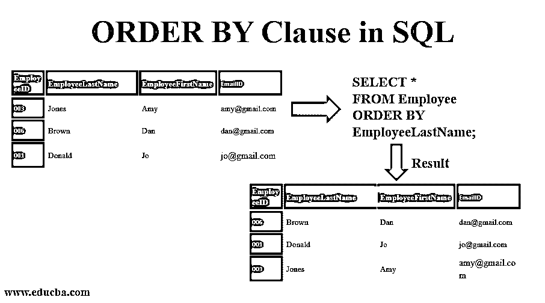

# SQL 中的 ORDER BY 子句

> 原文：<https://www.educba.com/order-by-clause-in-sql/>

## SQL 中 ORDER BY 子句介绍

SQL 中的 ORDER BY 子句帮助我们根据表中的列以升序或降序对数据进行分类。ORDER BY 是查询中使用的关键字，用于帮助我们对数据进行排序。默认情况下，一些数据库按升序对查询返回的结果进行分类。为了对记录中的数据进行降序排序，我们在查询中使用了关键字 DESC。我们还有关键字 ASC 来按升序对数据进行分类，尽管由于数据库的默认设置，我们通常不使用它。

### SQL 中 ORDER BY 子句的参数

*   **column_name:** 表示我们希望检索的列名，数据将根据该列名进行排列。
*   **table_name:** 表示要从中获取记录的表的名称。我们需要在这个参数中至少有一个表名。
*   **WHERE 条件:**可选参数。WHERE 子句包含我们选择数据时必须满足的条件。
*   **ASC** :用于对列数据进行升序排序的关键字。如果没有提到关键字，默认情况下，数据按升序排序。
*   **DESC:** 该关键字用于对列数据进行降序排序。
*   **|:** 这只是一个“或”的指示符，因为我们将在查询中相应地使用 ASC 或 DESC 作为结果。

#### ORDER BY 子句

ORDER BY 的语法是:

<small>Hadoop、数据科学、统计学&其他</small>

`SELECT column_name(s)
FROM table_name(s)
[WHERE condition] [ORDER BY column1, column2, .. columnN] [ASC | DESC];`

#### 根据单个列对数据进行排序的语法

要根据单个列对表中的数据进行升序或降序排序，我们可以使用 ASC 或 DESC 关键字。在我们的例子中，我们将按照升序对数据进行排序，因此使用了关键字 ASC。

**语法**

`SELECT * FROM table_name ORDER BY column_name ASC`

#### 根据几列对数据进行排序的语法

要根据几列按升序或降序对表中的数据进行排序，我们可以使用 ASC 或 DESC 关键字。为了提到我们将根据其对数据进行排序的几个列，我们需要提到由逗号(，)运算符分隔的列的名称。在我们的例子中，我们将按照升序对数据进行排序，因此使用了关键字 ASC。

**语法**

`SELECT * FROM table_name ORDER BY column1 ASC, column2 ASC`

### ORDER BY 子句示例

让我们看看各种例子，以便更好地理解 ORDER BY 子句。

#### 1.以升序对结果进行排序的示例

为了按升序对结果进行分类，我们可以使用 ASC 关键字。如果没有提供关键字 ASC 或 DESC，则默认的排序顺序是升序。让我们借助一个例子来理解这一点。我们有员工桌。

| **员工 ID** | **雇员姓氏** | **雇员名字** | **EmailID** |
| 001 | 唐纳德 | 乔 | jo@gmail.com |
| 002 | 史密斯（姓氏） | 杰米 | jamie@gmail.com |
| 003 | 琼斯 | 艾米 | amy@gmail.com |
| 004 | 雷诺兹 | 安迪(男子名ˌ等于 Andrew) | andy@gmail.com |
| 005 | 托马斯 | 俏皮话 | sally@gmail.com |
| 006 | 褐色的 | 但 | dan@gmail.com |

当我们试图按雇员姓氏的升序排列结果时，我们可以使用下面的语句，下面的结果显示在后面的表中。

`SELECT *
FROM Employee
ORDER BY EmployeeLastName;`

**结果**

| **员工 ID** | **雇员姓氏** | **雇员名字** | **EmailID** |
| 006 | 褐色的 | 但 | dan@gmail.com |
| 001 | 唐纳德 | 乔 | jo@gmail.com |
| 003 | 琼斯 | 艾米 | amy@gmail.com |
| 004 | 雷诺兹 | 安迪(男子名ˌ等于 Andrew) | andy@gmail.com |
| 002 | 史密斯（姓氏） | 杰米 | jamie@gmail.com |
| 005 | 托马斯 | 俏皮话 | sally@gmail.com |

此示例返回根据 EmployeeLastName 字段按升序排序的来自*雇员*表的所有记录。我们也可以如下使用关键字 ASC 来获得相同的结果。

`SELECT EmployeeID, EmployeeLastName
FROM Employee
WHERE EmployeeID <> '003'
ORDER BY 1 DESC;`

#### 2.以降序对结果进行排序的示例

当我们想在 ORDER BY 子句中按降序对数据进行排序时，我们使用关键字 DESC。让我们借助一个例子来理解这一点。我们有包含以下数据的相同的雇员表。

| **员工 ID** | **雇员姓氏** | **雇员名字** | **EmailID** |
| 001 | 唐纳德 | 乔 | jo@gmail.com |
| 002 | 史密斯（姓氏） | 杰米 | jamie@gmail.com |
| 003 | 琼斯 | 艾米 | amy@gmail.com |
| 004 | 雷诺兹 | 安迪(男子名ˌ等于 Andrew) | andy@gmail.com |
| 005 | 托马斯 | 俏皮话 | sally@gmail.com |
| 006 | 褐色的 | 但 | dan@gmail.com |

我们只需要 EmployeeID 大于 2 的雇员，并且我们需要按降序对数据进行排序。我们使用下面的 SQL 语句，得到只有 4 条记录的结果集表。

`SELECT *
FROM Employee
WHERE EmployeeID > 002
ORDER BY EmployeeID DESC;`

**结果:**

| **员工 ID** | **雇员姓氏** | **雇员名字** | **电子邮件 ID** |
| 006 | 褐色的 | 但 | dan@gmail.com |
| 005 | 托马斯 | 俏皮话 | sally@gmail.com |
| 004 | 雷诺兹 | 安迪(男子名ˌ等于 Andrew) | andy@gmail.com |
| 003 | 琼斯 | 艾米 | amy@gmail.com |

#### 3.按相对位置对结果进行排序的示例

我们还可以根据列的相对位置来排列数据，其中 1 代表第一个字段，2 代表第二个字段，3 代表第三个字段，依此类推。让我们试着根据相对位置来排列雇员表中的数据。

| **员工 ID** | **雇员姓氏** | **雇员名字** | **电子邮件** |
| 001 | 唐纳德 | 乔 | jo@gmail.com |
| 002 | 史密斯（姓氏） | 杰米 | jamie@gmail.com |
| 003 | 琼斯 | 艾米 | amy@gmail.com |
| 004 | 雷诺兹 | 安迪(男子名ˌ等于 Andrew) | andy@gmail.com |
| 005 | 托马斯 | 俏皮话 | sally@gmail.com |
| 006 | 褐色的 | 但 | dan@gmail.com |

通过使用如下 SQL 语句，我们可以按照 EmployeeID 的降序排列数据。我们还断言我们只需要表中的两列，即 EmployeeID 和 EmployeeLastName，并使用 WHERE 子句说明我们不希望任何行包含 EmployeeID 003。

`SELECT EmployeeID, EmployeeLastName
FROM Employee
WHERE EmployeeID <> '003'
ORDER BY 1 DESC;`

**结果**

| **员工 ID** | **雇员姓氏** |
| 006 | 褐色的 |
| 005 | 托马斯 |
| 004 | 雷诺兹 |
| 002 | 史密斯（姓氏） |
| 001 | 唐纳德 |

因为位置 1 处的列是 EmployeeID，所以结果集根据 EmployeeID 进行排序。

### 结论

在 SQL 中，SELECT 语句不以任何特定的顺序返回数据。为了保证特定的顺序，我们使用 ORDER BY 子句。ORDER BY 根据一列或多列进行排序。记录按升序或降序返回。如果没有提供 ASC 或 DESC 关键字，那么结果将按升序排列。

### 推荐文章

这是 SQL 中 ORDER BY 子句的指南。这里我们讨论 ORDER BY 子句的参数和不同的例子以及语法。您也可以浏览我们推荐的其他文章，了解更多信息——

1.  [SQL 管理工具](https://www.educba.com/sql-management-tools/)
2.  [PostgreSQL 数据类型](https://www.educba.com/postgresql-data-types/)
3.  [SQL 数据](https://www.educba.com/sql-data-types/) [类型](https://www.educba.com/sql-data-types/)
4.  [Oracle 中的排序依据](https://www.educba.com/order-by-in-oracle/)

