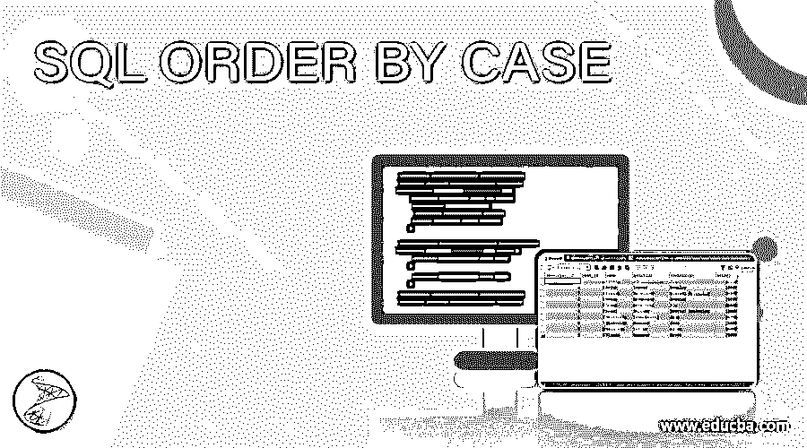
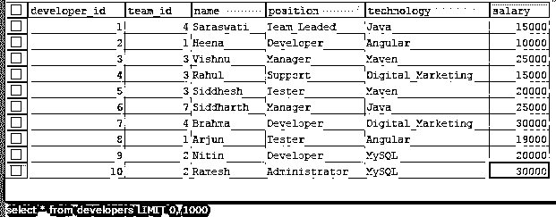
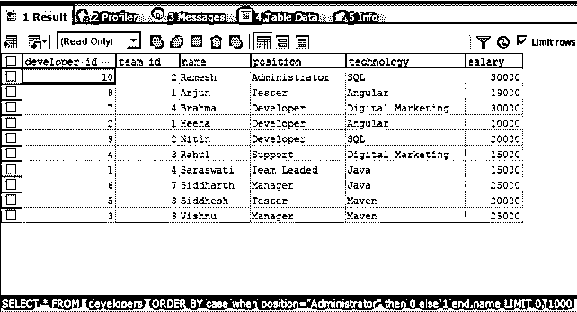
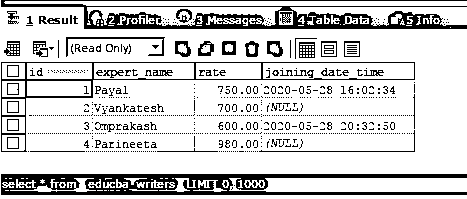
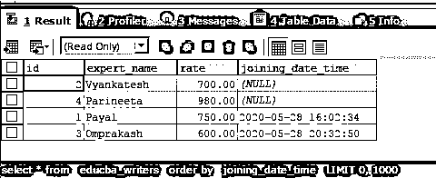
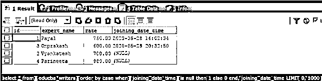

# 按案例排序的 SQL

> 原文：<https://www.educba.com/sql-order-by-case/>

## SQL ORDER BY CASE 简介

当我们必须根据条件对数据进行排序并定义基于特定条件进行排序的标准时，可以使用 SQL order by case。order by 子句对于以升序或降序方式对数据进行排序很有帮助，只需指定要进行排序的列，或者如果要逐个考虑所有列来进行排序，则指定多个列。但是，如果需要以动态方式指定排序标准，即要对其进行排序的列，并且将在查询语句的执行过程中决定考虑排序的列，则会出现这种情况。为此，可以在 order by 子句中使用 case 语句。

在本文中，我们将研究使用 case 语句动态定义 order by 子句的语法，研究它的工作原理，并实现 order by with case 的一些示例。

<small>Hadoop、数据科学、统计学&其他</small>

**语法:**

`SELECT
column1, column2,..., columnm
FROM
target_table
WHERE
conditions_or_constraints
ORDER BY CASE WHEN condition1 THEN columni ELSE [CASE WHEN condition2 THEN columni ELSE...] END;`

ORDER BY 子句和 case 语句的语法如上所示。每当我们需要检索包含多个列值的结果集时，它都是 select 子句中使用的可选子句。它应该始终放在 SELECT 子句中的 FROM 和 WHERE 子句之后。上述语法中使用的一些术语解释如下

*   column1，column2，…，columnm–这些是 target_table 表中需要在结果集中检索和获取的列的名称。
*   target _ table–从中获取结果的表的名称。
*   conditions _ or _ constraints–如果您希望对某些列应用某些条件，可以在可选的 WHERE 子句中提到它们。
*   CASE WHEN condition 1 THEN column I ELSE[CASE WHEN condition 2 THEN column I ELSE…]–CASE 语句可以在 order by 子句中可选地使用，以提供对列进行动态排序的功能。也可以使用多个嵌套的 case 语句。在这些条件中，如果条件的计算结果为 true，那么在 then 之后指定的列名将作为排序的标准；如果条件的计算结果为 false，那么将考虑在 else 之后提到的列名或 case 语句，以进行标准计算，从而获得要进行排序的列。

### SQL ORDER BY CASE 示例

让我们考虑一个名为 developers 的表，并使用下面的查询检查其内容。使用下面的选择查询检索 developers 表的记录后

`SELECT * FROM developers;`

给出以下输出

现在，假设在 developers 表的上述内容中，我们想要获得包含 developers 表的所有列的结果集，并且这些列是根据 developers 的名称排序的。此外，我们必须确保首先检索管理员的姓名，然后所有的 ordering on name 子句才生效。

为此，我们可以在 order by 子句中使用 case 语句，该子句指定如果开发人员的职位是管理员，则将其保持为 0 order by，这是使其到达第一个记录的最小值，否则我们会将大于 0 的值 1 分配给除管理员职位之外的其他记录，作为 order by 标准。

此外，这样做时，将首先检索管理员的记录，然后检索剩余的记录。现在，same order by 子句中的第二个标准将是 name column，因为我们必须检索按名称的字母顺序排序的所有记录。因此，我们的查询语句将如下所示，指定的 case 语句按管理员和其他开发人员的顺序排序，其余开发人员将根据他们的姓名排序。

`SELECT
*
FROM
`developers`
ORDER BY CASE WHEN POSITION="Administrator" THEN 0
ELSE 1 END, NAME;`

执行上述查询语句的输出如下，第一个位置是管理员的记录，其余的开发人员根据他们的姓名排序

当我们必须分离某些记录并在对列进行常规排序之前或之后定义它们的顺序时，通常可以在 order by 子句中使用 CASE 语句。这些情况大多发生在处理空值、空白值以及在非空或非空白记录的末尾显示这些记录的情况下。

现在，我们将考虑名为 educba_writers 的表，其内容和结构如使用下面的 select 查询语句输出所示

`SELECT
*
FROM
`educba_writers`;`

执行上述查询语句的输出如下

现在，我们必须根据连接日期和时间列的内容对结果集进行排序。如果我们使用下面查询中提到的简单 order by 子句，结果集将如下所示

`SELECT
*
FROM
`educba_writers`
ORDER BY `joining_date_time` ;`

执行上述查询语句的输出如下

但是，如果我们必须对结果集进行排序，使得所有的空值都在末尾，有序的连接日期和时间值在开头，那么我们可以在 out select 查询中使用 case 语句，如下所示

`SELECT
*
FROM
`educba_writers`
ORDER BY
CASE
WHEN `joining_date_time` IS NULL
THEN 1
ELSE 0
END,
joining_date_time ;`

执行上述查询语句的输出如下

### 结论

我们可以在 ORDER BY 语句中使用 CASE 语句，根据需求以某种预期的方式定义某些列的顺序，然后根据某些其他参数照常对剩余的记录进行排序，或者保持不变。这种定义满足特定条件的特定记录顺序的动态行为只能通过在 select 查询语句的 order by 子句中使用 case 语句并相应地在 case 语句中提及条件来实现。

### 推荐文章

这是 SQL ORDER BY CASE 的指南。这里我们分别讨论引言、语法和代码实现的例子。您也可以看看以下文章，了解更多信息–

1.  [SQL 临时表](https://www.educba.com/sql-temporary-table/)
2.  [SQL 选择顶部](https://www.educba.com/sql-select-top/)
3.  [SQL 集群](https://www.educba.com/sql-cluster/)
4.  [SQL 表分区](https://www.educba.com/sql-table-partitioning/)

