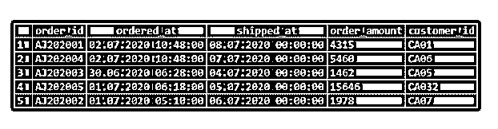
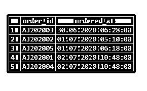
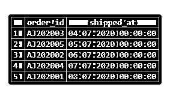
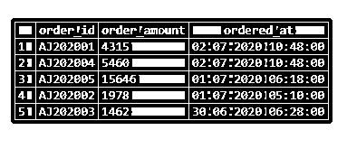
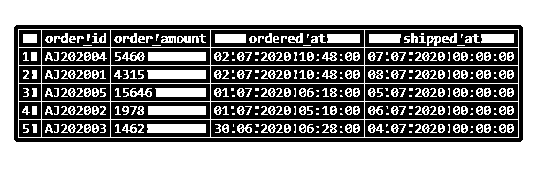
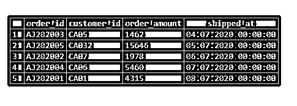
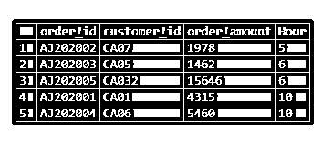
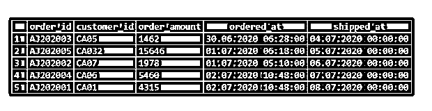
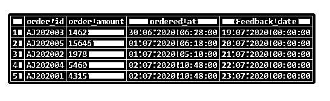

# 按日期排序的 SQL

> 原文：<https://www.educba.com/sql-order-by-date/>

## SQL ORDER BY DATE 简介

结构化查询语言(SQL)中的 ORDER BY DATE 子句用于根据一个或多个日期列按升序或降序排列选择查询获取的结果集。这类似于对任何其他字符串或整数类型的列使用 ORDER BY 语句。默认情况下，该语句按升序对结果集进行排序。如果我们想按降序排序，我们必须特别提到 DESC 关键字。

让我们从理解用于编写 ORDER BY 子句的语法开始。

<small>Hadoop、数据科学、统计学&其他</small>

**语法和参数:**

用于编写带有 ORDER BY 子句的选择查询的基本语法如下:

`SELECT column_name_1, column_name_2, ..., column_name_n
FROM
table_name
WHERE condition_expression
ORDER BY date_field ASC | DESC;`

上述语法中使用的参数如下:

*   column_name_1，column_name_2，…，column_name_n:必须为最终结果集提取的列或字段
*   table_name:必须从中提取上述列的数据库表。
*   condition_expression:过滤哪些行所依据的条件。这是可选的。
*   date_field:记录排序所依据的日期数据类型的列。
*   ASC | DESC:排序的顺序，如升序(ASC)或降序(DESC)

学习了用于编写 ORDER BY 子句的语法和参数之后，让我们尝试几个例子来详细理解这个概念。

### 按日期排序的 SQL 示例

为了说明 ORDER BY DATE 语句的工作原理，还有什么比在虚拟表上尝试几个例子更好的呢？因此，让我们创建一个名为“电子交易”的虚拟表。顾名思义，该表包含订单日期、发货日期等详细信息。与电子商务平台上的订单有关。我们可以使用下面的 CREATE TABLE 语句来创建所说的表。

`CREATE TABLE e_transactions
(
order_id character varying(255),
ordered_at datetime,
shipped_at date,
order_amount numeric,
customer_id character varying(255)
);`

该表已成功创建。让我们在其中插入一些记录来处理。为此，我们可以使用下面的 INSERT 语句。

`INSERT INTO e_transactions
(order_id
,ordered_at
,shipped_at
,order_amount
,customer_id)
VALUES
('AJ202001','2020-07-02T10:48:00',DATEADD(DAY,5,GETDATE()),4315,'CA01'),
('AJ202004','2020-07-02T10:48:00',DATEADD(DAY,4,GETDATE()), 5460,'CA06'),
('AJ202003','2020-06-30T06:28:00',DATEADD(DAY,1,GETDATE()), 1462,'CA05'),
('AJ202005','2020-07-01T06:18:00',DATEADD(DAY,2,GETDATE()), 15646,'CA032'),
('AJ202002','2020-07-01T05:10:00',DATEADD(DAY,3,GETDATE()), 1978,'CA07');
GO`

填充的电子交易表中的数据如下所示:

`SELECT * FROM e_transactions;`

注意，我们有两个日期字段，ordered_at 和 shipped_at 列。前者属于日期时间数据类型，后者属于日期数据类型。在 shipped_at 字段中，我们刚刚给系统的当前日期添加了几天。

现在，在这个表的帮助下，我们准备尝试几个基于 ORDER BY DATE 子句的示例。

### ORDER BY 子句中包含日期字段值的基本 SQL 查询

让我们讨论按日期排序的 SQL 示例。

#### 示例 1:查找订单的订单 id 和订购日期和时间，按订购时间升序排列。

`SELECT order_id, ordered_at
FROM e_transactions
ORDER BY ordered_at;`

#### 示例 2:查找订单的订单 id 和发货日期，按发货日期升序排列。

`SELECT order_id, shipped_at
FROM e_transactions
ORDER BY shipped_at;`

**使用 DESC 对记录进行降序排序**

#### 示例 3:查找所有订单的订单 id、订单金额和 ordered_at，并按 ordered_at 日期降序排列结果。

`SELECT
order_id,
order_amount,
ordered_at
FROM e_transactions
ORDER BY ordered_at DESC;`

#### 示例#4:查找所有订单的订单 id、订单金额、ordered_at 和 shipped_at 日期，并按 ordered_at 字段降序排序，如果相似，则按 shipped_at 字段降序排序。

`SELECT
order_id,
order_amount,
ordered_at,
shipped_at
FROM e_transactions
ORDER BY ordered_at DESC, shipped_at ASC;`

**使用日期部分，如月、日、小时等。作为 ORDER BY 子句**中的一个参数

#### 示例 5:查找订单的订单 id、客户 id、订单金额和发货日期，按发货日期升序排列。

`SELECT order_id,customer_id,order_amount,shipped_at
FROM e_transactions
ORDER BY DATEPART(Day,shipped_at);`

#### 示例 6:查找所有订单的订单 id、客户 id、订单金额和订购时间，按订购时间升序排列。

`SELECT
order_id,
customer_id,
order_amount,
DATEPART(HOUR,ordered_at) as "Hour"
FROM e_transactions
ORDER BY DATEPART(HOUR,ordered_at);`

**在 ORDER BY 子句中使用两个日期参数**

#### 示例#7:查找所有订单的订单 id、客户 id、订单金额、订购日期和时间以及发货日期，按订购月份和发货日期升序排列。

`SELECT
order_id,
customer_id,
order_amount,
ordered_at,
shipped_at
FROM e_transactions
ORDER BY DATEPART(MONTH,ordered_at),shipped_at;`

**使用从 DATEADD 函数获得的日期作为 ORDER BY 子句的参数**

#### 例 8:查找订单 id、订单金额、订购日期和时间、反馈日期(订单发货后 15 天)，按反馈日期升序排列。

`SELECT
order_id,
order_amount,
ordered_at,
DATEADD(Day,15,shipped_at) As 'Feedback_date'
FROM e_transactions
ORDER BY DATEADD(Day,15,shipped_at);`

### 结论

ORDER BY keyword 子句用于根据一个或多个字段将选定的结果集按升序或降序排序。

### 推荐文章

这是一个按日期排序的 SQL 指南。这里我们分别讨论引言、语法和代码实现的例子。您也可以看看以下文章，了解更多信息–

1.  [SQL 表分区](https://www.educba.com/sql-table-partitioning/)
2.  [SQL 临时表](https://www.educba.com/sql-temporary-table/)
3.  [SQL 更新后触发器](https://www.educba.com/sql-after-update-trigger/)
4.  [SQL NOT 运算符](https://www.educba.com/sql-not-operator/)

