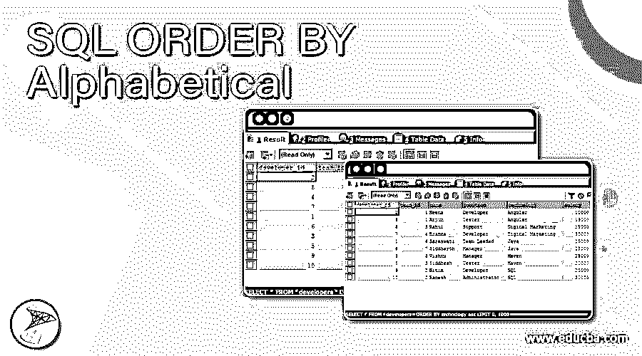
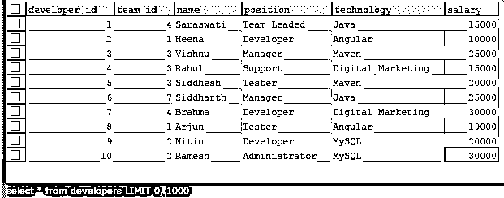
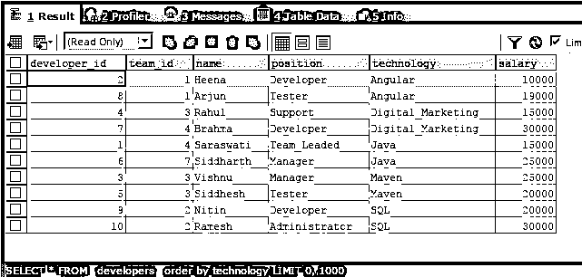
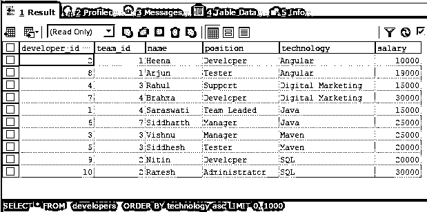
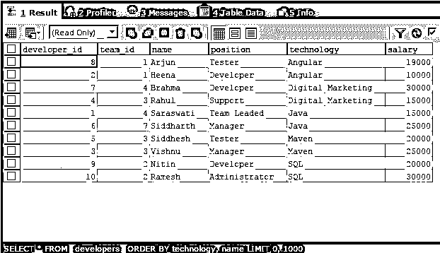
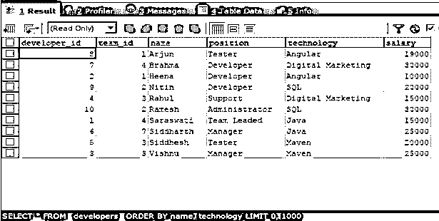
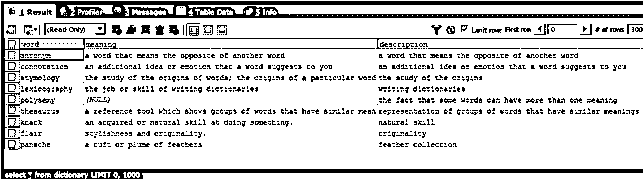
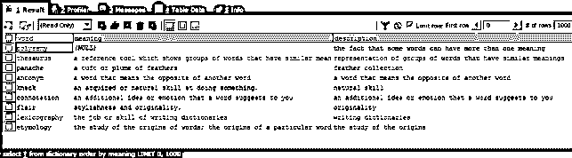

# SQL 按字母顺序排序

> 原文：<https://www.educba.com/sql-order-by-alphabetical/>

## 按字母顺序排序的 SQL 介绍

可以使用简单的 Order by 子句以升序对基于字符的列值进行 SQL 排序。在 SQL 中，各种子句可以与 SELECT 子句一起使用，以实现某些特定的功能，或者使结果集以特定的格式被检索。ORDER BY 子句就是这样一个子句，它有助于从原始结果集中获取有序数据。它返回基于特定列的排序数据，作为数据排序的标准。数据可以按升序或降序排列。当列为字符串格式或 varchar 数据类型时，order by 会导致以升序方式按字母顺序对数据排序。

大多数情况下，当使用 SQL 的聚合函数时，如果我们不指定升序或降序的顺序类型，则使用 ORDER BY 函数，默认情况下，数据以升序方式排序。在本文中，我们将学习 SQL 中用于字母顺序的 ORDER BY 子句的语法、用法和执行。

<small>Hadoop、数据科学、统计学&其他</small>

**语法:**

`SELECT
column1, column2,..., columnm
FROM
target_table
WHERE
conditions_or_constraints
ORDER BY stringColumn;`

ORDER BY 子句的语法如上所示。每当我们需要检索包含多个列值的结果集时，它都是 select 子句中使用的可选子句。它应该始终放在 SELECT 子句中的 FROM 和 WHERE 子句之后。下面解释了上述语法中使用的一些术语。

*   column1，column2，…，column–这些是 target_table 表中需要在结果集中检索和获取的列的名称。
*   target _ table–从中获取结果的表的名称。
*   conditions _ or _ constraints–如果您希望对某些列应用某些条件，可以在可选的 WHERE 子句中提到它们。
*   string column–这是将被视为在 SQL 查询中创建排序流的标准的列。为了按字母顺序进行排序，该列应该是基于字符的列，具有 varchar、nvarachar、text 这样的数据类型。等等。

### 按字母顺序排序的 SQL 示例

让我们考虑一个名为 developers 的表，并使用下面的查询检查它的内容。使用下面的 SELECT 查询检索 developers 表的记录后。

`SELECT * FROM `developers`;`

给出以下输出:

现在，让我们简单地根据 technology 列值对 developer 表中的记录进行排序。为此，我们可以简单地使用下面的查询语句，其中我们只指定了作为排序标准的列的名称，而没有指定需要进行哪种类型的排序

`SELECT
*
FROM
`developers`
ORDER BY technology ;`

执行上述查询语句的输出如下所示，其中包含了对 technology 列的升序排序，即使我们在 GROUP BY 子句中没有提到 ASC。这是因为升序是所考虑的默认排序类型。每当 order by 子句以升序方式应用于存储字符串和文本的所有基于字符的列时，这些列都按字母顺序排序。

让我们尝试在查询语句中显式指定 ASC

`SELECT
*
FROM
`developers`
ORDER BY technology ASC;`

执行上述查询语句的输出如下，与前一个相同。

在 SQL 中，可以对多个列值进行排序。为此，我们需要在 ORDER BY 子句中以逗号分隔的格式优先提及所有列。考虑下面的例子，其中首先根据技术列的列值进行排序，然后再根据名称列进行排序。

`SELECT
*
FROM
`developers`
ORDER BY technology, name;`

执行上述查询语句的输出如下，其中我们可以观察到所有列在技术列上以升序方式和字母顺序排序，并且对于每个技术列值，同样的技术值记录的排序是基于名称列值以字母顺序方式再次完成的，因为该列中也存储了基于字符的值。

如果我们恢复上述查询的 order by 子句中的列名规范，则输出会有所不同，因为首先将按名称排序，然后按技术排序。考虑下面的查询语句。

`SELECT
*
FROM
`developers`
ORDER BY name, technology;`

执行上述查询语句的输出如下

让我们从另一个名为 dictionary 的表中检索按字母顺序排列的记录。使用 SQL–的选择查询，表字典的内容如下所示

`SELECT * FROM dictionary;`

执行上述查询语句的输出如下

现在，我们需要根据名为 meaning 的列的列值，以升序方式对字典表中的数据进行排序。为此，我们的查询语句如下

`SELECT
*
FROM
dictionary
ORDER BY meaning ;`

执行上述查询语句的输出如下，其中包含字典表的记录，这些记录根据含义列值排序，空值位于开头，并且这些记录按字母顺序排序

### 结论

我们可以使用 ORDER BY 子句对结果进行排序和排序，并从原始结果集中获得排序后的结果集。要按字母顺序执行排序，我们可以跳过指定订单类型，因为默认类型是升序，或者可以在 order by 子句中明确提到 ASC，并提到包含基于字符的列的订单的标准。另外，请注意，在多列条件排序的情况下，在 order by column 中指定列名的顺序很重要。

### 推荐文章

这是一个按字母顺序排序的 SQL 指南。这里我们分别讨论引言、语法和代码实现的例子。您也可以看看以下文章，了解更多信息–

1.  [SQL 更新后触发器](https://www.educba.com/sql-after-update-trigger/)
2.  [SQL 临时表](https://www.educba.com/sql-temporary-table/)
3.  [SQL NOT 运算符](https://www.educba.com/sql-not-operator/)
4.  [SQL 集群](https://www.educba.com/sql-cluster/)

