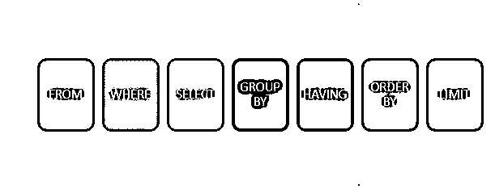
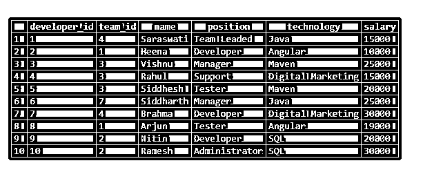
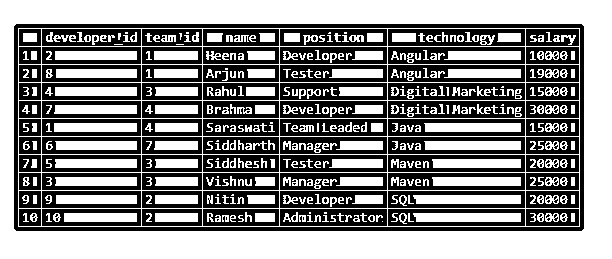
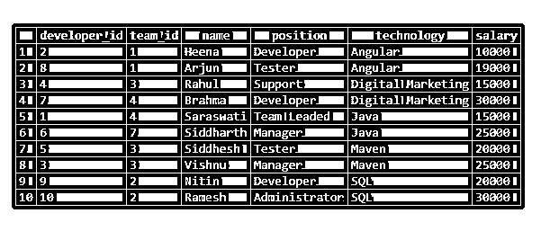
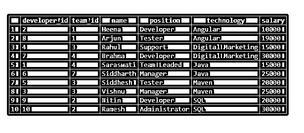
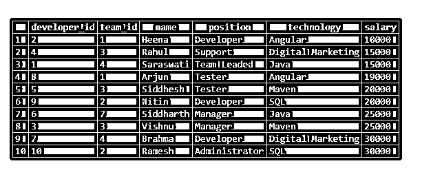

# SQL 升序排序

> 原文：<https://www.educba.com/sql-order-by-ascending/>

## SQL 升序排序简介

在 SQL 中，各种子句可以与 SELECT 子句一起使用，以实现某些特定的功能，或者使结果集以特定的格式被检索。ORDER BY 子句就是这样一个子句，它有助于从原始结果集中获取有序数据。它返回基于特定列的排序数据，作为数据排序的标准。数据可以按升序或降序排列。

大多数情况下，当使用 SQL 的聚合函数时，如果我们不指定升序或降序的顺序类型，则使用 ORDER BY 函数，默认情况下，数据以升序方式排序。在本文中，我们将了解 SQL 中用于升序排序的 ORDER BY 子句的语法、用法和执行。

<small>Hadoop、数据科学、统计学&其他</small>

**语法:**

`SELECT
column1, column2,..., columnm
FROM
target_table
WHERE
conditions_or_constraints
ORDER BY criteriacolumn1 , criteriacolumn2,...,criteriacolumnj;`

ORDER BY 子句的语法如上所示。每当我们需要检索包含多个列值的结果集时，它都是 select 子句中使用的可选子句。它应该始终放在 SELECT 子句中的 FROM 和 WHERE 子句之后。上述语法中使用的一些术语解释如下

*   column1，column2，…，columnm–这些是 target_table 表中需要在结果集中检索和获取的列的名称。
*   target _ table–从中获取结果的表的名称。
*   conditions _ or _ constraints–如果您希望对某些列应用某些条件，可以在可选的 WHERE 子句中提到它们。
*   criteriacolumn1、criteriacolumn2、…、criteria columnj–这些列将被视为在 SQL 查询中创建排序流的标准。可以有一个或多个需要应用标准的列名。请注意，应以逗号分隔的格式提及多个排序标准。

### 估价

SQL 中的 ORDER BY 子句在 FROM、WHERE、SELECT、HAVING、GROUP BY 和子句之后计算。此外，对 LIMIT 子句的评估是在对 ORDER BY 子句的评估之后执行的。下图说明了评估的顺序。

### SQL 升序排序示例

让我们使用下面的创建查询创建一个名为 developers 的表

`CREATE TABLE developers(
developer_id int NOT NULL,
team_id int NOT NULL,
name varchar(100) DEFAULT NULL,
position varchar(100) DEFAULT NULL,
technology varchar(100) DEFAULT NULL,
salary int DEFAULT NULL,
PRIMARY KEY (developer_id,team_id)
);`

让我们使用 insert 语句在 developers 表中插入一些记录

`INSERT INTO developers (developer_id, team_id, name, position, technology, salary) VALUES
('1','4','Saraswati','Team Leaded','Java',15000),
('2','1','Heena','Developer','Angular','10000'),
('3','3','Vishnu','Manager','Maven','25000'),
('4','3','Rahul','Support','Digital Marketing','15000'),
('5','3','Siddhesh','Tester','Maven','20000'),
('6','7','Siddharth','Manager','Java','25000'),
('7','4','Brahma','Developer','Digital Marketing','30000'),
('8','1','Arjun','Tester','Angular','19000'),
('9','2','Nitin','Developer','SQL','20000'),
('10','2','Ramesh','Administrator','SQL','30000');`

我们使用相同的插入格式在我的表中插入了多个值。

现在，在使用下面的 SELECT 查询检索了 developers 表的记录之后

`SELECT * FROM developers;`

给出以下输出

现在，让我们简单地根据 technology 列值对 developer 表中的记录进行排序。为此，我们可以简单地使用下面的查询语句，其中我们只指定了作为排序标准的列的名称，而没有指定需要进行哪种类型的排序

`SELECT
*
FROM developers ORDER BY technology ;`

执行上述查询语句的输出如下所示，其中包含了对 technology 列的升序排序，即使我们在 GROUP BY 子句中没有提到 ASC。这是因为升序是所考虑的默认排序类型。

让我们尝试在查询语句中显式指定 ASC

`SELECT
*
FROM developers ORDER BY technology ASC;`

执行上述查询语句的输出如下，与前一个相同。

在 SQL 中，可以对多个列值进行排序。为此，我们需要在 ORDER BY 子句中以逗号分隔的格式提及所有基于优先级的列。考虑下面的例子，其中首先根据技术列的列值进行排序，然后再根据薪水列进行排序。

`SELECT
*
FROM
developers
ORDER BY technology, salary ;`

执行上述查询语句的输出如下，其中我们可以观察到所有列在技术列上以升序方式排序，并且对于每个技术列值，同样的技术值记录的内部排序是基于薪金列值以最小的方式进行的，然后以递增的方式进行。

如果我们恢复上述查询的 order by 子句中的列名规范，输出将会有所不同，因为首先将根据薪水进行排序，然后根据技术进行排序。考虑以下查询语句–

`SELECT
*
FROM
developers
ORDER BY salary, technology ;`

执行上述查询语句的输出如下

### 结论

我们可以使用 ORDER BY 子句对结果进行排序和排序，并从原始结果集中获得排序后的结果集。顺序可以按升序或降序设置。要以升序方式执行排序，我们可以跳过指定订单的类型，因为默认类型是升序，或者可以在 order by 子句中显式提及 ASC。另外，请注意，在多列条件排序的情况下，在 order by column 中指定列名的顺序很重要。

### 推荐文章

这是一个 SQL 升序排序的指南。这里我们分别讨论引言、语法和代码实现的例子。您也可以看看以下文章，了解更多信息–

1.  [SQL NOT 运算符](https://www.educba.com/sql-not-operator/)
2.  [SQL 临时表](https://www.educba.com/sql-temporary-table/)
3.  [SQL 更新后触发器](https://www.educba.com/sql-after-update-trigger/)
4.  [SQL 集群](https://www.educba.com/sql-cluster/)

