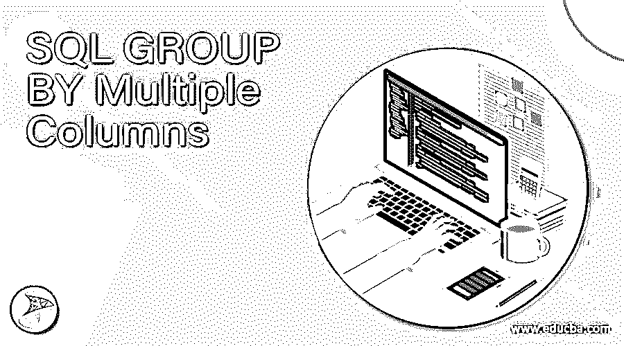
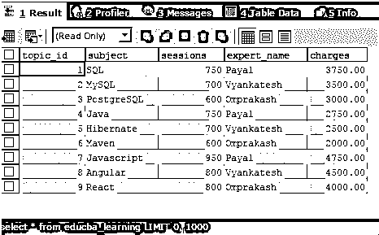
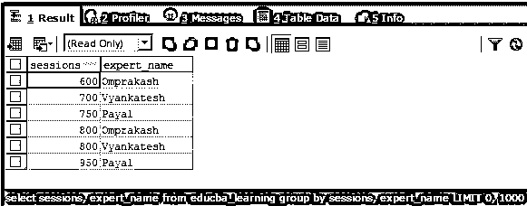
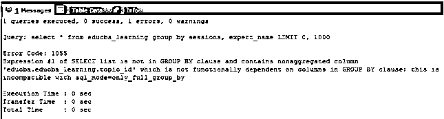

# SQL 按多列分组

> 原文：<https://www.educba.com/sql-group-by-multiple-columns/>

## SQL 多列分组简介

SQL GROUP BY multiple columns 是一种技术，通过这种技术，我们可以使用 SQL 查询从数据库中检索汇总的结果集，该查询涉及通过将多个列作为分组标准来对列值进行分组。“分组依据”是为了将具有相同分组标准值的记录组合在一起。当考虑对单个列进行分组时，对于定义了条件的列，包含相同值的记录将被分组到结果集的单个记录中。类似地，当在多个列上定义分组标准时，这些列的所有值应该与其他列的值相同，以便考虑将它们分组到单个记录中。在本文中，我们将借助一些示例了解 GROUP BY 子句的语法、用法和实现，该子句涉及将多个列指定为分组标准。

**语法:**

<small>Hadoop、数据科学、统计学&其他</small>

`SELECT
column1, column2,..., columnm, aggregate_function(columni)
FROM
target_table
WHERE
conditions_or_constraints
GROUP BY criteriacolumn1 , criteriacolumn2,...,criteriacolumnj;`

GROUP BY 子句的语法如上所示。每当我们需要对结果集进行汇总和归约时，它都是 select 子句中使用的可选子句。它应该始终放在 SELECT 子句中的 FROM 和 WHERE 子句之后。上述语法中使用的一些术语解释如下

*   column1，column2，…，column–这些是 target_table 表中需要在结果集中检索和获取的列的名称。
*   aggregate _ function(column)–这些是在 target_table 的列上定义的聚合函数，需要从 SELECT 查询中检索。
*   target _ table–从中获取结果的表的名称。
*   conditions _ or _ constraints–如果您希望对某些列应用某些条件，可以在可选的 WHERE 子句中提到它们。

criteriacolumn1、criteriacolumn2、…、criteria columnj–这些列将被视为在 MYSQL 查询中创建组的标准。可以有一个或多个需要应用标准的列名。我们甚至可以提到表达式作为分组标准。SQL 不允许在 GROUP BY 子句中使用别名作为分组标准。请注意，分组的多个标准应该以逗号分隔的格式提及。

### 使用多列分组

当在多个列或表达式上定义分组条件时，所有与分组条件中提到的相应列匹配并具有相同值的记录将被分组到一个记录中。group by 子句通常与 MAX()、MIN()、COUNT()、SUM()等聚合函数一起使用，从一个表或连接在一起的多个表中获取汇总数据。多列分组最常用于为报告、仪表板等生成查询。

### 例子

考虑一个名为 educba_learning 的表，其内容和结构如以下 select 查询语句的输出所示

`SELECT * FROM educba_learning;`

执行上述查询语句的输出如下所示，显示了 educba_learning 表的结构和内容

现在，我们将根据 sessions 和 expert_name 列对 educba_learnning 表内容的结果集进行分组，这样，对于 sessions 和 expert_name 值相同的行，检索到的记录将只有一条记录。我们的查询语句如下

`SELECT
sessions,
expert_name
FROM
educba_learning
GROUP BY sessions,
expert_name ;`

上述 SQL 查询语句的输出如下所示，包含每个会话的唯一记录，专家姓名列值–

注意，在使用分组标准时，检索定义分组子句的记录是很重要的。如果 SQL 模式设置为 only full group by –,使用上述语句检索所有记录将产生以下错误

`SELECT
*
FROM
educba_learning
GROUP BY sessions,
expert_name ;`

上述 SQL 查询语句的输出如下所示-

让我们在具有多列的 group by 子句中使用聚合函数。我们将考虑上面的同一个示例，在该示例中，我们将对 sessions 列应用 SUM()聚合函数来检索该专家姓名的总会话数，该专家姓名的会话数与表中的会话数相同。这意味着对于名为 Payal 的专家，将检索两个不同的记录，因为在表 educba_learning 中有两个不同的会话计数值，即 750 和 950。其中，有两个记录的专家姓名为 Payal，会话计数为 750，因此，由于使用了分组语句，这两个记录将组合在一起，并生成一个总会话计数值为 1500 的记录。

让我们执行下面的查询语句，研究输出，并确认它是否会产生如上所述的输出

`SELECT
SUM(sessions),
expert_name
FROM
educba_learning
GROUP BY sessions,
expert_name ;`

执行上述查询语句的输出如下

我们可以观察到，对于名为 Payal 的专家，获取了两条记录，会话计数分别为 1500 和 950。类似的工作也适用于其他专家和记录。请注意，当使用 group by 子句时，聚合函数主要用于数值列。

### 结论

我们可以根据多个列值对 SQL 中的结果集进行分组。当我们在多个列上定义分组条件时，对于 group by 子句中定义的列，具有相同值的所有记录都使用查询输出中的单个记录来共同表示。定义为分组标准的所有列值都应该与其他记录的列值相匹配，以便将它们分组到单个记录中。大多数情况下，group by 子句与聚合函数一起使用，从多表联接查询输出的表内容中检索总和、平均值、计数、最小值或最大值。

### 推荐文章

这是一个多列 SQL 分组指南。这里我们分别讨论引言、语法和代码实现的例子。您也可以看看以下文章，了解更多信息–

1.  [SQL 临时表](https://www.educba.com/sql-temporary-table/)
2.  [SQL 表分区](https://www.educba.com/sql-table-partitioning/)
3.  [SQL 更新后触发器](https://www.educba.com/sql-after-update-trigger/)
4.  [SQL 选择顶部](https://www.educba.com/sql-select-top/)

