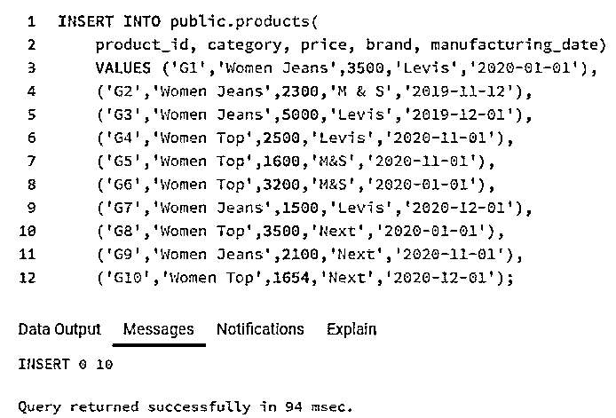
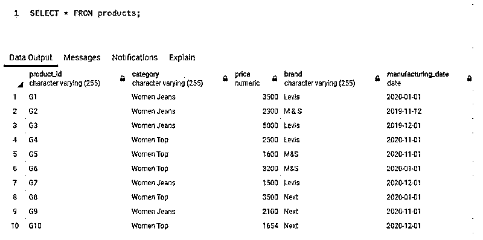
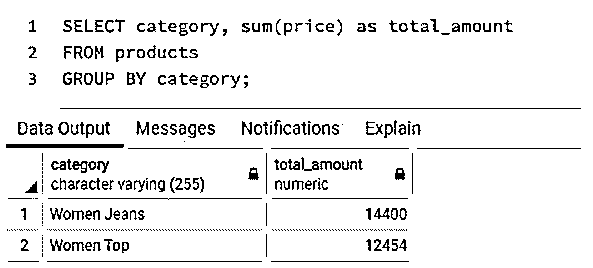
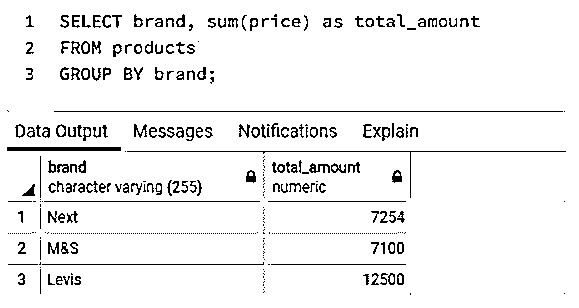
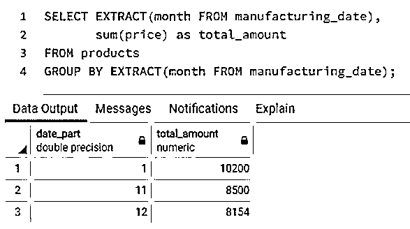
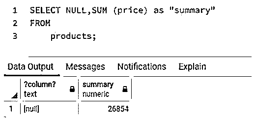
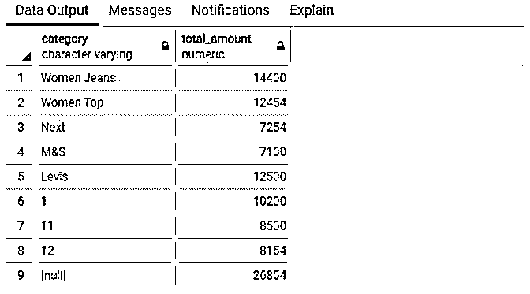
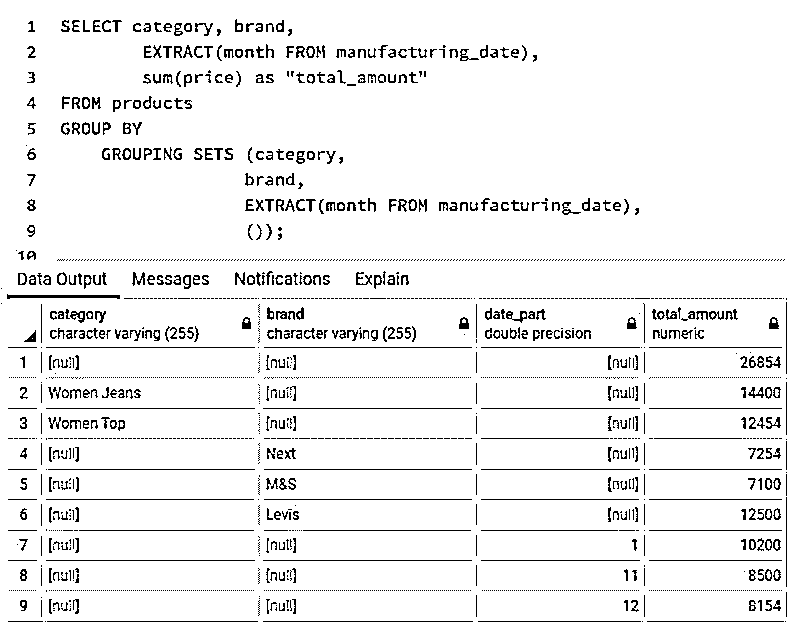
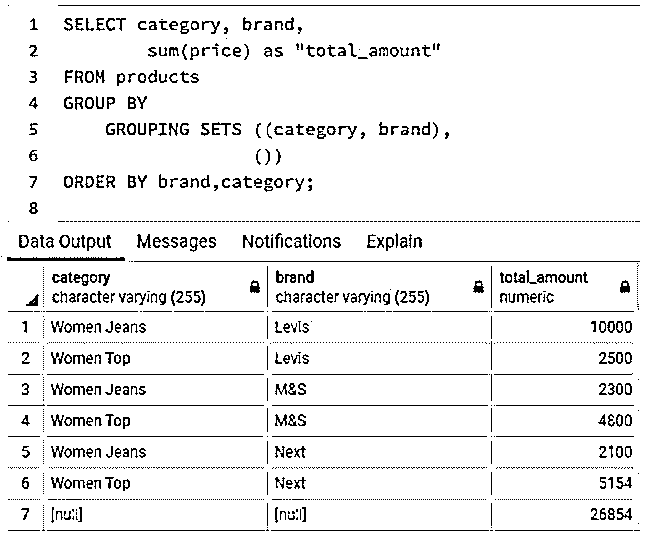
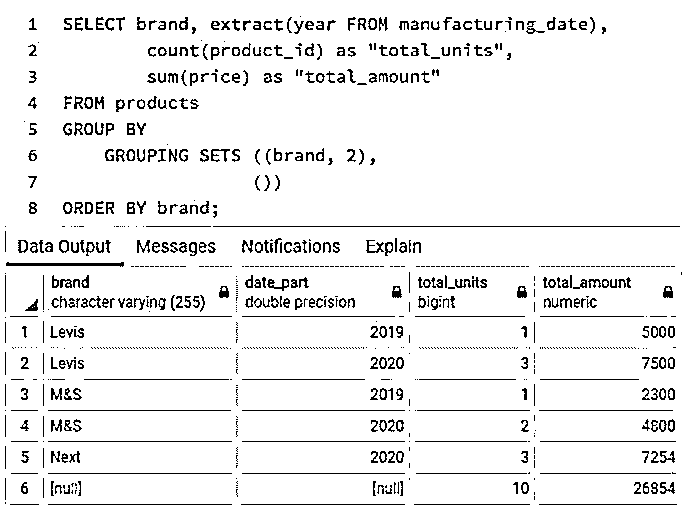

# SQL 分组集

> 原文：<https://www.educba.com/sql-grouping-sets/>

## SQL 分组集简介

标准查询语言(SQL)中的分组集可以被认为是 GROUP BY 子句的子子句。对于初学者，GROUP BY 子句用于将一列中具有相同值的行分组到汇总行中。分组集是一组或一组列，通过这些列，具有相似值的行被分组在一起。从功能上讲，它生成的结果集类似于由单个列上的多个 GROUP BY 子句的 UNION ALL 生成的结果集。GROUP BY 子句的一些其他子子句(如 ROLLUP、CUBE 等)也产生与分组集等效的结果集。

**语法和参数:**

<small>Hadoop、数据科学、统计学&其他</small>

在 SQL 中使用分组集()的基本语法如下:

`SELECT
column1,
column2,
aggregate_function(column3)
FROM
table_name
GROUP BY
GROUPING SETS (
(column1, column2),
(column1),
(column2),
()
);`

上述语法中使用的参数如下:

*   **column1，column2:** 必须为最终结果集提取的列或字段名称。
*   **aggregate _ function(column 3):**汇总函数和列名，将根据该函数和列名编制分组汇总。
*   **分组集合:**必须分组在一起的列的集合。

### SQL 分组集的示例

为了说明 SQL 中的分组集，让我们创建一个名为“products”的虚拟表。它包含产品详细信息，如 product_id、价格、品牌和生产日期。

**代码:**

`CREATE TABLE products(
product_id character varying(255),
category character varying(255),
price  numeric,
brand character varying(255),
manufacturing_date date
);`

**输出:**

我们已经成功地创建了表。接下来，让我们使用下面的插入查询在表中插入一些值。

**代码:**

`INSERT INTO public.products(
product_id, category, price, brand, manufacturing_date)
VALUES ('G1','Women Jeans',3500,'Levis','2020-01-01'),
('G2','Women Jeans',2300,'M&S','2019-11-12'),
('G3','Women Jeans',5000,'Levis','2019-12-01'),
('G4','Women Top',2500,'Levis','2020-11-01'),
('G5','Women Top',1600,'M&S','2020-11-01'),
('G6','Women Top',3200,'M&S','2020-01-01'),
('G7','Women Jeans',1500,'Levis','2020-12-01'),
('G8','Women Top',3500,'Next','2020-01-01'),
('G9','Women Jeans',2100,'Next','2020-11-01'),
('G10','Women Top',1654,'Next','2020-12-01');`

**输出:**

成功插入操作后的产品表如下所示:

**代码:**

`SELECT * FROM products;`

**输出:**

#### 示例#1

在 SQL 中对集合进行分组被认为等同于对多个 group by 子句进行 UNION ALL。所以，我们的第一个例子是同样的例子。

考虑下面的 SQL 查询，它带有关于类别、品牌、生产月份的 GROUP BY 子句，最后是一个摘要。

形容词（adjective 的缩写）SQL 查询来查找每个类别的总金额。

**代码:**

`SELECT category, sum(price) as total_amount
FROM products
GROUP BY category;`

**输出:**

b.SQL 查询来查找每个品牌的总金额。

**代码:**

`SELECT brand, sum(price) as total_amount
FROM products
GROUP BY brand;`

**输出:**

碳（carbon 的缩写）用于查找每月生产总量的 SQL 查询。

**代码:**

`SELECT EXTRACT(month FROM manufacturing_date),
sum(price) as total_amount
FROM products
GROUP BY EXTRACT(month FROM manufacturing_date);`

**输出:**

d.SQL 查询来查找总额。

**代码:**

`SELECT NULL,SUM (price) as "summary"
FROM
products;`

**输出:**

当我们使用如下所示的 UNION ALL 将上述所有 GROUP BY 查询组合在一起时，我们得到的结果集等同于通过对集合进行分组而得到的结果集。

**代码:**

`SELECT category, sum(price) as total_amount
FROM products
GROUP BY category
UNION ALL
SELECT brand, sum(price) as total_amount
FROM products
GROUP BY brand
UNION ALL
SELECT EXTRACT(month FROM manufacturing_date) :: varchar,
sum(price) as total_amount
FROM products
GROUP BY EXTRACT(month FROM manufacturing_date)
UNION ALL
SELECT NULL,SUM (price) as "summary"
FROM products;`

**输出:**

现在观察下一个查询。这里，我们使用分组集将类别、品牌和生产月份分组在一起。

**代码:**

`SELECT category, brand,
EXTRACT(month FROM manufacturing_date),
sum(price) as "total_amount"
FROM products
GROUP BY
GROUPING SETS (category,
brand,
EXTRACT(month FROM manufacturing_date),
());`

**输出:**

你观察到了什么？我们观察到从两个查询中获得的结果集是相同的。唯一的区别是空值，我们可以使用 coalesce 函数合并它们。但最重要的是，第二个查询更简洁，也更容易理解。

#### 实施例 2

为每个类别的品牌准备一份汇总表，列出每组的总金额。

**代码:**

`SELECT category, brand,
sum(price) as "total_amount"
FROM products
GROUP BY
GROUPING SETS ((category, brand),
())
ORDER BY brand,category;`

**输出:**

在本例中，我们将类别和品牌组合成一个集合。因此，在每个类别中，我们可以看到进一步的品牌分组。

#### 实施例 3

准备一份汇总表，列出品牌每年生产的产品数量和总量。

**代码:**

`SELECT brand, extract(year FROM manufacturing_date),
count(product_id) as "total_units",
sum(price) as "total_amount"
FROM products
GROUP BY
GROUPING SETS ((brand, 2),
())
ORDER BY brand;`

**输出:**

在这里，我们通过将品牌和生产年份组合在一个集合中，找到了每个品牌每年生产的服装总量。

### 结论

对集合进行分组就像 GROUP BY 子句下的子子句，有助于沿多个维度准备汇总表。这相当于对多个 GROUP BY 查询执行 UNION ALL。但是它更简洁，查询也更容易理解。

### 推荐文章

这是一个 SQL 分组集的指南。这里我们分别讨论 SQL 分组集的介绍和例子。您也可以看看以下文章，了解更多信息–

1.  [SQL DATEPART()](https://www.educba.com/sql-datepart/)
2.  [SQL 用户](https://www.educba.com/sql-users/)
3.  [SQL DECODE()](https://www.educba.com/sql-decode/)
4.  [SQL 中的列](https://www.educba.com/column-in-sql/)

