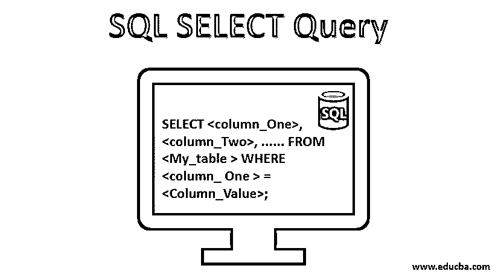
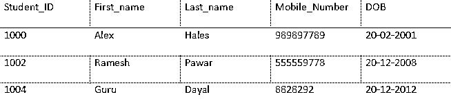
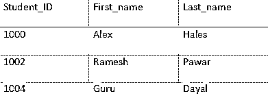
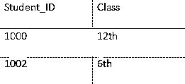
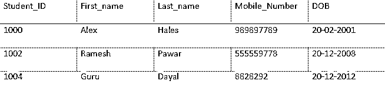
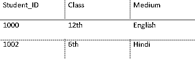
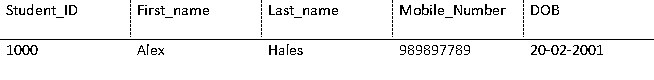
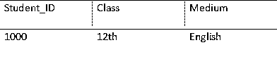
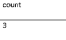
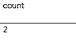

# SQL 选择查询

> 原文：<https://www.educba.com/sql-select-query/>




## SQL 选择查询简介

SQL 中的“Select”查询用于从表/数据库中获取一个或多个记录，根据用户的需要，它还可以容纳其他条件子句。结果数据集临时存储在输出表集中，通常称为“结果集”。如果不包含条件语句，使用“select”语句进行查询可以返回整个表；如果“select”查询中包含筛选器或条件，则只返回所需的数据。

### SQL 选择查询的语法

Select 是[关系数据库管理系统](https://www.educba.com/what-is-rdbms/)的基本命令之一。我们可以使用 SELECT 关键字作为前缀，从给定的表中选择记录。select 查询从给定的一个或多个表中返回一组记录。

<small>网页开发、编程语言、软件测试&其他</small>

1.选择给定表中所需的列

```
SELECT <column_A>, <column_B>, ...... FROM <My_table_name>;
```

**说明:**

*   SELECT 本身就是一个命令；我们可以用它从表中选择记录。
*   <column_a>、<column_b>、……是表格 My_table_name 的列。</column_b></column_a>
*   <my_table_name>是一个表的名称。</my_table_name>

2.选择表格中的所有列

```
SELECT * FROM <My_table_name>;
```

**说明:**

*   SELECT 本身就是一个命令，我们可以用它来从表中选择记录。
*   *表示给定表的所有列。
*   <my_table_name>是一个表的名称。</my_table_name>

3.使用 WHERE 子句选择记录

```
SELECT <column_One>, <column_Two>, ...... FROM <My_table > WHERE <column_ One > = <Column_Value>;
```

**说明:**

*   <column_one>、<column_two>、……是表格 My_table 的列。</column_two></column_one>
*   <my_table>是一个表的名称。</my_table>
*   其中是一个关键字，我们可以在 SQL select 语句中使用它来选择指定的条件记录。

4.选择记录的数量

```
SELECT  COUNT(*)  FROM <My_table>;
```

**说明:**

*   COUNT(*)，这将给出表 My_table 的总行数。
*   <my_table>是一个表的名称。</my_table>

### SQL 选择查询的示例

在这一节中，我们将讨论一些例子，考虑上面提到的语法，这样任何人都可以很容易地理解。让我们练习一些例子来更好地理解 SQL select 语句。

假设我们有一个名为“学校”数据库。该数据库包含表格，如下所述:

****学生:****




****类:****

*<u>*

*</u>* 

#### 示例# 1–选择所需的列

**查询:**

```
SELECT Student_ID, First_name, Last_name from Student;
```

**输出:**




**查询:**

```
SELECT Student_ID, Class from Class;
```

**输出**:




#### 示例 2–选择表格中的所有列

**查询:**

```
SELECT * from Student;
```

**输出**:




**查询:**

```
SELECT * from Class;
```

**输出:**

#### *<u>*

*</u>* 

#### <u>示例# 3–使用 WHERE 子句选择记录</u>

 <u>**查询:**

```
SELECT * from Student WHERE First_name="Alex";
```

**输出**:




**查询:**

```
SELECT * from Class where Medium=' English ';
```

**输出**:

<u>

</u> 

#### 示例 4–选择记录的数量

**查询:**

```
SELECT COUN(*) as count  from Student;
```

**输出**:




**查询:**

```
SELECT COUN(*) as count  from Class;
```

**输出**:




### 关于 SQL SELECT 的其他事实

上面提到的 select 语句可以在关系数据库上执行。我们可以使用各种其他 select 语句查询来选择记录。select 语句总是返回一个结果集。这个结果集可能包含零(0)、一个或多个记录。在 select 语句中，我们可以使用各种其他的东西来获得想要的结果。我们可以使用 JOIN 关键字从两个或多个表中选择记录。有多种方法可以使用两个或多个 select 语句从一个或多个表中获取记录。我们应该对任何表使用一个主键，以便可以唯一地标识一个记录。

我们可以在 SELECT 语句中使用下面提到的可选子句:

*   **其中:**我们已经通过例子看到了这一点。
*   **分组依据:**这在使用聚合函数之前是必需的。
*   **HAVING:** 我们可以在 GROUP BY 语句中使用 this 来执行聚合函数。
*   **ORDER** **BY:** 我们可以用它和 SELECT 一起对结果集的顺序进行排序。
*   **AS:** 我们在选择给定表的总记录时看到了这一点。这可用于为所选列或表创建别名。

### 结论

我们可以使用 SQL select 语句根据业务需要选择所需的列或记录。几乎每个关系数据库都有这个 SELECT 命令来从表中选择记录。我们可以以各种方式使用 select。我们可以选择基于条件的记录。select 操作可以在一个或多个表上执行。我们可以将各种其他命令与 SELECT 语句结合使用。MySQL、ORACLE 都是关系数据库管理系统的例子。

### 推荐文章

这是一个 SQL 选择查询的指南。这里我们讨论 SQL Select 查询的简介、语法、示例和其他一些事实。您也可以阅读以下文章，了解更多信息——

1.  [SQL 插入查询](https://www.educba.com/sql-insert-query/)
2.  [MySQL 查询命令](https://www.educba.com/mysql-query-commands/)
3.  [SQL 中的数据库](https://www.educba.com/database-in-sql/)
4.  [SQL 中的表格](https://www.educba.com/table-in-sql/)


</u>