# SQL 随机选择

> 原文：<https://www.educba.com/sql-select-random/>

## SQL 随机选择简介

SQL 随机函数用于从结果集中获取随机行。我们在在线考试中使用随机函数来随机显示每个学生的问题。SQL SELECT RANDOM 在每个数据库中的用法是不同的。让我们检查它在不同数据库中的用法。RAND()函数返回 0 到 1 之间的随机数。

**在 MYSQL:**

<small>Hadoop、数据科学、统计学&其他</small>

`SELECT < column_name > FROM < table_name >
ORDER BY RAND()`

在 MYSQL 中，我们使用 RAND()函数从数据库中获取随机行。

**在 POSTGRE SQL 中:**

`SELECT < column_name > FROM < table_name >
ORDER BY RAND()`

在 postgre sql 中，随机函数的表示类似于 sql。

**在甲骨文:**

`SELECT < column_name > FROM
( SELECT < column_name > FROM < table_name >
ORDER BY dbms_random.value )`

在网易中:

`SELECT RANDOM()
FROM < source >`

**语法:**

`SELECT RAND()
FROM < source >`

在 MYSQL 中，我们使用 RAND()函数从数据库中获取随机行。

### 如何实现 SQL SELECT RANDOM？

让我们在 SQL 中实现 Random 的用法。下面是得到从 0 到 1 的随机数。

`Select RAND()  AS <RESULT1>`

在上面的例子中，我们在 0 到 1 之间随机取值。让我们执行脚本并得到结果。

#### 示例 1

`Select RAND()  AS result1`

**输出:**

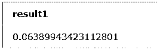

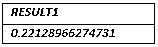

下面是相同的截图。

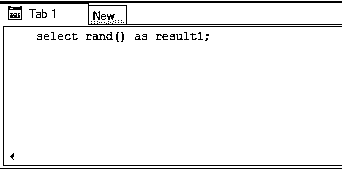

#### 示例 2

`Select RAND() AS result2`

**输出:**

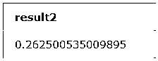

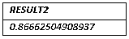

下面是相同的截图。

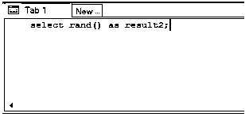

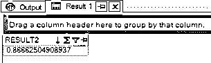

#### 示例 3

`Select RAND()  AS result3;`

**输出:**

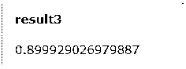

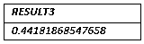

下面是相同的截图。

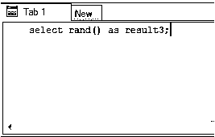

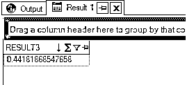

#### 实例 4

`Select RAND()  AS result4;`

**输出:**

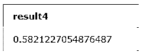

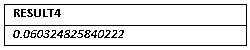

下面是相同的截图。

*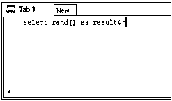

* 

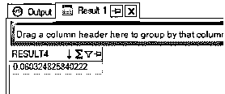

#### 实例 5

`Select RAND()  AS result5;`

**输出:**

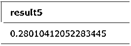

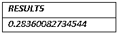

下面是相同的截图。

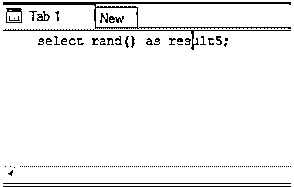

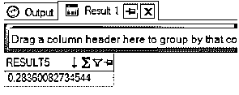

#### 实例 6

`Select RAND()  AS result6;`

**输出:**

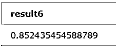

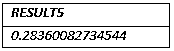

下面是相同的截图。

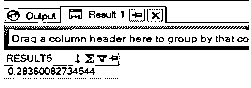

### SQL 随机选择示例

#### 示例#1

让我们考虑一个关于表中随机函数的例子。让我们考虑“在家工作”这张表。该表包含与在家工作的人相关的数据。

**表:在家工作**

**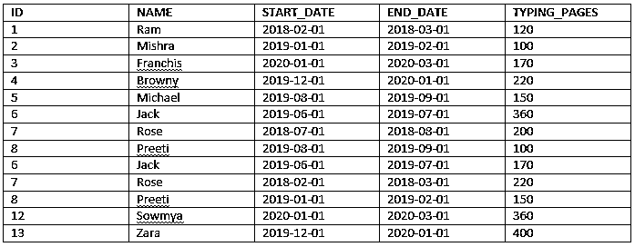

** 

现在让我们应用 RAND 并检查结果。

**查询:**

`SELECT *
FROM WORK_FROM_HOME
ORDER BY RAND();`

**执行输出 1:**

**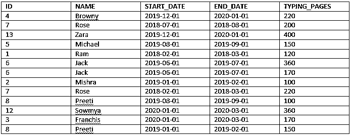

** 

**执行输出 2:**

**

** 

**执行输出 3:**

**<u>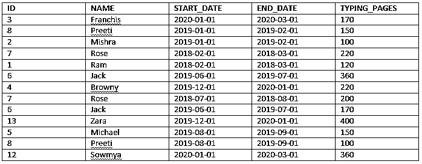

</u>** 

#### 示例 2

让我们考虑表格中随机函数的例子。让我们考虑“付款 _ 明细”表。该表包含的数据与支付给在家工作的人员的金额相关。

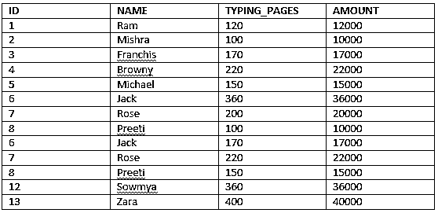

**执行输出 1:**

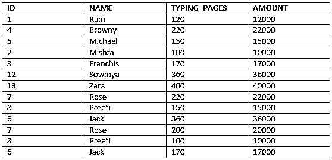

**执行输出 2:**

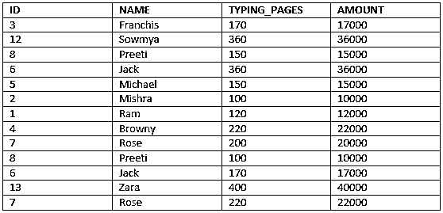

### 结论

为了精确描述随机函数，我们需要记住以下几点:

*   每当我们想要计算随机值并发送输出时，我们就使用随机函数。示例如在线考试中所述，为每个学生随机显示问题。
*   SQL SELECT RANDOM 在每个数据库中的用法是不同的。有些数据库显示为 RAND()，有些显示为 RANDOM()。
*   RAND()函数返回 0 到 1 之间的随机数。

### 推荐文章

这是一个 SQL 随机选择的指南。这里我们讨论 SQL SELECT RANDOM 的例子以及语法和参数。您也可以阅读以下文章，了解更多信息——

1.  [SQL 中的 BETWEEN](https://www.educba.com/between-in-sql/)
2.  [SQL 中的触发器](https://www.educba.com/triggers-in-sql/)
3.  [PostgreSQL 提交](https://www.educba.com/postgresql-commit/)
4.  [SQL 子查询](https://www.educba.com/sql-subquery/)
5.  [SQL |示例中的任何一个](https://www.educba.com/any-in-sql/)

