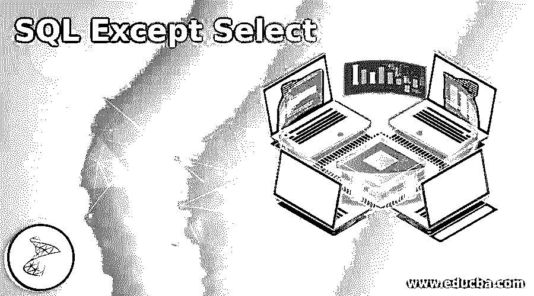
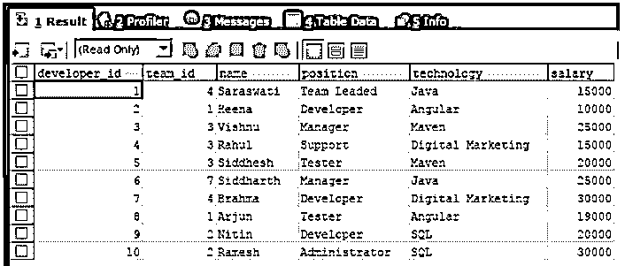
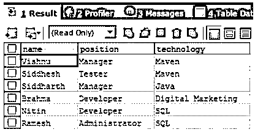
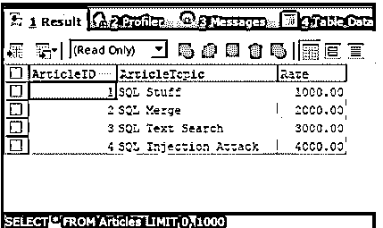
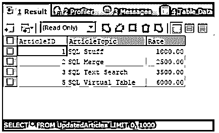
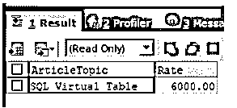

# 除 Select 之外的 SQL

> 原文：<https://www.educba.com/sql-except-select/>

## 除 Select 之外的 SQL 简介

从查询中检索数据时，除 select 之外的 SQL 非常有用，并且您必须提到某些数据不应该添加到最终的结果集中。当从数据库中提取数据、更新数据库中的记录或从数据库中删除多个记录时，我们必须提到，来自查询执行的检索结果集中的某些记录应该从最终结果集中排除，在最终结果集中执行任一操作，即选择、更新或删除。在 select 语句后使用 except 子句，您可以提到要从最终结果集中排除的硬编码值，或者甚至可以在 except 关键字后提供另一个查询语句，其结果集将从最终结果集中排除。

在本文中，我们将研究 select 子句中 except 子句的一般语法，并通过多个示例了解其实现。此外，我们还将了解 not in the 子句和 except 的不同用法。Microsoft SQL Server 2005 引入了 except 子句及其功能。请注意，某些支持 SQL 查询语言的 DBMS(如 MySQL DBMS)不支持 except 子句。

<small>Hadoop、数据科学、统计学&其他</small>

### 除 Select 之外的 SQL 语法

SQL 查询语句的 select 操作中的 except select 子句的语法如下所示

`SELECT column name 1 [, column name 2 ] FROM table name 1 [, table name 2 ] [WHERE condition or restriction] EXCEPT
SELECT column name 1 [, column name 2 ] FROM table name 1 [, table name 2 ] [WHERE condition or restriction]`

在上面的语法中，右侧的第一个 select 语句是从名为 table name 1 的表中检索结果集的主查询，检索到的值包含名为 column name 1、column name 2 等的列的值。现在，EXCEPT 关键字的作用是，从左侧第二个 select 查询语句中检索到的行应该从执行右侧查询(如果存在)后获得的结果集中删除。请注意，左侧和右侧的查询都应该检索彼此相同数量的比较数据类型值，类似于 union 子句的用法。

except 关键字的执行是这样的:获得右侧和左侧查询的结果集的交集，然后最终结果将由右侧查询的所有记录组成，然后从中删除相交的记录结果集以获得最终结果集。

### 除 Select 之外的 SQL 示例

让我们首先考虑一个简单的例子，其中我们有一个名为 developers 的现有表，该表的结构和内容如以下查询语句的输出所示

现在，我们必须从从 developers 表中检索姓名、职位和技术的查询结果集中排除薪水低于 20000 的记录，通过使用 EXCEPT 关键字，我们可以使用以下查询语句

`SELECT
NAME,
POSITION,
technology
FROM
`developers`
EXCEPT
SELECT
NAME,
POSITION,
technology
FROM
`developers`
WHERE salary < 20000;`

上述查询语句的执行给出了如下所示的输出

我们可以观察到，工资大于或等于 2000 的所有开发人员都包含在最终结果集中，而工资小于 20000 的其他开发人员被排除在外，因为这些记录是从 except 之后的第二个 select 语句中检索的。现在，让我们再考虑一个示例，其中我们有两个表，两个现有的表分别名为 Articles 和 UpdatedArticles，其内容和结构如以下查询语句的输出所示

`SELECT * FROM Articles;`

上述查询语句的执行给出了如下所示的输出

`SELECT * FROM UpdatedArticles;`

上述查询语句的执行给出了如下所示的输出

现在，我们必须从更新的 articles 表中检索记录，这样这些记录就不会出现在名为 articles 的表中。请注意，这两个表包含相同的列，我们必须检索文章的主题及其比率。为此，我们可以使用 EXCEPT 子句并构建如下查询语句

`SELECT
`ArticleTopic`,
`Rate`
FROM
`UpdatedArticles`
EXCEPT
SELECT
`ArticleTopic`,
`Rate`
FROM
`Articles` ;`

上述查询语句的执行给出了如下所示的输出

我们可以观察到，只检索到一条记录，这是唯一一条出现在更新的文章中，但没有出现在文章表记录中的记录。

### EXCEPT 和 NOT 在子句中的区别

我们可以看到，这两个子句的功能是相同的，它们都有助于指定某些不应包含在查询的最终结果集中的结果集。但是他们的工作有很多不同之处。

每当我们使用 EXCEPT 子句时，有必要提及查询将在查询中检索的所有列值，该查询将提及要排除的记录，因此该记录应被排除的约束适用于所有列值，而在 NOT IN 子句的情况下，只有单个列值因其有价值的内容而受到限制，该内容指定具有该列值的结果集不应包括在最终结果集中。

除此之外，EXCEPT 子句的使用删除了将从结果集中检索的所有重复记录，而 NOT IN 子句将在最终结果集中保留重复条目。

### 推荐文章

这是一个 SQL 的指南，除了 Select。在这里，我们还将讨论 except 和 not in 子句的介绍和区别，以及不同的示例和代码实现。您也可以看看以下文章，了解更多信息–

1.  [对于 Unix 中的循环](https://www.educba.com/for-loop-in-unix/)
2.  [Crontab in Unix](https://www.educba.com/crontab-in-unix/)
3.  [Unix 中的数组](https://www.educba.com/array-in-unix/)
4.  [Unix 中的 VI 编辑器](https://www.educba.com/vi-editor-in-unix/)

