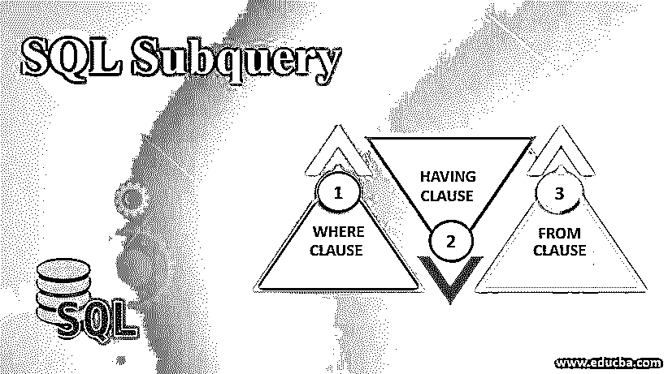
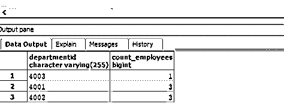
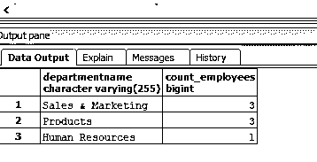
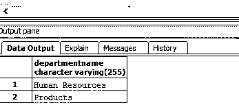
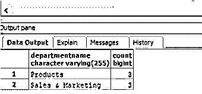

# SQL 子查询

> 原文：<https://www.educba.com/sql-subquery/>

## 什么是 SQL 子查询？

SQL 子查询是包含在主 SQL 查询中的嵌套内部查询，通常由 inSERT、UPDATE、DELETE 和 SELECT 语句组成，通常嵌入在 WHERE、HAVING 或 FROM 子句以及表达式运算符中，如=、NOT IN、、> =、< =、IN、EXISTS、BETWEEN 等。，主要用于解决复杂的用例并提高 DBMS 操作的性能或速度。

### 句法

编写 SQL 子查询的基本语法取决于要嵌入主查询的部分。它可以嵌入 HAVING、WHERE 或 FROM 子句中。我们将很快逐一了解它们。

<small>Hadoop、数据科学、统计学&其他</small>

#### 语法# 1–FROM 子句中的子查询

`SELECT column_name(s)
FROM (SELECT column_name(s) from table_name) as table_alias
WHERE condition;`

#### 语法# 2–WHERE 子句中的子查询

`SELECT column_name(s)
FROM table_name_1
WHERE column_name expression_operator{=,NOT IN,IN, <,>, etc}(SELECT
column_name(s) from table_name_2);`

#### 语法# 3–HAVING 子句中的子查询

`SELECT column_name(s)
FROM table_name_1
WHERE condition
GROUP BY column_name(s)
HAVING Aggregate_function(column_name)expression_operator{=,
<,>}(SELECT column_name(s) from table_name_2);`

##### SQL 子查询中的参数

上述语法中使用的参数是:

*   **选择列名:**用于从数据库中选择需要的数据。提及您希望在结果集中出现的列名。
*   **FROM:** 用于指定要从哪个来源提取数据。在第一种情况下，子查询的结果将作为源。在第二种情况下，将从 table_name_1 中获取数据。
*   **其中条件:**用于指定过滤记录的条件。在第二种情况下，将根据子查询结果和提到的列之间的比较来筛选行。
*   **GROUP BY column_name(s):** 用于将具有相似值的行分组到汇总行中。
*   **HAVING condition:** 根据指定的条件过滤分组。在第三种情况下，组的筛选是基于子查询的结果完成的。

### FROM 子句中的子查询

FROM 子句中的子查询创建一个派生表或中间表，可以直接用于获取主 SELECT 查询的结果，或者与其他表连接，然后在以后使用。为了更好地理解这个概念，我们将借助两个表，Employees(它包含所有雇员的个人详细信息)和 departments(它包含部门 id、名称及其 hod 等详细信息)。

部门表中的数据如下所示:

| **部门编号** | **部门名称** | **头** |
| Four thousand and one | 销售和营销 | Ten thousand and twenty-four |
| Four thousand and two | 制品 | Ten thousand and twenty-three |
| Four thousand and three | 人力资源 | Ten thousand and twenty-two |

雇员表中的数据如下:

| **员工 id** | **姓氏** | **名字** | **部门编号** | **地址** | **城市** |
| Ten thousand and twenty-eight | １９８９．　贝克尔 | 托德 | Four thousand and one | 27 街 | 奥斯陆 |
| Ten thousand and twenty-nine | 丽贝卡(女子名ˌ寓意迷人的美) | 杜松子酒的 | Four thousand and one | 27 街 | 曼哈顿 |
| Ten thousand and twenty-seven | Tobby | 丽雅 | Four thousand and two | 31 街 | 曼哈顿 |
| Ten thousand and twenty-six | 夏尔马 | 迪帕克（男子名） | Four thousand and two | 第十街 | 新德里 |
| Ten thousand and twenty-four | 克利须那 | 丽娜 | Four thousand and one | 27 街 | 奥斯陆 |
| Ten thousand and twenty-three | 杰克逊 | 大卫 | Four thousand and two | 27 街 | 曼哈顿 |
| Ten thousand and twenty-two | 迈耶斯 | 大卫 | Four thousand and three | 27 街 | 曼哈顿 |

这里有几个例子来理解 FROM 子句中的子查询。

#### 示例#1

找出每个部门的员工人数。

**代码:**

`SELECT departmentid, count_employees
FROM (SELECT count(DISTINCT employeeid) AS "count_employees",departmentid
FROM employees GROUP BY departmentid) AS employee_summary
ORDER BY count_employees;`

**输出:**

**解释:**在上面的例子中，我们首先创建了一个派生表“employee_summary ”,并使用它来获取 departmentid 和在该部门工作的雇员数。

#### 实施例 2

找出每个部门的雇员人数，但在最终结果中有部门名称。

**代码:**

`SELECT dept.departmentname, employee_summary.count_employees
FROM (SELECT count(DISTINCT employeeid) AS "count_employees",departmentid
FROM employees GROUP BY departmentid) AS employee_summary
INNER JOIN
department as dept
ON dept.departmentid::varchar = employee_summary.departmentid
ORDER BY employee_summary.count_employees DESC;`

**输出:**

**解释:**在上面的例子中，我们首先创建了一个派生表“employee_summary ”,然后将它与“department”表连接以获得部门名称。

### WHERE 子句中的子查询

WHERE 子句中的子查询通过将主表中的列与子查询的结果进行比较，有助于筛选结果集的行。下面是一个理解 WHERE 子句中子查询的示例。

#### 示例#1

找出部门主管来自“曼哈顿”的部门名称。

**代码:**

`SELECT departmentname
FROM department
WHERE head IN (SELECT employeeid::varchar
FROM employees
WHERE city = 'Manhattan');`

**输出:**

**解释:**在上面的例子中，我们在 WHERE 子句中创建了一个条件，用于比较部门主管是否来自曼哈顿。但是，由于我们在“employees”表中拥有与城市相关的所有信息，我们必须创建一个子查询，从“employees”表中选择来自“Manhattan”的 employeeid，然后将其与“department”表中负责人的雇员 id 进行比较。

### HAVING 子句中的子查询

HAVING 子句中的子查询通过比较主表中的列与子查询的结果来帮助筛选结果集的组。下面是一个理解 HAVING 子句中子查询的示例。

#### 示例#1

找出雇员总数超过新德里雇员总数的部门。

**代码:**

`SELECT d.departmentname,count(e.employeeid)
FROM department as d INNER JOIN employees as e
ON d.departmentid::varchar = e.departmentid
GROUP BY d.departmentname
HAVING count(e.employeeid)>(SELECT count(employeeid) FROM employees WHERE city = 'New Delhi');`

**输出:**

**解释:**在上面的例子中，我们在 HAVING 子句中创建了一个子查询。该子查询的结果将获取新德里的雇员总数，然后将其与每个部门的雇员数进行比较。因此，这将有助于我们得出最终结果。

### 结论–SQL 子查询

SQL 子查询是主查询中编写的嵌套内部查询。他们帮助解决复杂的问题。子查询是 SQL 连接的一个很好的替代，因为它们提高了效率或速度。

### 推荐文章

这是 SQL 子查询指南。在这里，我们讨论语法、参数和三个不同的子查询示例以及适当的代码和输出。您也可以浏览我们的其他相关文章，了解更多信息——

1.  [SQL 运算符](https://www.educba.com/sql-operators/)
2.  [SQL 字符串运算符](https://www.educba.com/sql-string-operators/)
3.  [SQL 外部连接](https://www.educba.com/sql-outer-join/)
4.  [SQL 交叉连接](https://www.educba.com/sql-cross-join/)
5.  [PostgreSQL 子查询指南](https://www.educba.com/postgresql-subquery/)
6.  [由](https://www.educba.com/tableau-group-by/)引导至 Tableau 组

