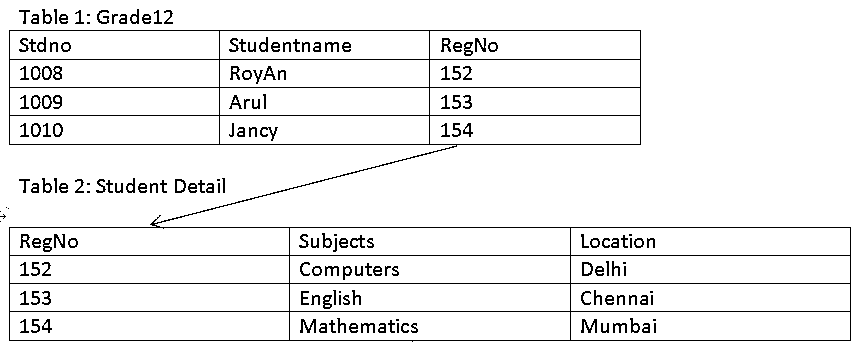
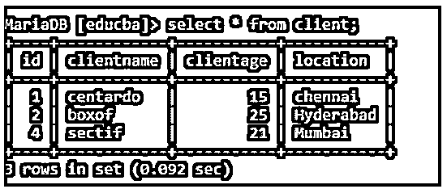
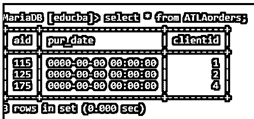

# SQL 外键

> 原文：<https://www.educba.com/sql-foreign-key/>


## SQL 外键介绍

以下文章提供了 SQL 外键的概述。分配了外键的列的每一行都应该包含它所链接的列中的值。被引用(即“外来”)字段必须只包含不同的值；通常，它充当表的主键。

### 关键要点

*   引用键也称为外键。具有与另一个表中的主键相匹配的值的一列或一组列称为外键。
*   当处理多个项目时，我们需要大量的表格来连接工作。通常需要键来连接表。在 SQL 中，键是一个字段或一组列，可用于唯一标识表中的条目。

### 什么是 SQL 外键？

外键限制通过将一个表中的列连接到另一个表中的列，确保只有在相同的值以前出现在另一个表中时，才可以首先将该值添加到该列中。引用的键和任何关联的列必须使用相同类型的数据。像整数和小数这样的静态精度类型必须具有相同的大小和符号。字符串长度不能都相等。数据库中的外键约束有助于检查信息的正确性。此外，添加约束可能会降低数据库的速度。

<small>Hadoop、数据科学、统计学&其他</small>

### 为什么使用 SQL 外键？

外键有助于建立表之间的连接，这就是将“关系”放入“关系数据库”的原因它们使数据库开发人员能够在整个系统中保持引用完整性。通过减少错误和加快从由索引外键连接的表中提取数据的过程，外键也使最终用户受益。

#### 1.数据标准化

我们可以通过使用外键来减少冗余，并平衡几个表中的数据。这意味着一个数据库可能有几个相互连接的表。

#### 2.防止插入错误的数据

使用外键可以确保不会将正确的数据放入连接两个数据库表的字段中。这有助于消除数据库级的问题。

### 如何创建 SQL 外键？

在 CREATE 表中使用关键字“Foreign Key”和引用父表的“REFERENCES”创建外键。

**代码:**

```
CREATE TABLE table name(col1 datatype….coln , FOREIGN KEY (Col1) REFERENCES Parent table (ColA));
```

在执行了上述查询之后，子数据库中的 col1 将作为这个新表中的外键。我们使用上面提到的基于名为 ColA 的共享列的查询来连接这两个表。

### 使用创建表

使用 CREATE 命令创建 sql 表。但是，在新表中，也使用了外键。让我们看一个使用 create 命令定义外键的例子。

**代码:**

```
Create table actors (actor_id int references film(id),
actor name varchar2(20));
```

### SQL 外键表

让我们考虑两个表，并使用外键来查看这种关系是如何存在的。




在上面的表结构 RegNo 中，一个列字段充当外键，同时也被视为学生详细信息表中的主键。

### SQL 外键约束

我们使用 SQL 外键约束来停止会破坏表之间连接的操作。在这些约束条件下，甚至不允许向表中添加不正确的数据。

**代码:**

```
[CONSTRAINT ] FOREIGN KEY
[index_name] (col_name, ...)
REFERENCES tbl_name (col_name,...)
[ DELETE reference_option]
```

它需要主表上的一个特权(比如 select、insert、update、delete)。

### 外键在 SQL 中是如何工作的？

这里展示了外键限制如何工作，以及它在创建、插入和删除中是如何工作的。

**例子:**

这个示例数据库将更清楚地展示外键功能，同样的一般概念也适用于更大、更复杂的数据库。

这里我们首先创建一个父表“client ”,它有一个特定的主键“id”。

**代码:**

```
create table client(id int PRIMARY KEY, clientname varchar(20),clientage int, location varchar(20));
```

在表中插入特定值后，它看起来像这样:

**代码:**

```
insert into client values (01,'centardo',15,'chennai');
insert into client values (02,'boxof',25,'Hyderabad');
insert into client values (04,'sectif',21,'Mumbai');
MariaDB [educba]> select * from client;
```

该表如下所示:




接下来，我们用引用父表主键的外键(clientid)创建一个子表‘at lorders’。

创建表上的外键。

**代码:**

```
create table ATLAorders(aid int PRIMARY KEY, pur_date datetime, clientid int References client(id));
```

插入相应的值后，带有外键的表如下所示。




从上表中我们可以看到，父表和子表中的“clientid”和“id”属性是相同的。值是相同的。如果我们尝试输入不同的值，它会显示一个警告。请看下面的截图。我尝试在 clientid 中输入值“10”。它显示警告。


接下来，使用 Alter table 添加外键约束。

**代码:**

```
alter table ATLAorders ADD CONSTRAINT fk FOREIGN KEY (clientid) REFERENCES client(id);
```

**输出:**


### 主键和外键的区别

下面是提到的差异:

| ****序号**** | ****主键**** | ****外键**** |
| One | 表中的项由其主键唯一标识。 | 一个表中的列作为另一个表中的主键被称为外键。 |
| Two | 为了保证给定列中的数据是唯一的，使用了主键。 | 关系数据库表的外键是在两个表中的数据之间创建连接的一列或一组列。 |
| Three | 父表不允许用户删除它的值。 | 我们可以从子表中删除它的值。 |
| Four | 临时表允许隐式定义其约束。 | 没有办法在本地或全局临时表上定义它的约束。 |

### 常见问题解答

下面是提到的常见问题:

#### Q1。主键和外键是如何关联的？

**答:**主表是保存主键的表，子表是包含外键的表。因此，外键连接两个信息数据库。

#### Q2。列出创建外键的一些规则。

**答:**主表中的主键列和子表中的外键字段必须包含完全相同的数据。同一数据库应包含引用记录和被引用记录。

#### Q3。使用外键有什么好处？

**答:**性能是使用外键限制的主要好处。团队可以很容易地确定数据库的设计。我们还可以看看查询使用的数据检索策略。

### 结论

本文介绍了 SQL 中的外键以及如何借助示例来利用它们。此外，我们使用外键约束来构建两个表之间的关系。

### 推荐文章

这是一个 SQL 外键的指南。这里我们讨论一下入门，为什么要用 SQL 外键？关键约束和常见问题。您也可以看看以下文章，了解更多信息–

1.  [SQLAlchemy 示例](https://www.educba.com/sqlalchemy-example/)
2.  [SQLAlchemy 模型](https://www.educba.com/sqlalchemy-model/)
3.  [SQLAlchemy 类型](https://www.educba.com/sqlalchemy-types/)
4.  [SQLAlchemy 多对多](https://www.educba.com/sqlalchemy-many-to-many/)


