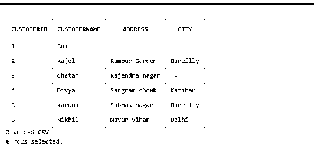
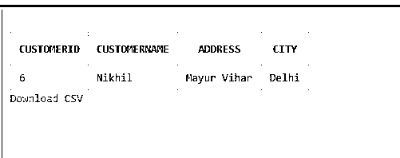

# SQL 中的主键

> 原文：<https://www.educba.com/primary-key-in-sql/>

## SQL 中主键的介绍

在 SQL 中，主键是一个特殊的关系数据库表字段或字段组合，它唯一地标识多记录表中的一条记录。主键的主要特性是，它为数据库中的每一行表数据保存一个唯一的值。在 DBMS 表中，应该只有一个主键，并且任何包含主键的字段都不能包含 NULL。一个表只能有一个主键约束，该约束可以有一列或多列。但是当我们使用多个字段作为主键时，我们称之为组合键。假设如果我们已经定义了一个列作为主键，那么不应该有任何两个记录具有与该列相同的值。

### 为什么我们在 SQL 中需要主键？

假设对于任何身份识别，我们都需要一个不同的特征，使其与众不同。每个人都有独特的特长，这使我们根据一个人的品质来判断和验证他们。同样，为了区分一个表和其他表并对它们进行标识，我们需要一个特殊的键约束来验证该表的记录，并保持唯一性、一致性和完整性。

<small>Hadoop、数据科学、统计学&其他</small>

对于连接关系数据库系统中的任意两个表，一个主键和另一个表的主键被称为外键，这起着至关重要的作用。因此，我们可以在创建表或在数据库中修改表时使用这个主键。如果主键已经存在于表中，那么服务器或系统将不允许插入具有相同键的行。它还有助于提高数据库记录的安全性。

**语法:**

在 SQL 中，通常我们可以使用 CREATE TABLE query 或 ALTER TABLE SQL 语句来创建表的主键约束。

为此，我们可以使用以下语法:

*   Create Table 语句上的 SQL 主键

当我们创建 Persons_Data 表时，SQL 中的以下查询在 PersonID 列上创建主键。

**MySQL:**

`CREATE TABLE Persons_Data ( PersonID int NOT NULL, Name varchar(255) NOT NULL, Address varchar(255), Phone int, PRIMARY KEY (PersonID) );`

**MS Access | SQL Server | Oracle:**

`CREATE TABLE Persons_Data (PersonID int NOT NULL PRIMARY KEY, Name Varchar(255) NOT NULL, Address varchar(255), Phone int );`

要命名主键约束和在多个字段上创建主键约束，请使用下面的 SQL。

**语法**:

**MS Access | MySQL | SQL Server | Oracle:**

`CREATE TABLE Persons_Data(ID int NOT NULL,Name varchar(255) NOT NULL, Address varchar(255), Phone int, CONSTRAINT PersonID PRIMARY KEY (ID,Name) );`

*   ALTER TABLE 上的 SQL 主键

当 Persons_Data 表已经存在时，SQL 中的以下查询声明 PersonID 字段上的主键约束:

**Oracle****| MS Access****| MySQL | SQL Server:**

`ALTER TABLE Persons_Data ADD PRIMARY KEY (PersonID);`

这里，我们在多个列上定义主键约束:

**MS Access****| MySQL | SQL Server | Oracle:**

`ALTER TABLE Persons_Data ADD CONSTRAINT PK_PersonID PRIMARY KEY (PersonID, Name);`

当表中的字段已经被声明为 NOT NULL 时，使用 SQL ALTER query 向该字段添加主键就变得更加容易了。

*   删除主键约束

为此，我们使用以下 SQL 语句:

**MySQL:**

`ALTER TABLE Persons_Data DROP PRIMARY KEY;`

**MS Access****| SQL Server | Oracle:**

`ALTER TABLE Persons_Data DROP CONSTRAINT PK_PersonID;`

### SQL 中主键的使用

主键有自动定义的唯一约束，并且记住我们只能在一个表中包含一个主键。通常，我们提供 ID 作为表的主键，该表将是唯一的并且没有空值。因此，当我们创建一个表时，我们将某个字段定义为具有 NOT NULL 约束的主键，以便它成为表中的唯一标识符列。

**举例:**

**代码:**

`Create Table Persons_Data (PersonID int NOT NULL, Name Varchar(255) NOT NULL, Address Varchar(255) NOT NULL, Phone int NOT NULL, PRIMARY KEY (PersonID, Name));`

这里，我们在 PersonID 和 Persons_Data 表上的 Name 列上声明了主键。请注意，“约束允许我们在 SQL 中创建或更改表查询时定义限制数据类型。”

### 如何在 SQL 中对行、列、表等使用主键？?

我们在 SQL 数据库查询中使用主键，如下所示:

假设我们创建了一个名为 Customers 的表，表中的列为“CustomerID、CustomerName、Address 和 City”。

**代码:**

`CREATE TABLE Customers (CustomerID int NOT NULL PRIMARY KEY, CustomerName varchar (255) NOT NULL, Address varchar (255) NOT NULL, City varchar (255) );`

我们有下面的输出截图，其中我们也插入了一些数据值:

**输出:**

我们可以在上表中看到，列 CustomerID 具有唯一的值，并且不为 NULL，但是另一方面，我们可以发现，像在 City 列中的值也包含重复的数据。

例如，我们可以传递一个 SQL 语句来使用带有 SELECT 和 WHERE 语句的 CustomerID 列。

**代码:**

`SELECT * From Customers WHERE CustomerID=6;`

**输出:**

这里的输出是上面的 SQL 语句的结果，我们在 Customers 表中获得了 CustomerID 等于 6 的行数据。同样，SQL 数据库中的主键也有许多用途，如果在没有自动定义主键时没有输入主键值，则可能会收到来自服务器的错误消息。

### 结论

主键约束在规范化过程中很有用，它通过以有组织的方式建立数据库的字段和表来帮助维护数据库表中的冗余和依赖性。在 SQL 中，它有助于关联数据库中的许多表，确定 SQL 查询中的关系，如连接**、**反规格化过程，触发**、**逻辑或聚合函数，以及其他需要用唯一主键连接两个或更多表的语句。这有助于简化数据检索和管理过程，以减少冗余，RDBMS 变得更加方便。

### 推荐文章

这是一个 SQL 中主键的指南。这里我们讨论如何在 SQL 中使用主键，为什么我们需要它以及工作和语法。您也可以看看以下文章，了解更多信息–

1.  [SQL 中的组合键](https://www.educba.com/composite-key-in-sql/)
2.  [SQL 键](https://www.educba.com/sql-keys/)
3.  [像 SQL 中的查询](https://www.educba.com/like-query-in-sql/)
4.  [SQL 中的 IF ELSE 语句](https://www.educba.com/if-else-statement-in-sql/)

