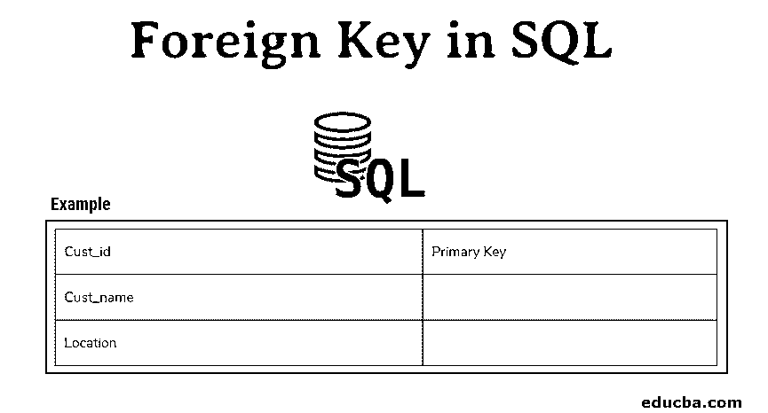
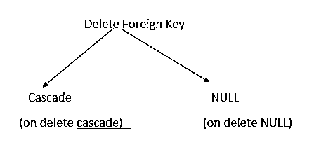

# SQL 中的外键

> 原文：<https://www.educba.com/foreign-key-in-sql/>

## SQL 中的外键介绍

SQL 中的外键指的是用于连接来自同一数据库的两个表以对表的内容执行任何操作的一列或一组列。一个表的外键连接到另一个表的主键(具有唯一值，并且是该表中唯一标识的列)，用于允许两个表之间的关系。

因此，如果数据库中有一对多或多对多关系，外键将非常有用。它充当两个表(parent_table 和 child_table)之间的交叉引用，因为它引用另一个表的主键。所以它在 parent_table 和 child_table 之间建立了一个链接。

<small>Hadoop、数据科学、统计学&其他</small>

**语法**

创建具有外键的新表需要数据库中的 CREATE TABLE 权限。

`CREATE TABLE child_Table
(
column_1 datatype [ NULL |NOT NULL ],
column_2 datatype [ NULL |NOT NULL ],
...
CONSTRAINT F_key
FOREIGN KEY (child_column1, child_column2, ... child_column_n)
REFERENCES parent_Table (parent_column1, parent_column2, ... parent_column_n)
[ ON DELETE { NO ACTION |CASCADE |SET NULL |SET DEFAULT } ] [ ON UPDATE { NO ACTION |CASCADE |SET NULL |SET DEFAULT } ] );`

*   Child_Table 是我们将创建的表名。
*   column_1，column_2-要添加到表中的列。
*   这是一个外键约束。
*   child_column1，child_column2…child_column_n-它是 child_Table 列的名称，用于引用父表中的主键。
*   Parent_Table-这是 Parent_Table 的名称。parent_table 的主键被 child_table 引用
*   删除时-此参数在删除父数据后对子数据执行操作。SET NULL、NO ACTION、CASCADE、SET DEFAULT 是该参数的一些值。
*   更新时——这是一个可选参数，在父数据更新后对子数据执行操作。SET NULL、NO ACTION、CASCADE、SET DEFAULT 是该参数的一些值。
*   级联——我们可以将它与删除和更新一起使用。删除或更新父数据后，子数据将被删除或更新。

在现有表中创建外键需要对该表具有 ALTER 权限。

**代码:**

`ALTER table_name
ADD CONSTRAINT constraint_name
FOREIGN KEY foreign_key_name(columns)
REFERENCES parent_table(columns)`

### 规则

*   外键不适用于临时表。
*   外键约束不必只链接到另一个表的主键；它也可以链接到另一个表的唯一约束。
*   外键约束可以引用同一表中的另一列。这被称为自参考。
*   外键约束可以引用同一数据库中的表。
*   我们还可以在子表中插入空值。
*   当我们在外键约束中插入非空值时，该值必须存在于被引用的列中；否则，会出现违规消息。
*   如果更新规则是 RESTRICT，并且有一个或多个相关行，则不能更改父项的唯一关键字的值。但是，如果更新规则是无操作，只要在 update 语句完成时每个子代都有一个父键，就可以更新父唯一键。

### 例子

假设我们有两个表，客户和订单。Customers 表包含所有与客户相关的数据，Orders 表包含与客户订单相关的数据。

**客户**

| 客户标识 | 主关键字 |
| 客户名称 |  |
| 位置 |  |

**订单**

| 订单 id | 主关键字 |
| 订单日期 |  |
| 数量 |  |
| 客户标识 | 外键 |
| 总数 |  |

在上面的示例中，ORDERS 表中的 Cust_id 列是一个外键，指向 CUSTOMERS 表中的 Cust_id 列。

让我们假设这些表有以下值。

**客户**

| One thousand and one | 亚历克斯 | 美国 |
| One thousand and two | 凯里 | 美国 |
| One thousand and three | （同 suddenionosphericdisturbance）电离层的突然骚扰 | 英国 |
| One thousand and four | 汤姆(男子名) | 澳大利亚 |
| One thousand and five | 卡皮尔 | 印度 |

**订单**

| Seventy-eight | 20-10-2018 | Five | One thousand and two | One thousand two hundred |
| Seventy-nine | 12-10-2017 | Four | One thousand and one | Eight hundred |
| Eighty | 20-11-2016 | Two | One thousand and five | Three hundred and sixty-nine |
| Eighty-one | 09-10-2016 | Five | One thousand and two | Two hundred and fifty-eight |
| Eighty-two | 19-08-2016 | Eleven | One thousand and four | One thousand nine hundred |
| Eighty-three | 30-06-2016 | Forty-five | One thousand and one | Two thousand three hundred |
| Eighty-four | 16-02-2016 | Seven | One thousand and one | Eight hundred and ninety |
| Eighty-five | 02-01-2016 | Two | One thousand and two | Two hundred and sixty |

对于 cust_id 1001，订单表中存在三个订单。

对于客户标识 1003，没有订单。

因此，如果父表中有特定的数据(比如 id 1003)，那么子表中就没有必要有该数据，反之亦然。

我们不能在子表(订单表)中包含任何数据，因为它不存在于父表(客户表)中。)

例如，我们不能在 Orders 表中插入新记录，比如 cust_id 1006，因为 Customers 表中不存在 cust_id 1006。

下面是违反这种关系的参照完整性的例子:

*   在 ORDERS 表中插入一行，其中 Cust_ID 没有出现在 CUSTOMERS 表的 Cust_ID 列中。
*   从 CUSTOMERS 表中删除一行，其中要删除的行的 Cust_ID 仍存在于 ORDERS 表的 Cust_ID 列中。

当从主表中删除特定记录时，有两种方法可以维护子表中数据的完整性。首先，当两个表用外键连接时，主表中的某些数据被删除，而记录存在于子表中，那么我们有某种机制来保存子表中数据的完整性。

*   **On Delete Cascade:** 如果从主表中删除了外键的值，这将从子表中删除记录。
*   **On Delete NULL:** 这将把子表的那个记录中的所有值设置为 NULL，这样外键的值将从主表中删除。

### 结论–SQL 中的外键

所以在数据库中使用外键是明智的，它具有一对一或一对多的关系。使用外键约束的主要优点是可以提高性能。开发人员可以很容易地识别数据库的结构。我们还可以检查查询将如何检索数据。

### 推荐文章

这是一个 SQL 外键指南。这里我们讨论 SQL 中外键的规则和例子。您也可以看看以下文章，了解更多信息–

1.  [SQL 视图](https://www.educba.com/sql-views/)
2.  [SQL Server 中的联接类型](https://www.educba.com/types-of-joins-in-sql-server/)
3.  [什么是 PL/SQL？](https://www.educba.com/what-is-pl-sql/)
4.  [SQL 服务器约束](https://www.educba.com/sql-server-constraints/)

